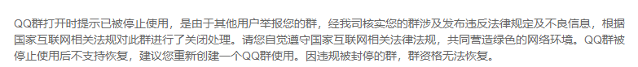

# 睡了一会，发现你坛官群没了

作者：masterqqq

TID：28048

<title>1</title> <link href="../Styles/Style.css" type="text/css" rel="stylesheet">

# 1

沉痛纪念开了那么久的官群。不过群炸了后，你坛有些人才知道还有官群。

<title>2</title> <link href="../Styles/Style.css" type="text/css" rel="stylesheet">

# 2

和楼主差不多，突然发现gn群没了。貌似这群12年就在了，感觉蛮可惜的。等新群通知吧 <title>3</title> <link href="../Styles/Style.css" type="text/css" rel="stylesheet">

# 3

昨天下午还看到在的，刚才上QQ才发现不见了 <title>4</title> <link href="../Styles/Style.css" type="text/css" rel="stylesheet">

# 4

估计是进了内鬼，被举报了 <title>5</title> <link href="../Styles/Style.css" type="text/css" rel="stylesheet">

# 5

啊。。。 等等
GN有qq群么。。。

10年就进来的我表示错过了一个亿 <title>6</title> <link href="../Styles/Style.css" type="text/css" rel="stylesheet">

# 6

GN的Q群消失了。。。我也是听人说了一看还真没了。 <title>7</title> <link href="../Styles/Style.css" type="text/css" rel="stylesheet">

# 7

毕竟这群成员是两岸的，大概是关键时刻被重点针对了吧
不是搞黄色，是传谣言 <title>8</title> <link href="../Styles/Style.css" type="text/css" rel="stylesheet">

# 8

具体原因我们也在调查中……请稍安勿躁 <title>9</title> <link href="../Styles/Style.css" type="text/css" rel="stylesheet">

# 9

> [玉藻喵 發表於 2020-2-14 01:15](https://giantessnight.cf/gnforum2012/forum.php?mod=redirect&goto=findpost&pid=426102&ptid=28048)
> 估计是进了内鬼，被举报了

具体原因正在调查中，在尚未有准确结论前，请暂时保留你的结论。
<title>10</title> <link href="../Styles/Style.css" type="text/css" rel="stylesheet">

# 10

我之前就知道有官群，但不知道群号，所以一直没加。如果有新群了，请务必告知群号 <title>11</title> <link href="../Styles/Style.css" type="text/css" rel="stylesheet">

# 11

我记得还有一个姐姐的……70w（:з」∠)_（不是）
蹲一个新群号 <title>12</title> <link href="../Styles/Style.css" type="text/css" rel="stylesheet">

# 12

别提多伤心了，记得最后好像几个人莫名其妙的骂了起来，然后，就没有然后了...... <title>13</title> <link href="../Styles/Style.css" type="text/css" rel="stylesheet">

# 13

？？？群没了？？？我好久没上群了咋就说没就没了呢？
<title>14</title> <link href="../Styles/Style.css" type="text/css" rel="stylesheet">

# 14

刚知道还有群+1
希望可以重新组织起来 <title>15</title> <link href="../Styles/Style.css" type="text/css" rel="stylesheet">

# 15

官群怎么炸了，搞line，fb也可以。 <title>16</title> <link href="../Styles/Style.css" type="text/css" rel="stylesheet">

# 16

我也是炸了之后才从其他群知道gn还有官群 <title>17</title> <link href="../Styles/Style.css" type="text/css" rel="stylesheet">

# 17

最近看到刚想加群，群就没了QAQ，希望能从新组建起来，拜托了,,Ծ^Ծ,, <title>18</title> <link href="../Styles/Style.css" type="text/css" rel="stylesheet">

# 18

还真就炸了，等新群吧...
实在不行可以搞个telegram群，不怕举报，还可以随便ghs（逃 <title>19</title> <link href="../Styles/Style.css" type="text/css" rel="stylesheet">

# 19

<ignore_js_op>

**QQ图片20200214131404.png** *(19.26 KB, 下載次數: 0)*

[下載附件](forum.php?mod=attachment&aid=ODEzNjR8NTMyNjlkZWJ8MTY3NDA2ODYwNXwxODIzMHwyODA0OA%3D%3D&nothumb=yes)

2020-2-14 13:14 上傳

群管理员申诉找回时，已确定为被他人举报。

<title>20</title> <link href="../Styles/Style.css" type="text/css" rel="stylesheet">

# 20

知道有官群 可是基本上QQ Wechat這類東西都太不用的

如果能有人搞個line或discord就太好了 <title>21</title> <link href="../Styles/Style.css" type="text/css" rel="stylesheet">

# 21

我还真是群炸了才知道有群的……
那我就等个新群吧 <title>22</title> <link href="../Styles/Style.css" type="text/css" rel="stylesheet">

# 22

我们还是再建一个吧（虽然刚刚半年前刚刚知道有群） <title>23</title> <link href="../Styles/Style.css" type="text/css" rel="stylesheet">

# 23

我之前也不知道有群啊，那等个新群吧 <title>24</title> <link href="../Styles/Style.css" type="text/css" rel="stylesheet">

# 24

原来论坛还有群吗。。完全不知道啊 <title>25</title> <link href="../Styles/Style.css" type="text/css" rel="stylesheet">

# 25

原来gn还有官群的吗。。 <title>26</title> <link href="../Styles/Style.css" type="text/css" rel="stylesheet">

# 26

是不是谁被怼了，想不开了，要死一起死了，就把群举报了？还是最近新加的人有内鬼给举报的？ <title>27</title> <link href="../Styles/Style.css" type="text/css" rel="stylesheet">

# 27

> [stgpoco 發表於 2020-2-14 21:20](https://giantessnight.cf/gnforum2012/forum.php?mod=redirect&goto=findpost&pid=426252&ptid=28048)
> 是不是谁被怼了，想不开了，要死一起死了，就把群举报了？还是最近新加的人有内鬼给举报的？ ...

目前只能說，在一切情況還沒調查清楚之前，沒有辦法確定具體的原因
<title>28</title> <link href="../Styles/Style.css" type="text/css" rel="stylesheet">

# 28

> [freelycat 發表於 2020-2-14 23:23](https://giantessnight.cf/gnforum2012/forum.php?mod=redirect&goto=findpost&pid=426286&ptid=28048)
> 目前只能說，在一切情況還沒調查清楚之前，沒有辦法確定具體的原因

嗯嗯，了解了。一切等调查结果吧，辛苦了！ <title>29</title> <link href="../Styles/Style.css" type="text/css" rel="stylesheet">

# 29

原来我们还有qq群，第一次知道 <title>30</title> <link href="../Styles/Style.css" type="text/css" rel="stylesheet">

# 30

来论坛摸了三年鱼才知道有官群 <title>31</title> <link href="../Styles/Style.css" type="text/css" rel="stylesheet">

# 31

Q群最初是我創建的，但是就現在來看，在找到黑手之前，短期之內是不會再考慮重組官方Q群了 <title>32</title> <link href="../Styles/Style.css" type="text/css" rel="stylesheet">

# 32

我也是刚发现，本来刚醒准备看看群并签个到来着，怎么突然就没了 <title>33</title> <link href="../Styles/Style.css" type="text/css" rel="stylesheet">

# 33

入gts好几年了，之前不会挂v进不来论坛，没想到居然有官方群，我居然没有找到 <title>34</title> <link href="../Styles/Style.css" type="text/css" rel="stylesheet">

# 34

真实，我也才知道，为啥被封 <title>35</title> <link href="../Styles/Style.css" type="text/css" rel="stylesheet">

# 35

那么现在有新的群了吗？ <title>36</title> <link href="../Styles/Style.css" type="text/css" rel="stylesheet">

# 36

> [嗜血唯我独尊 發表於 2020-2-22 03:53](https://giantessnight.cf/gnforum2012/forum.php?mod=redirect&goto=findpost&pid=427502&ptid=28048)
> 那么现在有新的群了吗？

短期内是不会再次创建了
<title>37</title> <link href="../Styles/Style.css" type="text/css" rel="stylesheet">

# 37

感觉最近是疫情被迫宅在家里，有些人就闲得想要挑事，Q群没了一方面是举报的锅。不过另一方面也体现出Q群的限制大呀，仅仅是举报一下就是永久封禁，抓到犯人，同时Q群的管理也需要更多投入了。短期内不建设确实是正确之举。 <title>38</title> <link href="../Styles/Style.css" type="text/css" rel="stylesheet">

# 38

真是伤心啊，这群说没就没啊 <title>39</title> <link href="../Styles/Style.css" type="text/css" rel="stylesheet">

# 39

gn有官群？？？？（超长弧 <title>40</title> <link href="../Styles/Style.css" type="text/css" rel="stylesheet">

# 40

> [hb245705061 發表於 2020-2-22 15:53](https://giantessnight.cf/gnforum2012/forum.php?mod=redirect&goto=findpost&pid=427555&ptid=28048)
> 感觉最近是疫情被迫宅在家里，有些人就闲得想要挑事，Q群没了一方面是举报的锅。不过另一方面也体现出Q群的 ...

如果僅僅是惡意舉報，還是可以解封的，只要群內的討論在合乎大陸的正常法律法規的情況下。
但是目前很多時候，Q群的管理人員在已經明確出面制止的情況下，仍舊有人員頂風作案，讓人留下口實，這個就純屬於自己作死了。
（別隱藏了，說的就是你們那幾個沒事兒就鍊銅的和搞時政言論的）
<title>41</title> <link href="../Styles/Style.css" type="text/css" rel="stylesheet">

# 41

tg群之类的也可以，q群之类的不是很方便       <title>42</title> <link href="../Styles/Style.css" type="text/css" rel="stylesheet">

# 42

……我也是看到封群事件才知道有群
不过这种东西……说实话不想加
个人不想暴露QQ号和其他个人信息
（小号？要定时登入太麻烦不搞w） <title>43</title> <link href="../Styles/Style.css" type="text/css" rel="stylesheet">

# 43

有新群了吗？现在可不可以加了 <title>44</title> <link href="../Styles/Style.css" type="text/css" rel="stylesheet">

# 44

> [Cirno7Lover 發表於 2020-2-26 21:22](https://giantessnight.cf/gnforum2012/forum.php?mod=redirect&goto=findpost&pid=427970&ptid=28048)
> ……我也是看到封群事件才知道有群
> 不过这种东西……说实话不想加
> 个人不想暴露QQ号和其他个人信息

再次重申，群不是强制会员必须加入的，本着自愿原则，可加可不加的。
<title>45</title> <link href="../Styles/Style.css" type="text/css" rel="stylesheet">

# 45

其实论坛搞个 tg 群挺好的，qq 群环境所限确实不方便 <title>46</title> <link href="../Styles/Style.css" type="text/css" rel="stylesheet">

# 46

逛了那么久我还真不知道有个群。 <title>47</title> <link href="../Styles/Style.css" type="text/css" rel="stylesheet">

# 47

。。最近疫情爆发，闲着点了个举报还是啥的？听上面兄弟说什么骂起来了？。。 <title>48</title> <link href="../Styles/Style.css" type="text/css" rel="stylesheet">

# 48

两年多，第一次听说
有官群
<title>49</title> <link href="../Styles/Style.css" type="text/css" rel="stylesheet">

# 49

申请了10年账号了，都不知道GN有QQ群 <title>50</title> <link href="../Styles/Style.css" type="text/css" rel="stylesheet">

# 50

還真不知道有這樣的群，被封了才知道。請教一下群裏通常聊什麽？有點好奇。</ignore_js_op>