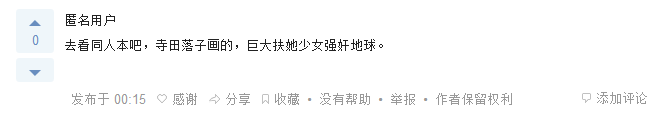

# 知乎／诶，难道有巨大娘的隐藏属性的比想象的多？

作者：不笑猫

TID：21270

<title>1</title> <link href="../Styles/Style.css" type="text/css" rel="stylesheet">

# 1

*本帖最後由 Dibdabdu 於 2016-6-24 04:50 編輯*

求赞美歌颂战争的动漫作品？
zhihu.com/question/34675864
OMG，勇士。
怎么说讷，各位有在公共场合说这个的胆量吗？
额，反正我没有，会被当作变态的……
<ignore_js_op>

**HHH.png** *(2.92 KB, 下載次數: 0)*

[下載附件](forum.php?mod=attachment&aid=NjE4NzR8YTlkODIwOWZ8MTY3NDA2Nzc2MXwxODIzMHwyMTI3MA%3D%3D&nothumb=yes)

2016-6-24 04:29 上傳

<title>2</title> <link href="../Styles/Style.css" type="text/css" rel="stylesheet">

# 2

其實這種東西就只是大圈子裡的一小個範圍而已
沒什麼好驚訝的
就像是有人喜歡看獵奇作
但是不喜歡的人聽到了也不會驚訝 <title>3</title> <link href="../Styles/Style.css" type="text/css" rel="stylesheet">

# 3

我们现实中向往和平,反对战争,但在虚拟世界是可以放纵一下的 <title>4</title> <link href="../Styles/Style.css" type="text/css" rel="stylesheet">

# 4

比起猎奇向的东西，巨大娘已经显得很普通了。 <title>5</title> <link href="../Styles/Style.css" type="text/css" rel="stylesheet">

# 5

这东西其实挺普通了... <title>6</title> <link href="../Styles/Style.css" type="text/css" rel="stylesheet">

# 6

我怎么没看到和巨大有关的话题，全是战争动漫什么的 <title>7</title> <link href="../Styles/Style.css" type="text/css" rel="stylesheet">

# 7

一开始进来的时候还以为有资源了呢。。。不过流弊，勇气可嘉。 <title>8</title> <link href="../Styles/Style.css" type="text/css" rel="stylesheet">

# 8

就像是有人喜歡看獵奇作.. <title>9</title> <link href="../Styles/Style.css" type="text/css" rel="stylesheet">

# 9

。。。胆量不胆量先不说，这答案答非所问啊。。。强行传教 <title>10</title> <link href="../Styles/Style.css" type="text/css" rel="stylesheet">

# 10

就是有這樣的人，人們也有不同的興趣 <title>11</title> <link href="../Styles/Style.css" type="text/css" rel="stylesheet">

# 11

即使是喜欢猎奇的人不一定会接受巨大娘，还是不要吸引火力好羞耻 <title>12</title> <link href="../Styles/Style.css" type="text/css" rel="stylesheet">

# 12

强奸地球哈哈哈哈哈哈</ignore_js_op>