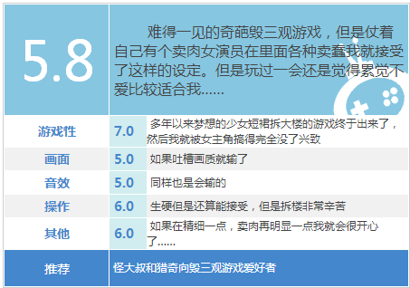

# 竟然在百度上看见gts游戏的新闻！

作者：seaboy1984

TID：15518

<title>1</title> <link href="../Styles/Style.css" type="text/css" rel="stylesheet">

# 1

       今天刚登陆百度，就发现百度有推新闻“女巨人大作战“，惊喜一下~

       然后点进网页，下面就给了游戏的截图，显然游戏内容都是gts的内容，crush，vore之类的都有。

      还有各种评论，比如
     ”重口味好奇葩！《女巨人大作战》满屏粉色舌头“，
     ”女主角在游戏过程中还频频出戏或者憋不住笑场，看来制作过程一定很欢乐。游戏中随处可见向低成本B级片，以及著名电影导演艾德·伍德致敬的痕迹。”
     “游戏本身已经脱离了娱乐的范畴，利用超现实和男女二元对立的手法来解构女权主义。游戏灵感应该源子1993年科幻电影《50英尺高的女人》，是一部脱离了低级趣味的人文主义前卫游戏。游玩过程中请保持欣赏高压艺术作品的心态，体会游戏对现实的反省思考。“

     虽然是以一种新奇的视角来看待这个游戏的，不过也是个好的开始啊。看来gts也渐渐将被被越来越多的接受了~
    回去下这个游戏看看，另外网址就不贴了，百度一下”女巨人大作战“就有~

<title>2</title> <link href="../Styles/Style.css" type="text/css" rel="stylesheet">

# 2

这年头撞车已经不值钱了 <title>3</title> <link href="../Styles/Style.css" type="text/css" rel="stylesheet">

# 3

是啊 但感觉总体评价不算好 <title>4</title> <link href="../Styles/Style.css" type="text/css" rel="stylesheet">

# 4

我都下载了，可惜不知道怎么运行，话说下载的好慢 <title>5</title> <link href="../Styles/Style.css" type="text/css" rel="stylesheet">

# 5

太奇葩不敢下= =
<title>6</title> <link href="../Styles/Style.css" type="text/css" rel="stylesheet">

# 6

已经不知道多少次看见关于这游戏的帖子了 <title>7</title> <link href="../Styles/Style.css" type="text/css" rel="stylesheet">

# 7

。。。我觉得编者只是调侃一下。。。毕竟制作有点粗糙。。。
还有我也是在这个网站知道的(′▽`〃) <title>8</title> <link href="../Styles/Style.css" type="text/css" rel="stylesheet">

# 8

 百度就是收钱办事啊= =广告费塞够了而已...评论也是水军吧 <title>9</title> <link href="../Styles/Style.css" type="text/css" rel="stylesheet">

# 9

<ignore_js_op>

**搜狗截图13年11月04日2232_1.png** *(31.8 KB, 下載次數: 0)*

[下載附件](forum.php?mod=attachment&aid=Mzc0NjR8ZGRiMzQwNTd8MTY3NDA2ODQ2MnwxODIzMHwxNTUxOA%3D%3D&nothumb=yes)

2013-11-4 22:37 上傳

网上的评价也比较欢乐....不过厂长是怎么找到这游戏的...
<title>10</title> <link href="../Styles/Style.css" type="text/css" rel="stylesheet">

# 10

连厂长都嘲讽模式全开了的说，管他呢_(:3) < )_ <title>11</title> <link href="../Styles/Style.css" type="text/css" rel="stylesheet">

# 11

gts逐渐进入大众视线了 <title>12</title> <link href="../Styles/Style.css" type="text/css" rel="stylesheet">

# 12

主要是那个解说员在游戏视频界比较出名   。。。 <title>13</title> <link href="../Styles/Style.css" type="text/css" rel="stylesheet">

# 13

其实他们都是站在一般游戏的角度来评论的，那个敖厂长也好，百度上的评论也罢。这个是media impact films出品的，风格还是和他们的视频挺一致的。不过就是尺寸太小了，不太喜欢。 <title>14</title> <link href="../Styles/Style.css" type="text/css" rel="stylesheet">

# 14

厂长嘲讽的也不够好啊... 基本上噪点太多不知道吐槽哪里好了..... <title>15</title> <link href="../Styles/Style.css" type="text/css" rel="stylesheet">

# 15

在下就是在B站看了廠長吐槽此遊戲，幾經百度才剛剛瞭解到GTS文化的。</ignore_js_op>