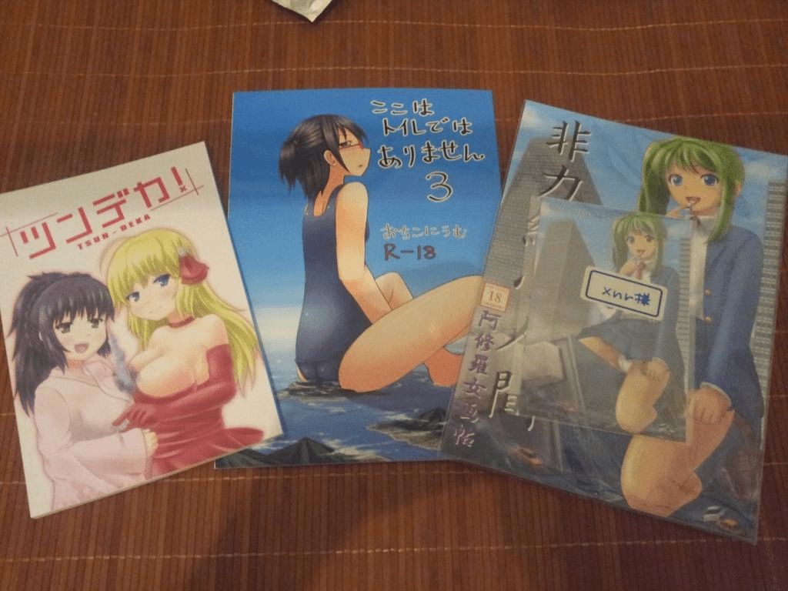

# 第一个拿到本子了

作者：上官傲雪

TID：13081

<title>1</title> <link href="../Styles/Style.css" type="text/css" rel="stylesheet">

# 1

今天非常开心，终于收到C82的本子了！而且抢得了头香！

非常感谢寺田落子和日本朋友的帮助！还写上我的名字，帮我保留了本子。

<ignore_js_op>

**20120816_190239.jpg** *(86.9 KB, 下載次數: 0)*

[下載附件](forum.php?mod=attachment&aid=MzAzMTh8MjNjNGQyNzh8MTY3NDA2ODU5MXwxODIzMHwxMzA4MQ%3D%3D&nothumb=yes)

2012-8-16 19:24 上傳

实体本的印刷材质非常好呢！内容就不多说了，狂喜中。。。总之，自己的努力没有白费！

在此XNR获得以下成就：

1\. 第一个拿到C82本子的华人同好（没去日本）。

2\. 用最经济的方式得到本子（三本加邮费也就200元人民币）。

3\. 第一个跟日本GTS同好合作的华人（所以寺田那本免费送我的）。

4\. 开启了进一步合作的大门，非常期待下一次合作机会呢！

[ *本帖最後由 xnr 於 2012-8-16 19:31 編輯* ] <title>2</title> <link href="../Styles/Style.css" type="text/css" rel="stylesheet">

# 2

哦哦哦，不错不错
可惜我没有日本朋友= =
叹息 <title>3</title> <link href="../Styles/Style.css" type="text/css" rel="stylesheet">

# 3

> 原帖由 *yudish* 於 2012-8-16 19:34 發表 
> 哦哦哦，不错不错
> 可惜我没有日本朋友= =
> 叹息

只要努力创作，就能交往到圈内朋友的，不管是日本还是哪里，真的！ <title>4</title> <link href="../Styles/Style.css" type="text/css" rel="stylesheet">

# 4

 恭喜楼主哦，期待楼主与日本GTS界进一步交流。 <title>5</title> <link href="../Styles/Style.css" type="text/css" rel="stylesheet">

# 5

恭喜阿! 
你太專業了! 真好! <title>6</title> <link href="../Styles/Style.css" type="text/css" rel="stylesheet">

# 6

这便是赤果果的叫人去打劫嘛w <title>7</title> <link href="../Styles/Style.css" type="text/css" rel="stylesheet">

# 7

XNR大大求本子网购。。。。。就是和寺田合作的那本  <title>8</title> <link href="../Styles/Style.css" type="text/css" rel="stylesheet">

# 8

没钱的时候不会买。。现在有钱了。。。照样不会买。。。。 <title>9</title> <link href="../Styles/Style.css" type="text/css" rel="stylesheet">

# 9

恭喜~華人的榮耀(?)
不過一般人也買不到就是了T^T <title>10</title> <link href="../Styles/Style.css" type="text/css" rel="stylesheet">

# 10

   貌似不是第一个 前几天见人发来这 难道那人不是华人？ <title>11</title> <link href="../Styles/Style.css" type="text/css" rel="stylesheet">

# 11

真是有点贵啊 <title>12</title> <link href="../Styles/Style.css" type="text/css" rel="stylesheet">

# 12

在下在書店裏邊轉悠時在想：
書店裏邊現在“各種各樣”的出版物似乎都可以借由“某音響出版社的附贈”形式把類似於畫冊的東西賣出呢~
“什麼時候能夠看見華人同好的作品實體化就好了！”
期待~
嗯——
日本國那邊這些產業既完備又發達呢！ <title>13</title> <link href="../Styles/Style.css" type="text/css" rel="stylesheet">

# 13

买不到·····买不到···········怨念···············</ignore_js_op>