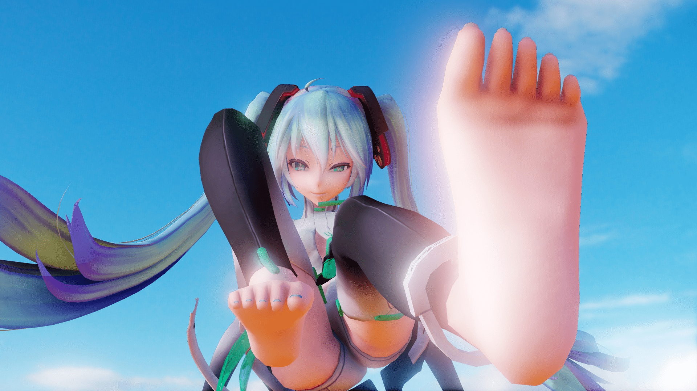
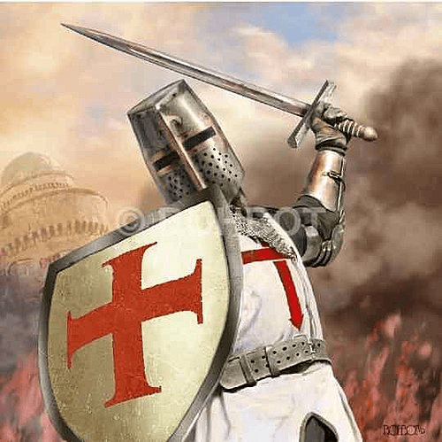

# 組隊開坑的可行性？

作者：ckw

TID：23554

<title>1</title> <link href="../Styles/Style.css" type="text/css" rel="stylesheet">

# 1

最近想到了一個故事，已經有著初步的大綱，只是從各方面來說我不覺我自己能夠成文，腦內總是預想很碎片卻沒有組織性。
而且我不是好筆墨的技巧之人，好比之前的坑其實寫到了6，但越寫越絕望，沒法將所想以筆墨釋出般的混亂。

到前些日子看到了某某在說有想法但不成文，便有了組團（拉人入坑）的想法
組團……也許行，也許不行，畢竟同波長的人是可遇不可求，拋出的故事沒有吸引力亦是問題。
~~大體上我不覺得可行。~~

在最後，揭示一下我想到的故事

> TYPE １
> 
> 一天，突如其來得到了變成GTS和一種能力
> 伴隨成長GTS對自身能力的帶來優勢產生了野心，可以君臨天下。
> 然而，由於不斷的成長，GTS們愈來愈巨大，愈來愈難以隱藏下來的身高提高了所有GTS的接觸機率，眾多GTS意識到不止有自己是GTS。漸漸地，GTS感到了來自別GTS的壓力，亦因一山不能收藏二虎的野心，GTS開始了爭鬥。
> 
> 這一系用美劇的手法，開局用不同人的視角作起點，以1-3章作一個角色單元，然後慢慢朝向一個目標並淘汰弱者，最後回收伏筆。

> TYPE ２
> 
> 背景是劍與魔法異世界
> 文明大致是工業革命程度，處於中古和近現交替之間
> 有著GTS獨菜的君主政體國，以及多數小人掌控民主制政體國。
> 
> GTS的地位是霸權、力量的象徵，雙方都有大量GTS，最大體積與能力成正比。但是GTS存在巨大化後會分泌母乳並累積的負擔~~（強行設定）~~
> 雙方一律進行超巨大GTS育成~~（Growth屬性是必需）~~，類似冷戰時期不停升級軍火技的戰略威脅。
> 小人國的GTS育成比較多花式，吃藥打針等等外力方法，亦能令不是GTS也能變成GTS，但欠點是維持力是短暫性，人工GTS。
> 
> 女主角由現穿越到GTS獨菜國
> 以一身異世界人的頂級體質一路快速升級，由MiniGTS一路升級成最終的星體球GTS
> 掌握著隔壁世界的民主核心吊打落後文明，引領小人推翻GTS獨菜（這是假的）

在最後的最後，有一張圖。圖片內容……自行腦補
<ignore_js_op>

**0725b.jpg** *(304.17 KB, 下載次數: 0)*

[下載附件](forum.php?mod=attachment&aid=Njg5NjN8NWI2OTcyZDZ8MTY3NDA2NzQ3MHwxODIzMHwyMzU1NA%3D%3D&nothumb=yes)

2017-7-27 20:34 上傳

<title>2</title> <link href="../Styles/Style.css" type="text/css" rel="stylesheet">

# 2

組團?是指多人合傳嗎?
我覺得可能性可能比較低
畢竟對於創作來說
自己的作品就像騷自己養
永遠搔不到癢處
才會變得愛看別人的
卻難跟自己的東西共鳴
明明覺得自己的作品沒什麼
別人卻不停地叫好這種落差感 <title>3</title> <link href="../Styles/Style.css" type="text/css" rel="stylesheet">

# 3

> [starcraftorz 發表於 2017-7-27 21:26](https://giantessnight.cf/gnforum2012/forum.php?mod=redirect&goto=findpost&pid=341684&ptid=23554)
> 組團?是指多人合傳嗎?
> 我覺得可能性可能比較低
> 畢竟對於創作來說

比喻的非常贴切啊，我不知道其他作者的写作目的是否和我一样。我是因为很难找到对胃口的文，即触到G点的文，所以才自己去写文的，更多的目的在于宣泄自己内心的想法（欲望！？）
组团开坑的情况出现除非是有多个写文倾向或是想法很接近的人存在才有可能，但是这应该很难才对。例如都是恋足的也有是否控气味或是是否控丝袜的差别，可能考虑接龙会实际点。。。
<title>4</title> <link href="../Styles/Style.css" type="text/css" rel="stylesheet">

# 4

> [wqr 發表於 2017-7-27 21:40](https://giantessnight.cf/gnforum2012/forum.php?mod=redirect&goto=findpost&pid=341685&ptid=23554)
> 比喻的非常贴切啊，我不知道其他作者的写作目的是否和我一样。我是因为很难找到对胃口的文，即触到G点的 ...

從一開始我也覺得不可能。
但是我發了本帖，顯然我心中覺得有一丟丟可能性。

雖然即使同波長也會有落差，但這分差異可以是多樣性的好發展。
但即使組了，我不覺得會一帆風順，雙方的差異性與分歧，好比甜豆腐腦和咸豆腐腦之爭，這個情況只有讓步才會獲得多樣性和共贏，顯然是困難的。
<title>5</title> <link href="../Styles/Style.css" type="text/css" rel="stylesheet">

# 5

接龙的形式再找个人修文是最好的，每个人的叙事手法都不同很凑成段子挺麻烦…… <title>6</title> <link href="../Styles/Style.css" type="text/css" rel="stylesheet">

# 6

A:你喜歡GTS嗎?
B:當然喜歡.這是我人生的全部.
A:那我們一起來寫篇GTS文吧
B:真是個好主意
A:那首先倍率就一千倍.主打乳PLAY
B:果然還是要星球級加足交才帶感啊
A+B:.....O你娘的.開戰啦!!!
<ignore_js_op>

**453173303_m.jpg** *(55.32 KB, 下載次數: 0)*

[下載附件](forum.php?mod=attachment&aid=Njg5NjR8OGIzMTU3Yjh8MTY3NDA2NzQ3MHwxODIzMHwyMzU1NA%3D%3D&nothumb=yes)

2017-7-27 22:46 上傳

有種莫名的即視感w

<title>7</title> <link href="../Styles/Style.css" type="text/css" rel="stylesheet">

# 7

回樓上，宗教戰爭就是這樣開打的(有請卡車來專業分析一下 <title>8</title> <link href="../Styles/Style.css" type="text/css" rel="stylesheet">

# 8

> [葬儀社 發表於 2017-7-27 22:49](https://giantessnight.cf/gnforum2012/forum.php?mod=redirect&goto=findpost&pid=341699&ptid=23554)
> A:你喜歡GTS嗎?
> B:當然喜歡.這是我人生的全部.
> A:那我們一起來寫篇GTS文吧

所以才說有甜豆腐腦和咸豆腐腦之爭的伏筆wwww

C：（1千倍乳PLAY後接著巨大化成星體級加足交不就行了？）

<title>9</title> <link href="../Styles/Style.css" type="text/css" rel="stylesheet">

# 9

> [ckw 發表於 2017-7-27 22:58](https://giantessnight.cf/gnforum2012/forum.php?mod=redirect&goto=findpost&pid=341703&ptid=23554)
> 所以才說有甜豆腐腦和咸豆腐腦之爭的伏筆wwww

这种情况只能考虑多重大小，但是性转排泄甚至乱伦这些极端属性可能就不好处理了呀
<title>10</title> <link href="../Styles/Style.css" type="text/css" rel="stylesheet">

# 10

> [wqr 發表於 2017-7-28 00:20](https://giantessnight.cf/gnforum2012/forum.php?mod=redirect&goto=findpost&pid=341712&ptid=23554)
> 这种情况只能考虑多重大小，但是性转排泄甚至乱伦这些极端属性可能就不好处理了呀
> ...

解決之法總會有，取決於當事雙方有沒有尊重包容~~閣置爭議共同開發~~的打算。
不過既然是合伙，由加入一刻本就有禮讓、理智、不破壞不極端的共同開發心態才會合伙。

如果是接龍，接龍每個參與者自出自入的個人風氣旺盛的地方，無需事前知會他人與協力研究。一個人寫出了甚麼登了甚麼便是事實。比如把上一手埋下的伏筆又誰去解結？可能是隨便寫的單純坐等下一手回收伏筆。

<title>11</title> <link href="../Styles/Style.css" type="text/css" rel="stylesheet">

# 11

每个人有每个人对文章的看法，有点不可行吧，会写写就偏离了原来的发展的，只是个人看法 <title>12</title> <link href="../Styles/Style.css" type="text/css" rel="stylesheet">

# 12

突然想到了贴吧里那个小女孩的游戏。。。 <title>13</title> <link href="../Styles/Style.css" type="text/css" rel="stylesheet">

# 13

感觉接龙文最后都会因为参与者口味分歧太大而混乱。。。 <title>14</title> <link href="../Styles/Style.css" type="text/css" rel="stylesheet">

# 14

最近有写文的打算 无奈自己文笔超差</ignore_js_op></ignore_js_op>