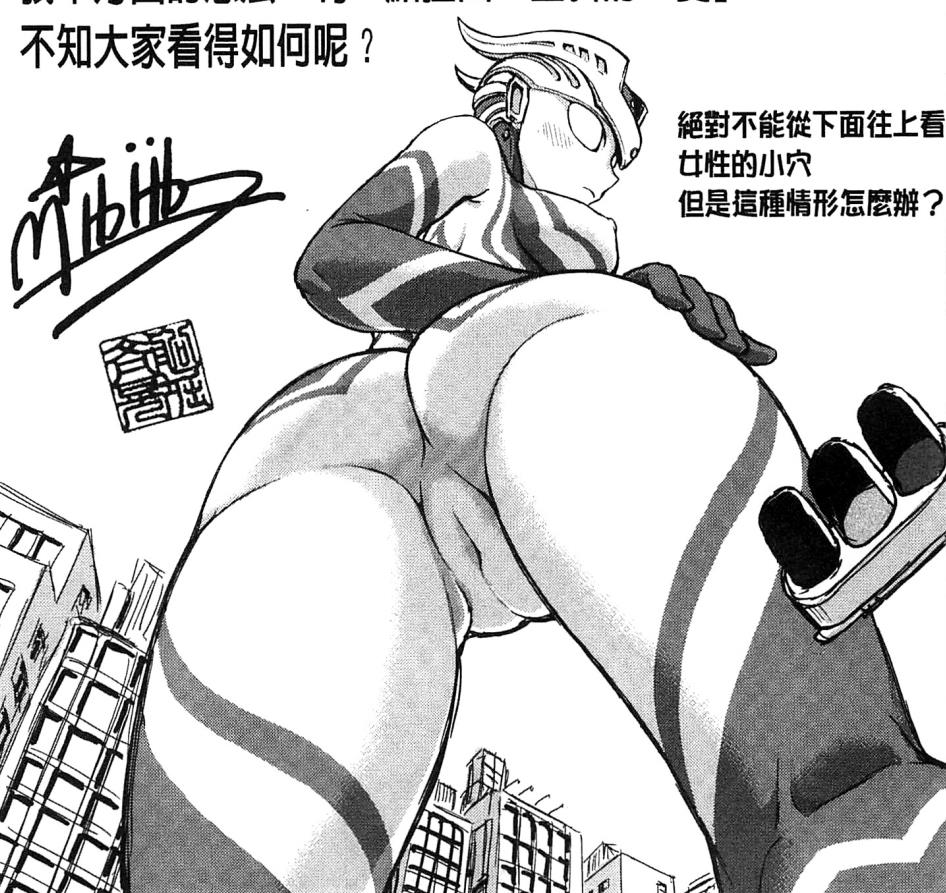

# 絕對不能從下面往上看女性的膣屄

作者：dandsn

TID：19597

<title>1</title> <link href="../Styles/Style.css" type="text/css" rel="stylesheet">

# 1

這種情況怎麼辦
開心嗎
如果有汁流下來就更開心了吧
<ignore_js_op>

**29571.jpg** *(167.9 KB, 下載次數: 2)*

[下載附件](forum.php?mod=attachment&aid=NTM3MDJ8ZDJhYjlhMWJ8MTY3NDA2NzUwOHwxODIzMHwxOTU5Nw%3D%3D&nothumb=yes)

2015-8-7 09:22 上傳

<title>2</title> <link href="../Styles/Style.css" type="text/css" rel="stylesheet">

# 2

预想到肯定会有人求出处的
出处是[船堀斉晃] 歪み拗らせ愛 [中国翻訳]的后记页面
可以在e-hentai和exhentai搜索到 <title>3</title> <link href="../Styles/Style.css" type="text/css" rel="stylesheet">

# 3

我是挺在意奥特曼有没有那个的 <title>4</title> <link href="../Styles/Style.css" type="text/css" rel="stylesheet">

# 4

跟楼上一样，同在意奥特曼有没有那个，如果只是单方面的话不是没有意义了吗。 <title>5</title> <link href="../Styles/Style.css" type="text/css" rel="stylesheet">

# 5

奥特曼怎么可能没有，只是被皮套包住了 <title>6</title> <link href="../Styles/Style.css" type="text/css" rel="stylesheet">

# 6

小的时候就一直在想的问题。。。。。 <title>7</title> <link href="../Styles/Style.css" type="text/css" rel="stylesheet">

# 7

图上是零兔子的妹妹吗？ <title>8</title> <link href="../Styles/Style.css" type="text/css" rel="stylesheet">

# 8

为毛要是奥特曼呢。。。。 <title>9</title> <link href="../Styles/Style.css" type="text/css" rel="stylesheet">

# 9

奥特曼真是逗，总是有神回复 <title>10</title> <link href="../Styles/Style.css" type="text/css" rel="stylesheet">

# 10

为毛要是奥特曼啊。 <title>11</title> <link href="../Styles/Style.css" type="text/css" rel="stylesheet">

# 11

为什么是奥特曼，还是个女的~脑洞 <title>12</title> <link href="../Styles/Style.css" type="text/css" rel="stylesheet">

# 12

怪兽如果有~奥特曼就必须有~不能输怪兽~ <title>13</title> <link href="../Styles/Style.css" type="text/css" rel="stylesheet">

# 13

小时候太纯洁完全没想过这个方面
今天看到才蓦然想起 奥特曼 这个概念
如果真的是这样的话 奥特曼不就不只是光之使者还是福利使者了吗 <title>14</title> <link href="../Styles/Style.css" type="text/css" rel="stylesheet">

# 14

喂喂喂，你这样不好吧，太邪恶了啊 <title>15</title> <link href="../Styles/Style.css" type="text/css" rel="stylesheet">

# 15

喂喂喂，你这样不好吧，太邪恶了啊 <title>16</title> <link href="../Styles/Style.css" type="text/css" rel="stylesheet">

# 16

奥特曼只给三分钟的时间，不够看的 <title>17</title> <link href="../Styles/Style.css" type="text/css" rel="stylesheet">

# 17

請不要把奧特曼想的太猥瑣好嗎?TAT童年阿 <title>18</title> <link href="../Styles/Style.css" type="text/css" rel="stylesheet">

# 18

小时候在意的是奥特曼为什么没有小丁丁 <title>19</title> <link href="../Styles/Style.css" type="text/css" rel="stylesheet">

# 19

那就要看你待在的位置在哪里了 <title>20</title> <link href="../Styles/Style.css" type="text/css" rel="stylesheet">

# 20

*本帖最後由 whrlovexm 於 2016-3-28 11:05 編輯*

凹凸曼，还好图长，我只用看下体就行了 <title>21</title> <link href="../Styles/Style.css" type="text/css" rel="stylesheet">

# 21

默默地把这个凹凸曼想象成自己女神的样子 <title>22</title> <link href="../Styles/Style.css" type="text/css" rel="stylesheet">

# 22

刚刚从youtue看到了一个奥特曼的                      <title>23</title> <link href="../Styles/Style.css" type="text/css" rel="stylesheet">

# 23

这奥特曼把我吓得，不行不行了！ <title>24</title> <link href="../Styles/Style.css" type="text/css" rel="stylesheet">

# 24

居然，居然，居然是奥特曼 <title>25</title> <link href="../Styles/Style.css" type="text/css" rel="stylesheet">

# 25

凹凸曼是什么鬼啦 <title>26</title> <link href="../Styles/Style.css" type="text/css" rel="stylesheet">

# 26

现实生活中，会有这种情况咩，， <title>27</title> <link href="../Styles/Style.css" type="text/css" rel="stylesheet">

# 27

不看头就很爽 凹凸曼也不错的样子 <title>28</title> <link href="../Styles/Style.css" type="text/css" rel="stylesheet">

# 28

像是赛兔子的娘化版啊 <title>29</title> <link href="../Styles/Style.css" type="text/css" rel="stylesheet">

# 29

讲道理，小时候一直以为奥特曼应该是没有男女之分的 <title>30</title> <link href="../Styles/Style.css" type="text/css" rel="stylesheet">

# 30

其实奥特曼别有一番滋味的(｀Д´*)逃 <title>31</title> <link href="../Styles/Style.css" type="text/css" rel="stylesheet">

# 31

这也可以么....不过跟题目没什么关系吧 <title>32</title> <link href="../Styles/Style.css" type="text/css" rel="stylesheet">

# 32

我发一句话就是一个标准的15字 <title>33</title> <link href="../Styles/Style.css" type="text/css" rel="stylesheet">

# 33

怎么是奥特曼呢

=== <title>34</title> <link href="../Styles/Style.css" type="text/css" rel="stylesheet">

# 34

然而男奥特曼并没有那个</ignore_js_op>