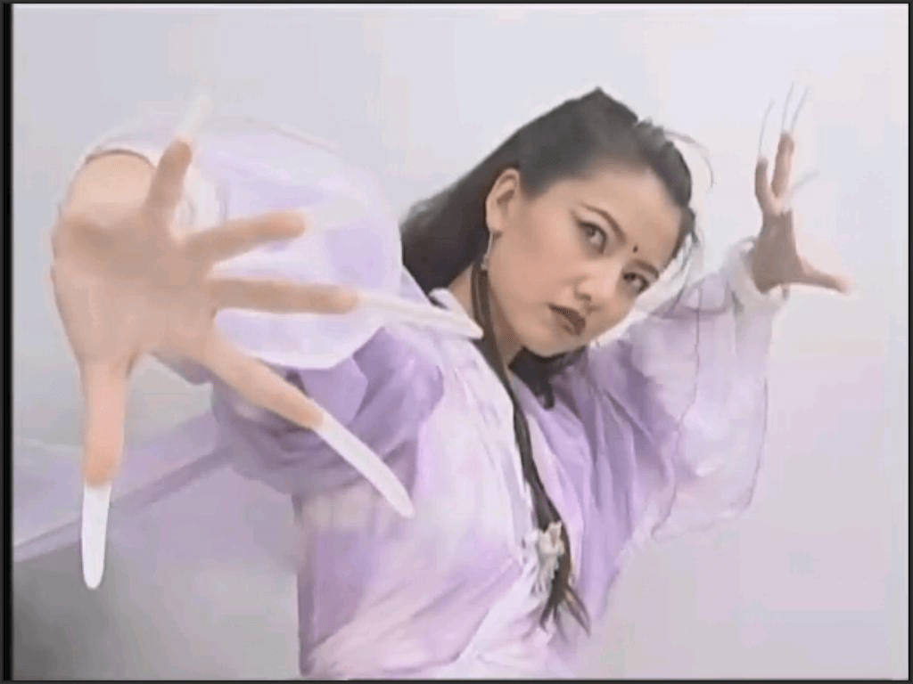
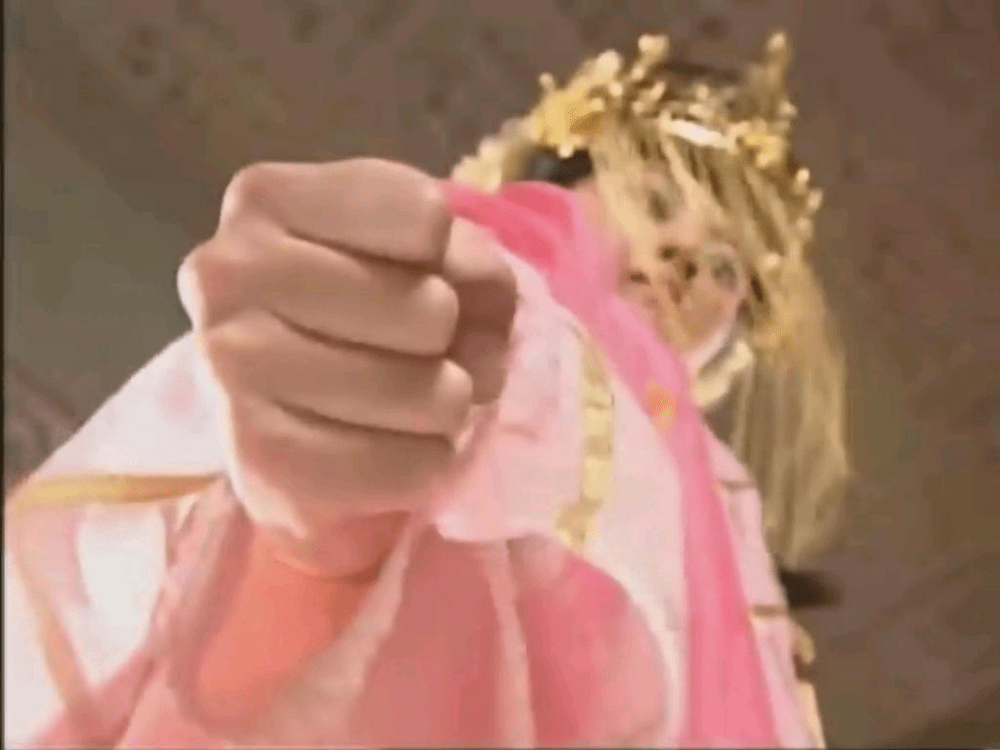

# 繼續上次的= =

作者：gn02340348

TID：6564

<title>1</title> <link href="../Styles/Style.css" type="text/css" rel="stylesheet">

# 1

這幾天我又抓了幾張
都是倚天屠龍記的
36必看阿= =...
看她捏珠子的橋段..真想被她捏死= =

[ *本帖最後由 gn02340348 於 2010-2-6 20:17 編輯* ] <title>2</title> <link href="../Styles/Style.css" type="text/css" rel="stylesheet">

# 2

 <ignore_js_op>[賈靜雯手2.JPG](forum.php?mod=attachment&aid=MTcwNjF8YmY4YzZiMTZ8MTY3NDA3MDQ5NXwxODIzMHw2NTY0&nothumb=yes) *(45.26 KB, 下載次數: 8)*

[下載附件](forum.php?mod=attachment&aid=MTcwNjF8YmY4YzZiMTZ8MTY3NDA3MDQ5NXwxODIzMHw2NTY0&nothumb=yes)

2010-2-6 20:15 上傳  

</ignore_js_op> <ignore_js_op>[賈靜雯手3.JPG](forum.php?mod=attachment&aid=MTcwNjJ8NWZiMTQ2MzZ8MTY3NDA3MDQ5NXwxODIzMHw2NTY0&nothumb=yes) *(44.87 KB, 下載次數: 2)*

[下載附件](forum.php?mod=attachment&aid=MTcwNjJ8NWZiMTQ2MzZ8MTY3NDA3MDQ5NXwxODIzMHw2NTY0&nothumb=yes)

2010-2-6 20:15 上傳  

</ignore_js_op> <ignore_js_op>[賈靜雯手.JPG](forum.php?mod=attachment&aid=MTcwNjN8OTBmZTI0NWR8MTY3NDA3MDQ5NXwxODIzMHw2NTY0&nothumb=yes) *(44.11 KB, 下載次數: 2)*

[下載附件](forum.php?mod=attachment&aid=MTcwNjN8OTBmZTI0NWR8MTY3NDA3MDQ5NXwxODIzMHw2NTY0&nothumb=yes)

2010-2-6 20:15 上傳  

</ignore_js_op> <ignore_js_op>[手3.JPG](forum.php?mod=attachment&aid=MTcwNjR8Y2Q5Y2I3NzF8MTY3NDA3MDQ5NXwxODIzMHw2NTY0&nothumb=yes) *(47.17 KB, 下載次數: 0)*

[下載附件](forum.php?mod=attachment&aid=MTcwNjR8Y2Q5Y2I3NzF8MTY3NDA3MDQ5NXwxODIzMHw2NTY0&nothumb=yes)

2010-2-6 20:15 上傳  

</ignore_js_op> <ignore_js_op>[36手2.JPG](forum.php?mod=attachment&aid=MTcwNjV8N2Q2MmU4NzZ8MTY3NDA3MDQ5NXwxODIzMHw2NTY0&nothumb=yes) *(44.06 KB, 下載次數: 0)*

[下載附件](forum.php?mod=attachment&aid=MTcwNjV8N2Q2MmU4NzZ8MTY3NDA3MDQ5NXwxODIzMHw2NTY0&nothumb=yes)

2010-2-6 20:15 上傳  

</ignore_js_op> <title>3</title> <link href="../Styles/Style.css" type="text/css" rel="stylesheet">

# 3

沙发
 没怎么呀 <title>4</title> <link href="../Styles/Style.css" type="text/css" rel="stylesheet">

# 4

據分析,幻想成份有99% <title>5</title> <link href="../Styles/Style.css" type="text/css" rel="stylesheet">

# 5

GTS的本意不就是幻想嘛= =... <title>6</title> <link href="../Styles/Style.css" type="text/css" rel="stylesheet">

# 6

要大家的幻想都朝同一個方向走的話,需要的是共鳴......
(這個帖子貌似沒有...) <title>7</title> <link href="../Styles/Style.css" type="text/css" rel="stylesheet">

# 7

恋手的我站出来顶一个。。。其实我现在的感觉可能跟恋足的同好差不多。。。 <title>8</title> <link href="../Styles/Style.css" type="text/css" rel="stylesheet">

# 8

我在踩踏區有發一個腳的= =...
可以去看看...
不過阿 像我本身是從喜歡手 跟 腳 開始進化成GTS吧(應該吧..)
不知道各位是怎樣= = <title>9</title> <link href="../Styles/Style.css" type="text/css" rel="stylesheet">

# 9

> 原帖由 *killer9999* 於 2010-2-6 21:28 發表 
> 要大家的幻想都朝同一個方向走的話,需要的是共鳴......
> (這個帖子貌似沒有...)

順便請教一下...
共鳴..說的是哪方面呢??
因為我是覺得大家都是這圈子的人，
應該都是有相同思考的。
就算不一樣，相差應該也不大。
像是我看到女生的手或者腳的特寫，就會去幻想= =... <title>10</title> <link href="../Styles/Style.css" type="text/css" rel="stylesheet">

# 10

GTS都有不同分支的,就像是科學也有不同分支一樣
戀足,mini系,超級系,等等
這方面的相差可以很大 <title>11</title> <link href="../Styles/Style.css" type="text/css" rel="stylesheet">

# 11

楼主太会幻想了