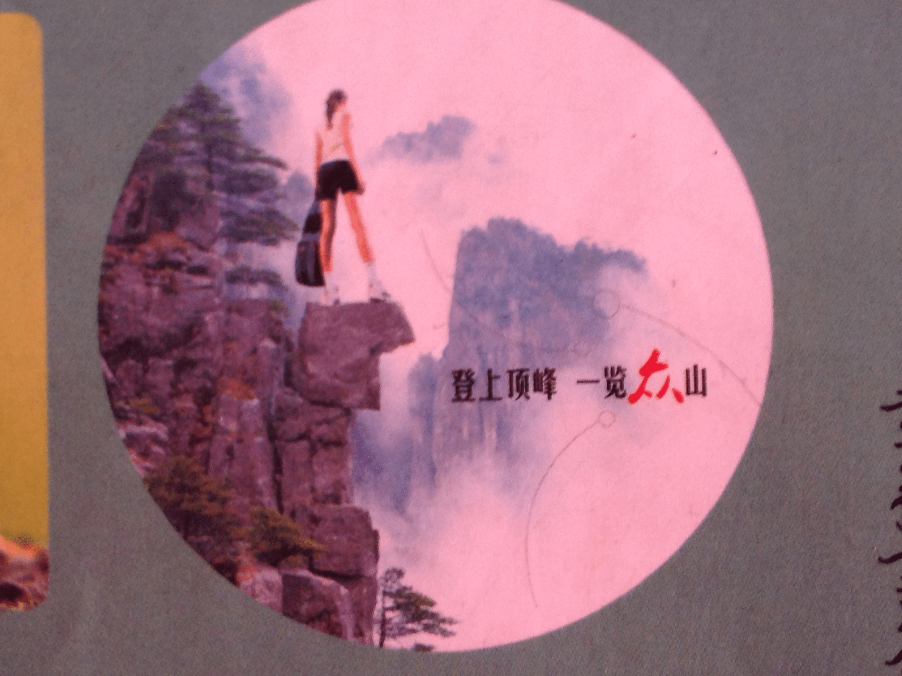

# 练习册上都有擦边球

作者：4545

TID：13935

<title>1</title> <link href="../Styles/Style.css" type="text/css" rel="stylesheet">

# 1

某个sx（傻…)级p图手把一个女孩p的像松树一样高…… <title>2</title> <link href="../Styles/Style.css" type="text/css" rel="stylesheet">

# 2

无图无真相 <title>3</title> <link href="../Styles/Style.css" type="text/css" rel="stylesheet">

# 3

难道是走向高考？ 我高三的时候也有用这练习册啊 <title>4</title> <link href="../Styles/Style.css" type="text/css" rel="stylesheet">

# 4

求图片

无图无真相

果然天朝就是无所不容么 <title>5</title> <link href="../Styles/Style.css" type="text/css" rel="stylesheet">

# 5

不知道啊！！练习册是什么东西？至少十年没听过这名字了吧！！ <title>6</title> <link href="../Styles/Style.css" type="text/css" rel="stylesheet">

# 6

什么啊、能贴个图么 <title>7</title> <link href="../Styles/Style.css" type="text/css" rel="stylesheet">

# 7

> dyf1800 發表於 2013-2-3 11:50 
> 难道是走向高考？ 我高三的时候也有用这练习册啊

登上顶峰一览众山？是吧？ <title>8</title> <link href="../Styles/Style.css" type="text/css" rel="stylesheet">

# 8

暂时没图，不过开学一段时间会上的（没把练习册拿回家） <title>9</title> <link href="../Styles/Style.css" type="text/css" rel="stylesheet">

# 9

> 445566 發表於 2013-2-4 11:47 
> 登上顶峰一览众山？是吧？

就是那个图了！ 有种无力吐槽的感觉。
<title>10</title> <link href="../Styles/Style.css" type="text/css" rel="stylesheet">

# 10

 <ignore_js_op>[IMG_2376.JPG](forum.php?mod=attachment&aid=MzI5NTd8MzMyZWNmYzF8MTY3NDA2ODU0MXwxODIzMHwxMzkzNQ%3D%3D&nothumb=yes) *(1.4 MB, 下載次數: 2)*

[下載附件](forum.php?mod=attachment&aid=MzI5NTd8MzMyZWNmYzF8MTY3NDA2ODU0MXwxODIzMHwxMzkzNQ%3D%3D&nothumb=yes)

2013-2-4 12:13 上傳  

</ignore_js_op> <title>11</title> <link href="../Styles/Style.css" type="text/css" rel="stylesheet">

# 11

由西，就是他
<title>12</title> <link href="../Styles/Style.css" type="text/css" rel="stylesheet">

# 12

我现在正在做这本书！！！ <title>13</title> <link href="../Styles/Style.css" type="text/css" rel="stylesheet">

# 13

话说这图是否有感觉 <title>14</title> <link href="../Styles/Style.css" type="text/css" rel="stylesheet">

# 14

我们的作业上也有的说……