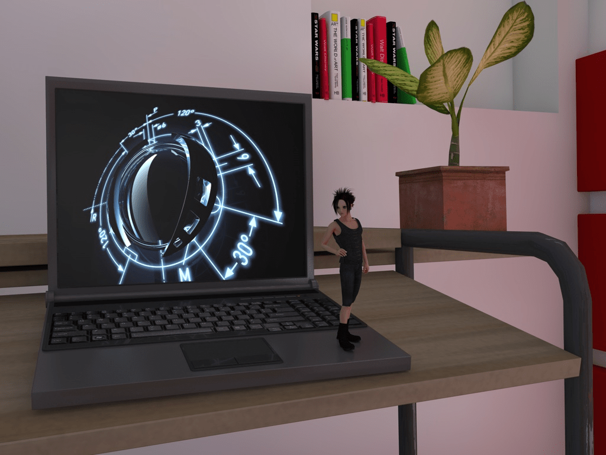

# 经布光改进渲染时间缩短至5分钟，哦也

作者：awkeygen

TID：6487

<title>1</title> <link href="../Styles/Style.css" type="text/css" rel="stylesheet">

# 1

**只加了一个人物 不开全局照明还可以 开了全局照明以后渲染速度着实令人崩溃 3D制作步履维艰啊。。。。7" />7" />**
<ignore_js_op>

**Red and White Room.jpg** *(152.58 KB, 下載次數: 0)*

[下載附件](forum.php?mod=attachment&aid=MTY4OTV8YTUzNTQ2MmJ8MTY3NDA2ODk1MHwxODIzMHw2NDg3&nothumb=yes)

2010-1-30 23:01 上傳

改善了布光方式，速度大幅度提升，减少至5分钟
<ignore_js_op>

**01.jpg** *(127.4 KB, 下載次數: 0)*

[下載附件](forum.php?mod=attachment&aid=MTY5MjZ8MzRiZjEyOWV8MTY3NDA2ODk1MHwxODIzMHw2NDg3&nothumb=yes)

2010-1-31 20:16 上傳

[ *本帖最後由 awkeygen 於 2010-1-31 20:19 編輯* ] <title>2</title> <link href="../Styles/Style.css" type="text/css" rel="stylesheet">

# 2

藝術成份不錯,至少看不出是GTS圖 <title>3</title> <link href="../Styles/Style.css" type="text/css" rel="stylesheet">

# 3

目前没打算做呢 只是试试效果。。。估计再加个美女得渲染1小时。。。 <title>4</title> <link href="../Styles/Style.css" type="text/css" rel="stylesheet">

# 4

這一小時絕對花得值得,值得... <title>5</title> <link href="../Styles/Style.css" type="text/css" rel="stylesheet">

# 5

这构图让我想起这个游戏
<ignore_js_op>

**未命名.JPG** *(41.75 KB, 下載次數: 0)*

[下載附件](forum.php?mod=attachment&aid=MTY4OTZ8YjA4NzQ5Yzh8MTY3NDA2ODk1MHwxODIzMHw2NDg3&nothumb=yes)

2010-1-30 23:10 上傳

<title>6</title> <link href="../Styles/Style.css" type="text/css" rel="stylesheet">

# 6

很不错啊……
一次出一张，只要是精品，也很值啊~~ <title>7</title> <link href="../Styles/Style.css" type="text/css" rel="stylesheet">

# 7

真的要很感謝作圖的作者們
敬禮!( �□�)/    <(�ㄧ� ) <(�ㄧ� ) <(�ㄧ� ) <title>8</title> <link href="../Styles/Style.css" type="text/css" rel="stylesheet">

# 8

漫画渲染需要的时间比较少吗？
其实哪个我都没所谓的…… <title>9</title> <link href="../Styles/Style.css" type="text/css" rel="stylesheet">

# 9

也许更长 应为把3d转为线条还要花费时间 <title>10</title> <link href="../Styles/Style.css" type="text/css" rel="stylesheet">

# 10

我感觉跟电脑配置有关吧 <title>11</title> <link href="../Styles/Style.css" type="text/css" rel="stylesheet">

# 11

我inter双核高端cpu gf9650gt显卡 4g内存。。。。 <title>12</title> <link href="../Styles/Style.css" type="text/css" rel="stylesheet">

# 12

41分........汗 <title>13</title> <link href="../Styles/Style.css" type="text/css" rel="stylesheet">

# 13

目前正在学习制作水花和水雾，还好调整了灯光，大幅度加快了渲染速度，这是以后要用的洗手间
<ignore_js_op>

**01.jpg** *(127.4 KB, 下載次數: 0)*

[下載附件](forum.php?mod=attachment&aid=MTY5Mjd8MDRiMDA5ZjV8MTY3NDA2ODk1NnwxODIzMHw2NDg3&nothumb=yes)

2010-1-31 20:21 上傳

<title>14</title> <link href="../Styles/Style.css" type="text/css" rel="stylesheet">

# 14

请问这用什么软件，，人物那里找的？我下了个什么4D软件，无从下手呀。。 <title>15</title> <link href="../Styles/Style.css" type="text/css" rel="stylesheet">

# 15

用poser建模 然后倒入cinema4d 做室内要开全局照明 周围最好再加一个HDRI  人物材质加自发光（也就是3s）
至于怎么下手 看看c4d的帮助手册
如果你英语不好就不好办了。。。
c4d是世界4大3d软件之一 一定要按部就班地学习 希望你能加入到制作中来 

[ *本帖最後由 awkeygen 於 2010-1-31 20:40 編輯* ]</ignore_js_op></ignore_js_op></ignore_js_op></ignore_js_op>