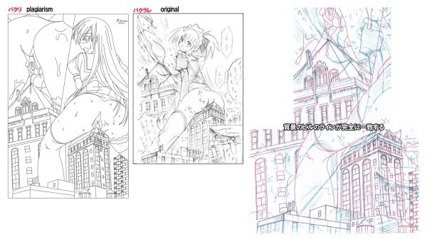

# 绘GTS图时的部分临摹是否侵权及其他的疑问

作者：rce

TID：12531

<title>1</title> <link href="../Styles/Style.css" type="text/css" rel="stylesheet">

# 1

今天在群里看到了如附件所示的图示。
在下也的确承认是plagiarism的部分，但是不知道确切是否在GTS界属于侵权行为，另外在P站发此图的时候（5月27日前后）已经说明了有“建筑偷盗“字样的说明，不知道这样是否是对原作者的不礼貌……

事实上，这是我正式画的第一张gts-H图……所以对于画面整体布局等等真的不是那么熟悉，所以就试验着临摹了部分背景，然后画成了如图所示的图片，虽然我认为在P站发图……抄袭什么的已经不是局部了，只是我目前比较纠结而已，毕竟GTS还算是小众圈子，我不太知道这里面的一些潜规则，现在在苦恼中，想请教一下前辈们的相关经验。

说句自我安慰的话就是，现在很多3D图PS的不都是盗用的别人已画好的东西么……难道是因为这个属于另一范畴所以没多少人管……然后还想请教OB大在哪里发现的此图- -……

以及因为被这样对比与此是否需要我做些什么……
唔姆……所以现在深深的自我厌恶中求指教……
当然，对于非绘画专业的人对建筑的速写……还是需要大量精力投入的，以后我对此当然会做到更加用心的学的……
然后这张图其实是先发在GN后发到P站的，所以关于这种行为是否得当？……
[http://giantessnight.com/gnforum ... &extra=page%3D4](http://giantessnight.com/gnforum/viewthread.php?tid=12196&extra=page%3D4)
发至此的日期是4月24日。

也就是这个图3月20前后画成半成品，期间发生很多事迫使4月24日把半成品发至GN，5月27日发至P站。然后6月20日附近在下发现这个图……

[ *本帖最後由 rce 於 2012-6-23 02:47 編輯* ] <title>2</title> <link href="../Styles/Style.css" type="text/css" rel="stylesheet">

# 2

 <ignore_js_op>[1.jpg](forum.php?mod=attachment&aid=Mjg5Njh8MTExZDM3NWV8MTY3NDA2ODY4M3wxODIzMHwxMjUzMQ%3D%3D&nothumb=yes) *(63.49 KB, 下載次數: 0)*

[下載附件](forum.php?mod=attachment&aid=Mjg5Njh8MTExZDM3NWV8MTY3NDA2ODY4M3wxODIzMHwxMjUzMQ%3D%3D&nothumb=yes)

2012-6-23 02:15 上傳  

</ignore_js_op> <title>3</title> <link href="../Styles/Style.css" type="text/css" rel="stylesheet">

# 3

你在這邊可以隨便發。。。。
P站嘛。。還是儘量免吧。。。
不過，我覺得部份臨摹問題應該不大，除非原作者從生下來第一分鐘就會畫畫。

另外，建議：你要是打算發的話，也可以下面注明是參考了哪位的構圖之類的。算是給個quote的樣子就好了。。。當然，純粹建議，不一定非要採用。。。 <title>4</title> <link href="../Styles/Style.css" type="text/css" rel="stylesheet">

# 4

你所临摹的对象是知名的东方同人作者、建筑艺术家及圈内知名GTS同好濑尾辰也的作品。

他的P站主页有他全部的个人网站的信息：
[http://www.pixiv.net/member.php?id=13077](http://www.pixiv.net/member.php?id=13077)

另外不论抄袭也好，模仿也好，临摹也好，要注明原图出处，以示敬意。

[ *本帖最後由 xnr 於 2012-6-23 03:13 編輯* ] <title>5</title> <link href="../Styles/Style.css" type="text/css" rel="stylesheet">

# 5

经过慎重考虑在下决定删除或者限定访问P站该图……然后关于建筑还是决定去找专业书籍学一下，或者考虑找些真实建筑群来摹写一下，自己不足之处还是很多，可惜不知道如何快速提升技巧。……

[ *本帖最後由 rce 於 2012-6-23 03:37 編輯* ] <title>6</title> <link href="../Styles/Style.css" type="text/css" rel="stylesheet">

# 6

抱歉。
原作者已經知道了，在twitter公開指責中。
那幅圖好像是他自己弄的，還仔細地指出哪個地方是"抄襲"。

[ *本帖最後由 wongvict 於 2012-6-24 11:51 編輯* ] <title>7</title> <link href="../Styles/Style.css" type="text/css" rel="stylesheet">

# 7

.
我昨晚已經清楚建議了樓主該怎麼處理這件事，所以我想到目前應該沒什麼可操心的。

臨摹別人的圖畫絕對不是什麼錯誤的行為，但是把臨摹畫作貼到 pixiv 上面，的確是不妥。

樓主在這一部份也已經處理了。所以，我想餘下只有原圖的作者是不是過來正式提出抗議的問題。

而既然我目前為止還沒收到這種正式抗議……自然是沒什麼可操心的囉。

--
我再強調一次，臨摹與模仿都是學習過程必不可少的一環，這兩者本身是絕對正當的。
但是不妥的地方在於利用p站進行了發布，所以這一點也必須告訴大家，這是不好的，所以進行了改正。
發布與臨摹是完全的兩回事。 <title>8</title> <link href="../Styles/Style.css" type="text/css" rel="stylesheet">

# 8

的確, 臨摹與模仿都是學習過程必不可少的一環，這兩者本身是絕對正當的。(但丁語錄)

像我之前也有完全臨摹初音的一張線搞, 自己練習上色, 當時也不知道有沒有侵權

後來我本想畫同人, 查了下關於同人或臨摹貼在網上違不違法時也才知道..

其實甚至也不知道貼在GN會不會不好.. <title>9</title> <link href="../Styles/Style.css" type="text/css" rel="stylesheet">

# 9

现在也不知道我应该还要怎么做，给但大添麻烦了也确实感到内疚中。难道是我在23日作了相关处理后，那边又发生了什么了么……