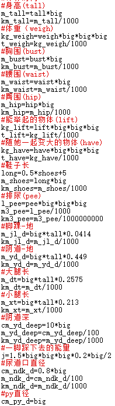

# 给大家推荐几个ios计算app(附带计算公式)

作者：study

TID：24280

<title>1</title> <link href="../Styles/Style.css" type="text/css" rel="stylesheet">

# 1

*本帖最後由 study 於 2018-1-10 20:49 編輯*

我就是那个做了两个计算机的人
在我编辑程序的时候，总觉得只能在电脑上计算不方便
有没有做app的技术
直到有一天
我发现几个app
这个app的名字叫**FormulaCal**
**(FormulaCal Life)**
**iFxCalc**

这两款app全部出自于Sam Yu（CHINA）
这两款app可以自由编辑公式来计算
FormulaCal是专门编辑公式来计算，并且可编的函数
并且你可以编多层列式（如下）

注：FormulaCal要1元，而Formula Life免费（有数量限制）

而iFxCalc是一个以编程为辅的软件，不想详细介绍，看图即可：

个人推荐FormulaCal可能大家不会用，那我贴一下公式(自由复制粘贴)，复制一下在粘贴就可以拉(记得不要复制#那一行)

1.  no

*複製代碼*
#身高(tall)
m_tall=tall*big
km_tall=m_tall/1000
#体重（weigh)
kg_weigh=weigh*big*big*big
t_weigh=kg_weigh/1000
#胸围(bust)
m_bust=bust*big
km_bust=m_bust/1000
#腰围(waist)
m_waist=waist*big
km_waist=m_waist/1000
#臀围(hip)
m_hip=hip*big
km_hip=m_hip/1000
#能举起的物体(lift)
kg_lift=lift*big*big*big
t_lift=kg_lift/1000
#随她一起变大的物体(have)
kg_have=have*big*big*big
t_have=kg_have/1000
#鞋子长
long=0.5*shoes+5
m_shoes=long*big
km_shoes=m_shoes/1000
#排尿(pee)
l_pee=pee*big*big*big
m3_pee=l_pee/1000
km3_pee=m3_pee/1000000000
#脚踝-地
m_jl_d=big*tall*0.0414
km_jl_d=m_jl_d/1000
#阴道-地
m_yd_d=big*tall*0.449
km_yd_d=m_yd_d/1000
#大腿长
m_dt=big*tall*0.2575
km_dt=m_dt/1000
#小腿长
m_xt=big*tall*0.213
km_xt=m_xt/1000
#阴道深
cm_yd_deep=10*big
m_yd_deep=cm_yd_deep/100
km_yd_deep=m_yd_deep/1000
#一脚踩下去的能量
j=1.5*big*big*big*0.2*big/2
#尿道口直径
cm_ndk_d=0.8*big
m_ndk_d=cm_ndk_d/100
km_ndk_d=m_ndk_d/1000
#py直径
cm_py_d=big
m_py_d=big/100
km_py_d=m_py_d/1000
#阴瓣
cm_yb=big*6
m_yb=cm_yb/100
km_yb=m_yb/1000
#阴蒂直径
cm_ydi=0.8*big
m_ydi=cm_ydi/100
km_ydi=m_ydi/1000
#跨一步多大
m_walk=tall*big*0.5118*0.2588190451*2
km_walk=m_walk/1000
#屁的速度
m_s_fart=big*3
km_s_fart=m_s_fart/1000
#走路的速度
m_s_walk=big
km_s_walk=m_s_walk/1000

<title>2</title> <link href="../Styles/Style.css" type="text/css" rel="stylesheet">

# 2

 <ignore_js_op>[QQ浏览器截屏未命名.png](forum.php?mod=attachment&aid=NzAyNzl8MzE0ZDMxNGV8MTY3NDA2OTQ0M3wxODIzMHwyNDI4MA%3D%3D&nothumb=yes) *(17.53 KB, 下載次數: 1)*

[下載附件](forum.php?mod=attachment&aid=NzAyNzl8MzE0ZDMxNGV8MTY3NDA2OTQ0M3wxODIzMHwyNDI4MA%3D%3D&nothumb=yes)

2018-1-9 22:22 上傳  

一部分GTS计算机计算部分

</ignore_js_op> <title>3</title> <link href="../Styles/Style.css" type="text/css" rel="stylesheet">

# 3

看起来很不错的样子，楼主大佬 <title>4</title> <link href="../Styles/Style.css" type="text/css" rel="stylesheet">

# 4

我估计没人会用 萌新看到这种帖子只看3秒就关闭了 <title>5</title> <link href="../Styles/Style.css" type="text/css" rel="stylesheet">

# 5

> [魔法士 發表於 2018-1-10 13:22](https://giantessnight.cf/gnforum2012/forum.php?mod=redirect&goto=findpost&pid=354741&ptid=24280)
> 我估计没人会用 萌新看到这种帖子只看3秒就关闭了

也是，那我就顺便贴一个计算公式把
<title>6</title> <link href="../Styles/Style.css" type="text/css" rel="stylesheet">

# 6

说得好，我用 matlab mobile（逃 <title>7</title> <link href="../Styles/Style.css" type="text/css" rel="stylesheet">

# 7

> [taroxd 發表於 2018-1-11 19:30](https://giantessnight.cf/gnforum2012/forum.php?mod=redirect&goto=findpost&pid=354894&ptid=24280)
> 说得好，我用 matlab mobile（逃

你就得新人会？
<title>8</title> <link href="../Styles/Style.css" type="text/css" rel="stylesheet">

# 8

ios？
农药9用户表示没辙了 <title>9</title> <link href="../Styles/Style.css" type="text/css" rel="stylesheet">

# 9

不太懂是做什么用的，求解释 <title>10</title> <link href="../Styles/Style.css" type="text/css" rel="stylesheet">

# 10

> [IMEX 發表於 2018-1-12 19:02](https://giantessnight.cf/gnforum2012/forum.php?mod=redirect&goto=findpost&pid=354987&ptid=24280)
> 不太懂是做什么用的，求解释

先下载
然后新建一个
再复制上面的（不要复制#开头那一行）
就能用了
<title>11</title> <link href="../Styles/Style.css" type="text/css" rel="stylesheet">

# 11

哦，这些公式对理论党很有用啊！谢谢楼主