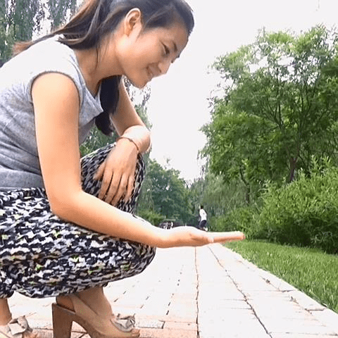

# 美拍里淘到的，挺好玩的

作者：斯佳摩妮

TID：21777

<title>1</title> <link href="../Styles/Style.css" type="text/css" rel="stylesheet">

# 1

<ignore_js_op>

**暴风截图2016973256692.jpg** *(49.17 KB, 下載次數: 0)*

[下載附件](forum.php?mod=attachment&aid=NjM5MTZ8YTg3MDdlZjZ8MTY3NDA2NzU5MnwxODIzMHwyMTc3Nw%3D%3D&nothumb=yes)

2016-9-7 21:11 上傳

<ignore_js_op> [＜小人国2＞我终于逃出了美女的五指山，虽然显得有那么一丢丢的 - 像极了小丑的美拍.m.mp4](forum.php?mod=attachment&aid=NjM5MTV8NGE4ZmQ2ZGN8MTY3NDA2NzU5MnwxODIzMHwyMTc3Nw%3D%3D) *(1.69 MB, 下載次數: 779)* 2016-9-7 21:10 上傳點擊文件名下載附件
错位摄像，加点处理

<title>2</title> <link href="../Styles/Style.css" type="text/css" rel="stylesheet">

# 2

截图看上去挺有代入感， 话说这是小人国2 那1在哪~ <title>3</title> <link href="../Styles/Style.css" type="text/css" rel="stylesheet">

# 3

不错救是稍微短了点。 <title>4</title> <link href="../Styles/Style.css" type="text/css" rel="stylesheet">

# 4

这个up主好像做了不止一个缩小视频，感觉像是同好 <title>5</title> <link href="../Styles/Style.css" type="text/css" rel="stylesheet">

# 5

感觉好不错，不知道是不是同好</ignore_js_op></ignore_js_op>