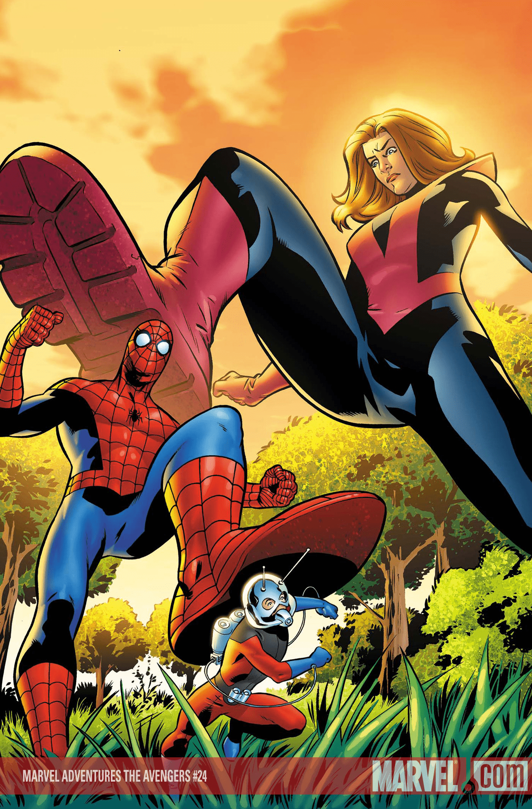
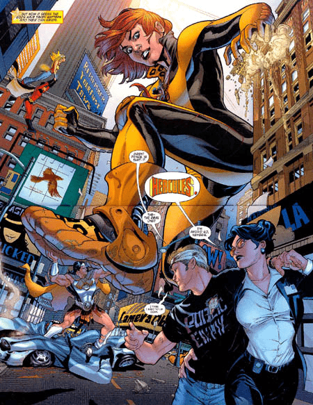

# 美漫中的gts

作者：gts_gts

TID：12441

<title>1</title> <link href="../Styles/Style.css" type="text/css" rel="stylesheet">

# 1

在美漫中有不少gts的情節
一些會巨大化的英雄和反派尤其容易發現
例如
英雄:marvel的Cassie Lang
反派: DC的Giganta

本人特別愛美漫的畫風

[ *本帖最後由 gts_gts 於 2012-6-6 13:09 編輯* ] <title>2</title> <link href="../Styles/Style.css" type="text/css" rel="stylesheet">

# 2

 <ignore_js_op>[giant-girl-1259.jpg](forum.php?mod=attachment&aid=Mjg3MzN8NjQxOTJiYTB8MTY3NDA2ODY5MnwxODIzMHwxMjQ0MQ%3D%3D&nothumb=yes) *(670.21 KB, 下載次數: 1)*

[下載附件](forum.php?mod=attachment&aid=Mjg3MzN8NjQxOTJiYTB8MTY3NDA2ODY5MnwxODIzMHwxMjQ0MQ%3D%3D&nothumb=yes)

2012-6-6 13:08 上傳  

</ignore_js_op> <ignore_js_op>[1251611-3ww2.jpg](forum.php?mod=attachment&aid=Mjg3MzR8OTUwMWNkMzl8MTY3NDA2ODY5MnwxODIzMHwxMjQ0MQ%3D%3D&nothumb=yes) *(115.38 KB, 下載次數: 0)*

[下載附件](forum.php?mod=attachment&aid=Mjg3MzR8OTUwMWNkMzl8MTY3NDA2ODY5MnwxODIzMHwxMjQ0MQ%3D%3D&nothumb=yes)

2012-6-6 13:08 上傳  

</ignore_js_op> <title>3</title> <link href="../Styles/Style.css" type="text/css" rel="stylesheet">

# 3

有更多的图吗 <title>4</title> <link href="../Styles/Style.css" type="text/css" rel="stylesheet">

# 4

不是说美漫不好，不过始终不太习惯，也可能是因为日漫先入为主 <title>5</title> <link href="../Styles/Style.css" type="text/css" rel="stylesheet">

# 5

我是希望大家認識多一種找資源的途徑
同時推廣美漫(偽)

再多介紹一下角色
蟻人之女Cassie Lang是出現在《少年復仇者》,她是主伇之一,有不少戲份,能力是巨人化
當時看漫畫時,實在令我眼前一亮,那根本是gts嘛!!

Giganta是神奇女俠的反派
她是在動畫片《Justice League》中Secret Society一集出場
我第一次接觸gts也是這動畫

圖片我就不在此版多發,上面提供的資料也應該足夠大家自己找了

不知道大家對美漫中gts的看法如何呢? <title>6</title> <link href="../Styles/Style.css" type="text/css" rel="stylesheet">

# 6

美漫有GTS這件事我想不少人都知道
但並不是所有人都喜歡美漫的GTS
至於我嗎?
只要有好的互動場面、好的視點、還有細緻的構圖
畫風什麼的用愛來填補就夠了

不過美漫有個缺點就是資源不好找
只好憑本事了 <title>7</title> <link href="../Styles/Style.css" type="text/css" rel="stylesheet">

# 7

美漫中我就认识Giganta <title>8</title> <link href="../Styles/Style.css" type="text/css" rel="stylesheet">

# 8

美漫倒是有個不錯的網站
[http://www.giantessfan.com/](http://www.giantessfan.com/)
裡面都還不錯

只是要看 是要花費一點財力

[ *本帖最後由 tony40507 於 2012-6-7 23:04 編輯* ]