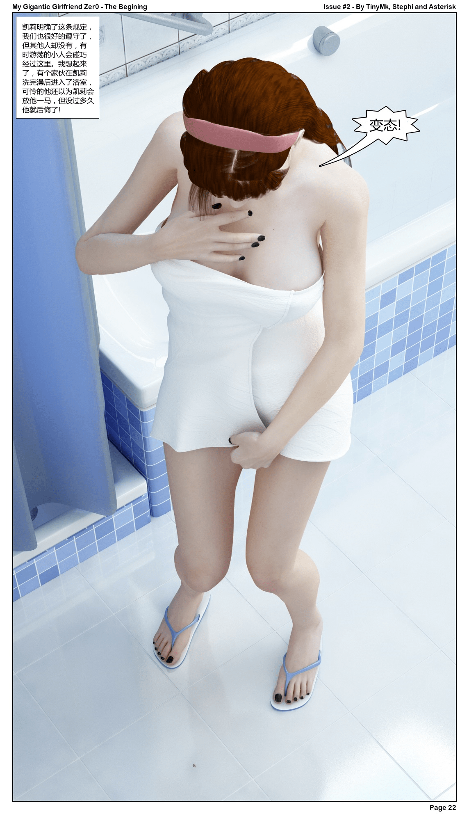
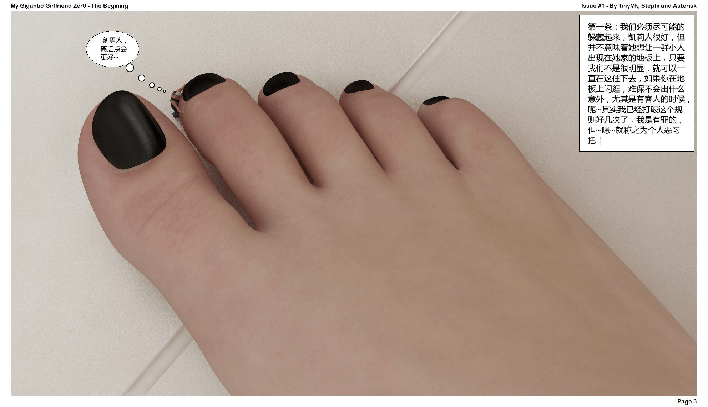
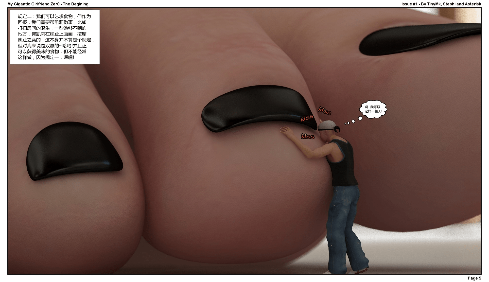
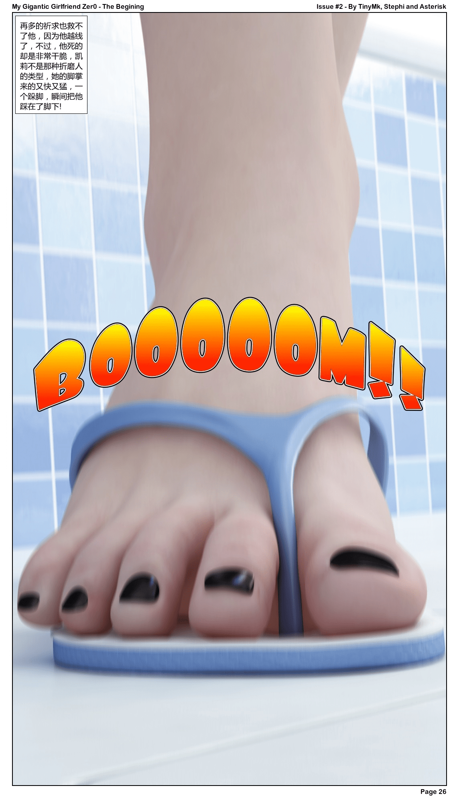

# 翻译镶字过程中碰到的问题!

作者：18号

TID：30985

<title>1</title> <link href="../Styles/Style.css" type="text/css" rel="stylesheet">

# 1

*本帖最後由 18号 於 2021-5-28 20:32 編輯*

pdf文件，使用了付费软件转换成了图片，大小和清晰度这边可以保证!!!

不多说了，两个问题，一个是旁白框大小的问题，下面的最后一幅图是原旁白框的大小，镶上字之后不知道大家能不能看清楚，我这边使用手机，文字是可以看清的，如果是电脑照片查看器浏览的话可能部分图片需要拉大镜头，如果各位看的费劲我尽量在原对话框的范围内拉大一点点（我并不想这么做!因为本身对话框就是透明的····!）
第二个不算问题的问题，就是女主的名字  stephi  我这边定的是斯蒂菲，保留大家的意见，什么斯蒂芬妮啊、史蒂芬、史蒂菲、斯蒂芬或是stephi，全凭大家。

谢谢!!!!!    六月份不一定能翻完，可能要七月份了，文字量太大了····！

最后说一下，我所有翻译的图片使用的软件都是美图秀秀桌面版 非常好用！！！！！

翻译已获授权
<title>2</title> <link href="../Styles/Style.css" type="text/css" rel="stylesheet">

# 2

 <ignore_js_op>[mgg_zer0_issue__2_by_tiny_mk_datzm8x_pages-to-jpg-0003.jpg](forum.php?mod=attachment&aid=ODg5NzJ8Y2FmYmIwMmR8MTY3NDA2NjAwN3wxODIzMHwzMDk4NQ%3D%3D&nothumb=yes) *(1.03 MB, 下載次數: 2)*

[下載附件](forum.php?mod=attachment&aid=ODg5NzJ8Y2FmYmIwMmR8MTY3NDA2NjAwN3wxODIzMHwzMDk4NQ%3D%3D&nothumb=yes)

2021-5-28 20:19 上傳  

</ignore_js_op> <ignore_js_op>[mgg_zer0_issue__1_by_tiny_mk_dashuau_page-0004.jpg](forum.php?mod=attachment&aid=ODg5NzN8ODM1MzFiNWJ8MTY3NDA2NjAwN3wxODIzMHwzMDk4NQ%3D%3D&nothumb=yes) *(955.63 KB, 下載次數: 1)*

[下載附件](forum.php?mod=attachment&aid=ODg5NzN8ODM1MzFiNWJ8MTY3NDA2NjAwN3wxODIzMHwzMDk4NQ%3D%3D&nothumb=yes)

2021-5-28 20:19 上傳  

</ignore_js_op> <ignore_js_op>[mgg_zer0_issue__1_by_tiny_mk_dashuau_page-0006.jpg](forum.php?mod=attachment&aid=ODg5NzR8MzllYjBjYmN8MTY3NDA2NjAwN3wxODIzMHwzMDk4NQ%3D%3D&nothumb=yes) *(875.47 KB, 下載次數: 1)*

[下載附件](forum.php?mod=attachment&aid=ODg5NzR8MzllYjBjYmN8MTY3NDA2NjAwN3wxODIzMHwzMDk4NQ%3D%3D&nothumb=yes)

2021-5-28 20:20 上傳  

</ignore_js_op> <ignore_js_op>[mgg_zer0_issue__2_by_tiny_mk_datzm8x_pages-to-jpg-0007.jpg](forum.php?mod=attachment&aid=ODg5NzZ8MDMyY2Q3YjJ8MTY3NDA2NjAwN3wxODIzMHwzMDk4NQ%3D%3D&nothumb=yes) *(837.06 KB, 下載次數: 1)*

[下載附件](forum.php?mod=attachment&aid=ODg5NzZ8MDMyY2Q3YjJ8MTY3NDA2NjAwN3wxODIzMHwzMDk4NQ%3D%3D&nothumb=yes)

2021-5-28 20:22 上傳  

</ignore_js_op> <title>3</title> <link href="../Styles/Style.css" type="text/css" rel="stylesheet">

# 3

这个文框大小是可以看得清楚的，另外关於翻译，不用过於强调用词精准度，这不是技术文件，也大概少有人会拿原文与译文对照挑毛病，以中文通顺语意清楚即可。 <title>4</title> <link href="../Styles/Style.css" type="text/css" rel="stylesheet">

# 4

真的膜拜大佬！一直翻译众多出色的作品，十分感谢！ <title>5</title> <link href="../Styles/Style.css" type="text/css" rel="stylesheet">

# 5

感谢大佬对新翻译的漫画表示期待 <title>6</title> <link href="../Styles/Style.css" type="text/css" rel="stylesheet">

# 6

> [phone2345 發表於 2021-5-28 23:15](https://giantessnight.cf/gnforum2012/forum.php?mod=redirect&goto=findpost&pid=469719&ptid=30985)
> 这个文框大小是可以看得清楚的，另外关於翻译，不用过於强调用词精准度，这不是技术文件，也大概少有人会拿 ...

嗯……看来问题不大，谢谢！                     <title>7</title> <link href="../Styles/Style.css" type="text/css" rel="stylesheet">

# 7

膜拜大佬啊，难得有质量这么高的图片 <title>8</title> <link href="../Styles/Style.css" type="text/css" rel="stylesheet">

# 8

之前试过很多付费的翻译软件，都比较坑，要么就是 不支持 过大的PDF翻译，要么就是翻译出来 跟山寨软件差不多，其实微信扫一扫翻译功能也很棒，翻译完美出现在框内，就是翻译只能一张一张，每次翻译都要拍照或者选择照片。 <title>9</title> <link href="../Styles/Style.css" type="text/css" rel="stylesheet">

# 9

> [龙影 發表於 2021-5-29 17:20](https://giantessnight.cf/gnforum2012/forum.php?mod=redirect&goto=findpost&pid=469782&ptid=30985)
> 之前试过很多付费的翻译软件，都比较坑，要么就是 不支持 过大的PDF翻译，要么就是翻译出来 跟山寨软件差不 ...

我可不是这么翻译的哦，最传统的方法，把翻译出来的文字写到纸上，然后再镶到图片上。。