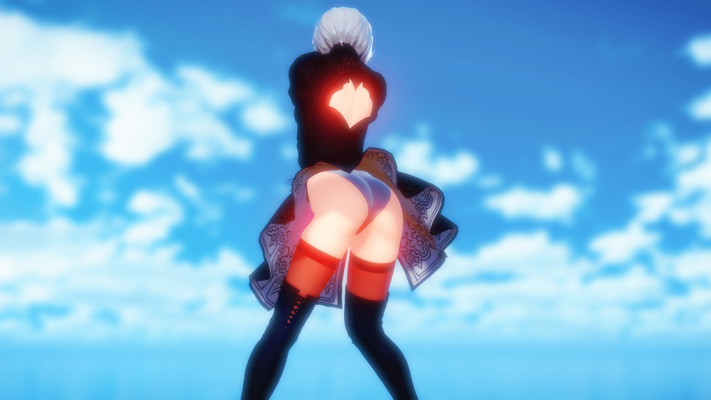

# 聊聊有趣的點子和PLAY情節

作者：葬儀社

TID：22836

<title>1</title> <link href="../Styles/Style.css" type="text/css" rel="stylesheet">

# 1

*本帖最後由 ckw 於 2017-3-31 02:48 編輯*

原本今天有點慾望打算要作文，還準備參考肉文，結果變成MMD試機（迷）大家可以看看兩者對比，不過和本主題沒甚麼關係（笑）。
會變成這樣因為直覺告訴我看屁股比作文有趣。雖然開始前都想出一丟丟點子、play，但一碰電腦就哈哈，反正也沒有人看（略）。
所以，不知大家有怎樣的有趣的片段、點子和PLAY但又沒弄出來？不妨分享一下，來招拋磚引玉看看會不會引起共嗚。
(我做了MMD累了別叫我分享_(´ཀ`」 ∠)_)
 其實，有個帖和本主題差不多，而且有獎勵點…… 
=========================================
MMD主要問題依然是技術問題和拍攝手手法。(思

去年至今的渲染　　　　　　　　　　　　　　　　　　　　　
高負載（有機會崩顯卡）　　　　　　　　　　　　　　　　　
之前在GNup的圖　　　　　　 　　　　　　　　　　　　　　

今天學會的渲染~~（用一個半小時學會加出圖）~~
中高負載（末全開）
外鏈圖（中國大陸8成死圖）

↑今天隨便做的圖↑　　　　　　　
中間顯卡崩了所以光影不同　　　　　　　
↓有小城市=GTS？↓

<title>2</title> <link href="../Styles/Style.css" type="text/css" rel="stylesheet">

# 2

下面三张图 图裂了                     <title>3</title> <link href="../Styles/Style.css" type="text/css" rel="stylesheet">

# 3

大老啊!!!

某MMD新手路過 <title>4</title> <link href="../Styles/Style.css" type="text/css" rel="stylesheet">

# 4

是看圖說故事還是純發怨念?
<title>5</title> <link href="../Styles/Style.css" type="text/css" rel="stylesheet">

# 5

看图说话类的也蛮好的，反正咱脑补能力强，就是作图太辛苦 <title>6</title> <link href="../Styles/Style.css" type="text/css" rel="stylesheet">

# 6

> [葬儀社 發表於 2017-3-31 21:06](https://giantessnight.cf/gnforum2012/forum.php?mod=redirect&goto=findpost&pid=327778&ptid=22836)
> 是看圖說故事還是純發怨念?

純發怨念吧，如片段情節、設定、素材、play法、H法。這樣簡簡單的，不用作文也能將靈感公開。
另外突然想到，如果有人投出有趣＂靈感＂，要不要置頂讓更多人能看到、點讚(思)(如果)

說到看圖說故事我聯想到最近西瓜的互動帖(略)
看圖說故事的話……其實MMD是我順手發的，因為做了圖不發好像很難忍住，特別是有腳輕巡棲鬼的大屁屁(*´д`)~~（可是一打開模型那張嘲笑臉(￣皿￣#)~~

<title>7</title> <link href="../Styles/Style.css" type="text/css" rel="stylesheet">

# 7

求模型出处，求第一张图的蓝发妹子模型出处 <title>8</title> <link href="../Styles/Style.css" type="text/css" rel="stylesheet">

# 8

*本帖最後由 ckw 於 2017-4-1 00:19 編輯*

> [冰西瓜 發表於 2017-3-31 21:53](https://giantessnight.cf/gnforum2012/forum.php?mod=redirect&goto=findpost&pid=327787&ptid=22836)
> 求模型出处，求第一张图的蓝发妹子模型出处

並不是藍色>>浜風

======為免誤會，以下模型均無畫質提特效======
~~(突然迷之冒出一個片段於是做了圖)
BGM：Roundabout（ジョジョの奇妙な冒険）~~

輕巡棲鬼：「贏定了！艦娘－－DDDeeeeeeeath！！」
浜風：「（阿…賀野……前輩……）」

~~==次回艦C（WKC.ver）最終回==
==FINAL BATTLE==~~ 

~~迷之聲：先有浜風後有阿賀野才對，浜風才是前輩吧？~~ <title>9</title> <link href="../Styles/Style.css" type="text/css" rel="stylesheet">

# 9

我是个做游戏的，也苦于没有点子呢 <title>10</title> <link href="../Styles/Style.css" type="text/css" rel="stylesheet">

# 10

注意：論壇up圖406，目前使用外鏈圖，大陸區死圖是正常。

作者(山風教)：心心一定給我的
觀眾(山風教)：明明是對我放
觀眾a(poi教)：都不要搶poi
紅色有角觀眾(雷媽教)：……我只是想成為山風的父親。
觀眾c(阿庫婭教)：阿庫婭教大法好，快退厄里絲教保平安，**厄里絲的胸部塞了胸墊**
觀眾d(阿庫婭教)：肥皂可以吃！現在加入阿庫婭教馬上入手吧！

＝＝＝正題如果我沒勾起興趣就當我自說自話＝＝＝＝

今天看了小說，回想到了些事自己以一直想搞的事但沒搞成。~~因為我沒有能力又無才華~~

作主題要素：「多名GTS」、「鬥大隻的成長向」

多名GTS成長向+競爭的成長設，最典型的做法是把身高體型可視作Lv，差距愈大愈有利，但exp不會那麼易入手。實際也不能這樣簡略，大約是要完成／解決一些事情。雖然數字化有直觀體現但總覺得缺了甚麼。

GTS數量多的話，就能玩GTS之間的體型差的互動，至少不會只有地球互動。

最好是強制性逼GTS變大，例如會被高Lv的等級差殺死、或者會當成奴隸、或者一天不長大會被處罰。而且我一直喜歡「非自願變大的GTS在無奈下一直、一點點的變大」的矛盾。

關於體型差距。差距有100倍，100倍大的GTS會被集火吧，1/100的GTS會被輾殺，這樣？但我覺得大小都大特點。（想不出來）
再者也有適應問題。比如一個小型10米級GTS，屬於多數弱者的範圍，但學會了如何避開大型GTS。只是突然入手了超稀有道具，迅間跳到菁英級範圍變成1公里級GTS。但問題是，原本弱者階級學會的技巧都不適合菁英級。所以漸漸變得巨大的GTS也需要剋服新體型的弱點的事情，像是一口河水，變得大了要補充更多變成一口湖水才夠。

也許加入點超能力之類的外掛、神器？需要鬥智鬥勇。

~~工口？工口永遠適合所有題材文章所以跳過~~

有想過將鬥大隻的要素加入到以前寫的偽日輕，但在自己腦中妄想後，發覺設衝突還挺大的，只能開新章。
最終日子久了，人懶了，~~因為我沒有能力又無才華~~，就忘了。
現在想想強逼性競爭……？我想到了肌餓遊戲。 <title>11</title> <link href="../Styles/Style.css" type="text/css" rel="stylesheet">

# 11

好.我打了.打了才發現.靠杯一次打不完....CKW你要怎麼負責...

另外整篇故事感覺滿滿的設定臭跟即視感.沒問題嗎? <title>12</title> <link href="../Styles/Style.css" type="text/css" rel="stylesheet">

# 12

*本帖最後由 ckw 於 2017-4-3 00:56 編輯*

> [葬儀社 發表於 2017-4-2 23:33](https://giantessnight.cf/gnforum2012/forum.php?mod=redirect&goto=findpost&pid=328067&ptid=22836)
> 好.我打了.打了才發現.靠杯一次打不完....CKW你要怎麼負責...
> 
> 另外整篇故事感覺滿滿的設定臭跟即視感.沒問 ...

今天上來看到更新了設定，讀者大概可以腦補一下，然後再舉辦粉絲問答會www
之後……「...CKW你要怎麼負責...」

哪尼！？生孩子嗎？為什麼是我！？Σ( ；ﾟдﾟ)！？
｛逃げるんだよォ！！｝(((┏(;>Д<)┛

>設定臭
設定不就這個樣子？拿出沒人知的事拿出來進行補完計劃（初Ｏ機）
但我覺得要優化排版，把項目的主題分出來
例如：
＜主題（人名／國家／內戰／技術／事件等等名稱）＞
＜詳細設定＞

看到瓦爾基麗有「再巨大化」莫名被吸注，也想了一會，可能因為我是grow向
有時是不得不取捨，不能把想要的要索都加入（思）。
不過從設定是殺手鐧，沒必要不用，但簡介的故事大意又沒說到有沒有使用上這招。
故事裡的達貢的初期型態，那代表了這種愈戰愈戰強的生物在幼年期要使能逼到女武神一眾拿出殺手鐧，那成熟期和完全体要怎對付？所以在中後期才拿出來再巨大化這招？
達貢設定說是雜魚，卻有很高的適性，在戰鬥中學習並使用反制技巧？感覺可以寫出惡戰，看其他設定，達貢是最BOSS無誤，不是雜魚吧。
達貢她們(?)也是出自克蘇魯吧，所以故事的形象也是獵奇的樣子吧？有很眼球和觸手~~好像可以有特殊play法的樣子不過已經說了大致是野獸樣子，觸手PLAY不可能~~

=====

偷偷發幾星前在想的事
<title>13</title> <link href="../Styles/Style.css" type="text/css" rel="stylesheet">

# 13

達貢是依照對手調整並自行改造.所以只要我方開加手減打(以最小力量收拾掉).基本上就是無限雜魚而已.
而且我設定的最終戰其實是我方全力開無雙清雜魚那種調調.也就是說達貢只是被拖出來方便宰的東西www

故事上.我巨大化的最大描寫就是萬倍(對小人來說是25萬倍就是.說過星球級我不喜歡.所以知道她們有能力這麼做就好.沒必要真的這樣搞.還有模擬城市理論上可以實現百萬的差距.當然那是福利玩法).而萬倍是初期對人類方開戰的手段.然後又是老美背黑鍋當初戰被宰的對象.後面內戰雙方都知道開巨大化只是製造不要的破壞.所以對打不會開這招

而達貢(在故事叫影獸).其實是讓瓦爾基麗有表現.跟讓利立普人有辦法反過來保護巨人的東西.本來二代主角焰.設定說過喜歡假面騎士.達貢出來亂的時候.焰會跟他的夥伴們出來打怪.而達貢雖然無知性.但本能也是認利立普人當主人.他們狩獵的對象是巨人方跟人類.所以小人國的男人是可以把他們驅趕走的(當然不可能打倒啦
).只是後面情況無法控制就是另外一個狀況了

我想了很多可以讓小人反過來保護巨人的手段跟情節.只是設定推出來的話.應該會很多人覺得根本是在自演乙吧(當然當事者根本不知道這回事
巨人跟小人的戀愛.其實某方面是被綁定的.當然雙方還是要越過某道牆才能在一起.我只是想辦法讓這不可能的愛情稍為合理化一點(簡單的說就是巨人方興奮的理由根本不是小人在她們身上做什麼.而是被小人需要他門自然就會興奮.也就是精神PLAY的成分居多

至於達貢這名字只是隨便挑一個邪神而已.裡面真正的大佬主要就是"門".也就是猶格.索托斯.而BUG的阿薩托拉大大.則是藉由某人顯現出部份力量(只是這兩位邪神都不會真的下場玩就是

剩下的之後有空再補.老實說光阿爾克那就打不太玩了 <title>14</title> <link href="../Styles/Style.css" type="text/css" rel="stylesheet">

# 14

> [葬儀社 發表於 2017-4-3 01:12](https://giantessnight.cf/gnforum2012/forum.php?mod=redirect&goto=findpost&pid=328091&ptid=22836)
> 達貢是依照對手調整並自行改造.所以只要我方開加手減打(以最小力量收拾掉).基本上就是無限雜魚而已.
> 而且我 ...

達貢的設定用手加減能處理
我想我以設妄想過：GTS能複制對手GTS能力，若GTS能力是「對手身高的2倍」那麼便會形成死循環，宇宙可以毀滅了。解決方法是派一個普通人(Ry)
像鏡子一樣的強大對手用最簡普通就KO就行了
……所以再巨大化不需要使用嗎？

說萬倍和星球……10公里級GTS，一個市－縣可容10公里級GTS，10公里級GTS眼中的人大既只有塵那麼大（PS地球直徑12000公里）
只要行幾步，可以催毀半個縣了。

＞讓小人反過來保護巨人的手段跟情節.只是設定推出來的話.應該會很多人覺得根本是在自演乙吧
＞小人國的男人是可以把他們驅趕走的
（咦？我看到小人保護巨人的方法了www）
<title>15</title> <link href="../Styles/Style.css" type="text/css" rel="stylesheet">

# 15

*本帖最後由 ckw 於 2017-4-10 18:15 編輯*

唉啊零投稿，企劃失敗了／(^o^)＼
~~（葬大大：「我不是發了補完計？」）~~
好吧……7天零投稿，企劃失敗了／(^o^)＼
下沉前的END圖，沒有GTS要素只能往這裡丟圖，一團黑的2B不好做。
<ignore_js_op>

**2B.jpg** *(222.61 KB, 下載次數: 0)*

[下載附件](forum.php?mod=attachment&aid=Njc1NDN8N2YwYjEwNjl8MTY3NDA2NzY2OHwxODIzMHwyMjgzNg%3D%3D&nothumb=yes)

2017-4-10 17:59 上傳

( ´◔‿ゝ◔`)<今日は風が騒がしいな……
(依然並沒有雲)
<title>16</title> <link href="../Styles/Style.css" type="text/css" rel="stylesheet">

# 16

首先是上面没变死图（楼主作出够强啊），个人最喜欢的情节就是unaware，因为和女友也有告白过这点，有时候就喜欢在她面前对她的各种动作发表gts妄想意见0w0，所以自然我的点子就是男友迷之缩小女友日常生活然后XXXXXX，哈哈</ignore_js_op>