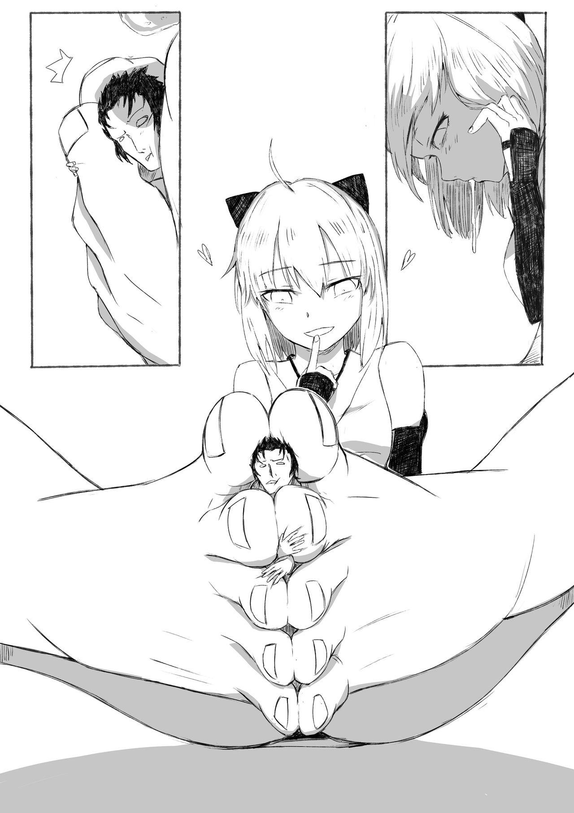

# 能否可以說對巨大娘來說，強大是最重要的

作者：希莶

TID：27419

<title>1</title> <link href="../Styles/Style.css" type="text/css" rel="stylesheet">

# 1

創作《刃牙》系列的日本漫畫家板垣恵介，雖然因為各種各樣的原因經常被用來當做梗娛樂，但他作品《范馬刃牙》中有一句話我覺得很有道理：
強的最小單位就是貫徹自己的“任性”。
強可有很多表現形式，但是當巨大娘是以自己的任性為主進行活動時，似乎這個“強”被表現的特別令人激動。
因為巨大娘本身就具有了各種各樣的“強”屬性，諸如體型巨大等，而且不少作品中還會加入神力一類的能力繼續增加巨大娘的強大。
可是這樣就造成了一個矛盾，因為大家已經約定俗成巨大娘必須強大，因此也就無視了大部分的強大因素。
這時候，對城市的破壞，對人類文明的摧毀以及人類的恐懼等，就成了額外表現巨大娘強大的要素，巨大娘本身特有的強大卻被選擇性無視，這也印證了我之前所說的“過於強大的某項屬性會掩蓋其他屬性”。
只有當作者文筆不佳導致這種表現力較差的時候，大家才會注意到巨大娘的本身能力。
換一句話說，如果一個巨大娘本身只是體型大，那麼她就只是一個巨大的少女，因為大家會選擇性無視這一點，只有當她開始破壞，或者展現力量，大家才會對她的行為和產生的後果或者其本身感興趣。
就例如sonnano氏在天真浪漫3中所畫的兩張插圖。
這兩張插圖單論質量而言無論放到哪裡都是極佳的，但它們絕對不是最好的巨大娘圖——巨大娘沒有和背景完全融為一體，儘管巨大娘和背景都極其精緻美觀，但是卻可以單獨拆出來沒有任何違和感。
相比之下，其他畫師的圖也許不如sonnano氏的精緻，但是很好的將巨大娘與背景融合在一起，二者完全處於不可分割的狀態，被破壞的城市提現了巨大娘的強大，巨大娘破壞城市的樣子也體現了她們的“任性”。
所以我認為，無法表現自己強大的“巨大娘”，不過是一個畫的比較大的少女，或者背景畫的很小的少女，或者是一個畫在城市裡的少女。
當然以上只是我的個人意見，因為根據我的調查，還是有不少人喜愛沒有體現“強大”因素的巨大娘的。
<title>2</title> <link href="../Styles/Style.css" type="text/css" rel="stylesheet">

# 2

*本帖最後由 Lastato 於 2019-9-24 05:28 編輯*

讓我想到我很久以前寫過的評論文。
[https://giantessnight.com/gnforum2012/forum.php?mod=redirect&goto=findpost&ptid=15420&pid=207381](https://giantessnight.com/gnforum2012/forum.php?mod=redirect&goto=findpost&ptid=15420&pid=207381)

我也思索過類似的問題，但我的思考不像是樓主從「強大」思考到「任性」。

我是從「主宰」跟「掌握」切入，考慮到巨大娘如何支配故事中的其他一切；後來思考到「蔑視」與「無視」，巨大娘是如何把一切活物貶低到另一個次元。我曾經在一篇討論，巨大化跟把人縮小的文章談過。但那串因為發文者被刪號，所以現在被鎖串了，沒法貼過來。

我印象中我是這樣說的：「將人縮小成小人是對人的蔑視，將城市縮小是對城市與文明的蔑視；而巨大化則是對世界框架本身的蔑視，也是世界對她的一種眷顧。」我很喜歡舉但大的一部作品有描述到這樣的場景：當姬海娜的皇女在閨房中無意打翻了一個城市，她為這個城市而哭泣時，她的女僕立刻又捧出了一個。在這個場景中，我們將城市放入了閨房中，還知道了城市是消耗品。公共領域被私密領域支配，各種羞恥的事情肆無忌憚的在大庭廣眾之上舒張，這樣的行動是禁忌的逾越，以及人性良知的超越，帶來的小大之辯使故事微妙而有魄力，我們體驗到了sublime 這種美。

所以我會認為：這樣「舒張」的情感，難以用「自由」或「逃脫」來形容，而是一種「肆無忌憚」。所以我認為，在「蔑視」與「無視」之後，最美妙的形式就是「無意識」，一舉手一投足都牽動著世界，而巨大娘卻不為所動，因為對她來說支配就是日常，沒有人為因為只喝杯水而感到興奮，除非那是剛剛開始懂得喝水的，剛轉變的巨大娘。那些真正從出生就被眷顧的巨大娘，會覺得這一切都是理所當然的。這僅僅是她們的日常。是「隨心所欲」的。
<title>3</title> <link href="../Styles/Style.css" type="text/css" rel="stylesheet">

# 3

好深奥的问题，想太复杂了 <title>4</title> <link href="../Styles/Style.css" type="text/css" rel="stylesheet">

# 4

我會喜歡巨大娘是因為她的強大
而且其中最愛的GROWTH屬性
更是能讓巨大娘不斷的變得更強
帶入自己之後整個欲罷不能
所以很難理解那些喜歡縮小男的想法
那樣根本稱不上巨大娘 <title>5</title> <link href="../Styles/Style.css" type="text/css" rel="stylesheet">

# 5

> [迷途小喵 發表於 2019-9-24 09:38](https://giantessnight.cf/gnforum2012/forum.php?mod=redirect&goto=findpost&pid=415417&ptid=27419)
> 我會喜歡巨大娘是因為她的強大
> 而且其中最愛的GROWTH屬性
> 更是能讓巨大娘不斷的變得更強

对嘛，缩小迄今为止只有一两篇我看的下去的。
就应该像哥斯拉一样看着才爽嘛。。。
<title>6</title> <link href="../Styles/Style.css" type="text/css" rel="stylesheet">

# 6

的确，我个人喜欢的，也是巨大娘所带来的“强大”表现，如果无法展现这一点，仅仅是体型的不同或者是姿态的变化，我都对其无感 <title>7</title> <link href="../Styles/Style.css" type="text/css" rel="stylesheet">

# 7

*本帖最後由 超SizeJKGirl 於 2019-9-24 17:19 編輯*

比較好的巨大娘作品必須要讓人有互動感和帶入感(普通的作品也是一樣)

我覺得＂強大＂不是一定的要素

反而巨大才是一定的必須要的

很多作品巨大都不一定代表強大

有時候體型越大反而變成標靶

強不強大都可以是巨大娘
有時候強大過頭反而讓作品沒互動性

感覺就像是巨大娘巨大過頭

小人在畫面上小到看不到

像這樣完全沒互動性的作品也是有的

要說是無意識也不像

所以呈現方式是很不容易的

享受巨大娘的方式有很多種

有幾種人就有幾種巨大娘

我覺得主要還是要有豐富的劇情或是腦洞大開的劇情

角色要有互動感讓人參與進去比較重要

而不是只是個死的假人模特兒在那裏一樣

在GN的大家都喜歡巨大娘(相對性－女大或是男小)
但是每個人喜歡的巨大娘又會有點不太一樣

要把每種屬性都講出來大概要三天三夜了

我是覺得特殊的新劇情跟女角色的塑造遠大於強不強大這一點

在強大角色沒有靈魂也不會讓人有共鳴感

巨大娘是可以有很多種屬性的

殘酷系、溫柔系、無意識系...

有時候會想要刺激的殘酷系

又有時候會想要溫柔的治癒系

有時候也想要無意識的放置系

對世人來說巨大娘是一個未開發的國度

強大只是巨大娘的冰山一角而已

我希望有那種可以巨大又可以復原還可以跟主角互動的那種巨大娘

雖然主角被貶得很低

但是雙方又可以互動

這樣的作品非常難寫

而且邏輯會容易不通順

<title>8</title> <link href="../Styles/Style.css" type="text/css" rel="stylesheet">

# 8

雖然個人也是偏好喜歡巨大化，但是我縮小系的也可以接受，

我很贊同樓主說的貫徹自己的“任性”這個論點，但我覺得讓我有感覺的與其是說展現巨大娘的“強大”因素，不如說讓人欲罷不能的是那種普通人完全無法抵抗的絕望感

有時候體現強大不一定是要主宰整個世界，能主宰主人公讓其完全無法抵抗其實也就是巨大娘的範疇了，這是我個人對縮小系怎麼有感覺的淺見啦 <title>9</title> <link href="../Styles/Style.css" type="text/css" rel="stylesheet">

# 9

*本帖最後由 weikesi 於 2019-9-24 20:10 編輯*

       同意，人物与场景的互动性就是体现强大的核心，sonnano的这两幅我印象也很深，同样是破坏城市，同样有巨大的体型差，但里面的人物上下半身的动作呈现出一种分离的状态，这一点在图二的咲夜身上表现十分突出，无视下半身把腰部以上抠出来就能单独当一副立绘（请手动遮挡），仿佛人物正在做与巨大化之后完全无关的事情，这有别于通常的”无意识“，因为人物做出了与这个场景并无多大联系的行为动作，与场景不相关的动作会产生严重的割裂感，那么对场景的破坏，展示力量的部分，现在有那么重要吗？很明显没有了，作者对画技的展示盖过了GTS元素的表现
<ignore_js_op>

**753620-d108d69a77-00000007.jpg** *(414.36 KB, 下載次數: 0)*

[下載附件](forum.php?mod=attachment&aid=Nzk3MzN8OGEzNTU0ZTF8MTY3NDA2NjY5MHwxODIzMHwyNzQxOQ%3D%3D&nothumb=yes)

2019-9-24 19:42 上傳

<ignore_js_op>

**753620-d108d69a77-00000006.jpg** *(406.63 KB, 下載次數: 0)*

[下載附件](forum.php?mod=attachment&aid=Nzk3MzJ8ZWFmMTBhZGJ8MTY3NDA2NjY5MHwxODIzMHwyNzQxOQ%3D%3D&nothumb=yes)

2019-9-24 19:42 上傳

（比起咲夜，我更想看后面帕秋莉的经典镜头）

<ignore_js_op>

**983991-6bb61c527b-00000008.jpg** *(127.63 KB, 下載次數: 2)*

[下載附件](forum.php?mod=attachment&aid=Nzk3MzR8ZGY0NGJlNzZ8MTY3NDA2NjY5MHwxODIzMHwyNzQxOQ%3D%3D&nothumb=yes)

2019-9-24 20:02 上傳

（同样体型差下这副就高到不知道哪里去了）

<title>10</title> <link href="../Styles/Style.css" type="text/css" rel="stylesheet">

# 10

[https://exhentai.org/g/1483399/61813129a1/](https://exhentai.org/g/1483399/61813129a1/)
縮小的也是能相當帶感的 <ignore_js_op>

**96461D9B-C7FD-46DA-BAB2-82A336705705.jpeg** *(217.38 KB, 下載次數: 2)*

[下載附件](forum.php?mod=attachment&aid=Nzk3MzV8OGE4Mjg1YTV8MTY3NDA2NjY5MHwxODIzMHwyNzQxOQ%3D%3D&nothumb=yes)

2019-9-25 17:20 上傳

Heh的這個系列，把戲謔、任性、支配、情慾都表現得很好。
而且不得不承認，縮小系的更適合表現私密互動跟閨房之樂。
<title>11</title> <link href="../Styles/Style.css" type="text/css" rel="stylesheet">

# 11

> Lastato 發表於 2019-9-25 17:23
> https://exhentai.org/g/1483399/61813129a1/
> 縮小的也是能相當帶感的
> Heh的這個系列，把戲謔、任性、支配 ...

我说的是巨大化的少女，而不是被缩小的其他人。 <title>12</title> <link href="../Styles/Style.css" type="text/css" rel="stylesheet">

# 12

*本帖最後由 Lastato 於 2019-9-26 22:03 編輯*

> [希莶 發表於 2019-9-26 10:18](https://giantessnight.cf/gnforum2012/forum.php?mod=redirect&goto=findpost&pid=415502&ptid=27419)
> 我说的是巨大化的少女，而不是被缩小的其他人。

能將人縮小的女孩，不也展現了強大嗎？
不然，你的強大說還是被限制在了巨大之下，如果任性真是更主導的要素的話，巨大娘也不必要有mega級的體型才是強大啊。
像是hachimitsu的《縮小性活》跟《兩倍》以及《相對性巨大少女》你又會怎樣適用你的理論呢？
《縮小性活》：https://exhentai.org/g/1234880/358213149c/
《兩倍》：https://exhentai.org/g/705934/b5ef76102c/
《相對性巨大少女》：https://exhentai.org/g/1146962/c27daebdea/

又或是《地板新世界》這類文章，你會看做是巨大娘嗎？
《地板新世界》：[https://giantessnight.com/dgustory/dgu_story/0279key.htm](https://giantessnight.com/dgustory/dgu_story/0279key.htm)

<title>13</title> <link href="../Styles/Style.css" type="text/css" rel="stylesheet">

# 13

> Lastato 發表於 2019-9-26 21:49
> 能將人縮小的女孩，不也展現了強大嗎？
> 不然，你的強大說還是被限制在了巨大之下，如果任性真是更主導的要 ...

所以说阁下并没有理解我的意思，我的意思是说，对于巨大少女来说，强大是最重要的。
如果我自己去否定了“巨大娘强大”这个论点，那我就自相矛盾了。
我反驳的论点是“巨大娘带给人快感与强大无关”</ignore_js_op></ignore_js_op></ignore_js_op></ignore_js_op>