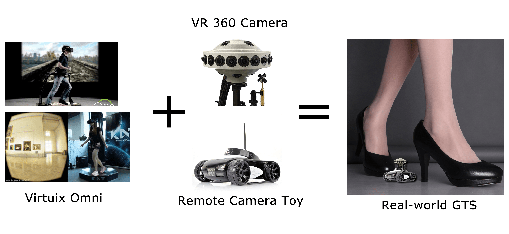

# 能否用现有技术实现“小人”的感觉？

作者：striker

TID：20865

<title>1</title> <link href="../Styles/Style.css" type="text/css" rel="stylesheet">

# 1

*本帖最後由 xnr 於 2016-4-1 18:01 編輯*

<ignore_js_op>

**Real-world GTS.jpg** *(869.25 KB, 下載次數: 1)*

[下載附件](forum.php?mod=attachment&aid=NjA0MTl8MzFkOThhYTV8MTY3NDA2Nzg0MnwxODIzMHwyMDg2NQ%3D%3D&nothumb=yes)

2016-4-1 17:50 上傳

如图所示：

VR跑步机+VR眼镜     来操作控制    VR 360度摄像机+遥控玩具车，是否能体验小人的感觉呢？

如果可行的话，基本上就能实现视觉上的“缩小人”的感觉了。

如果有可移动微型人形机器人的话，配合可传递语音，就能实现基本的互动了。

=================================================

顺便再请大家帮忙找找VR 360的视频，谢谢！

[http://giantessnight.com/gnforum ... page%3D2&page=1](http://giantessnight.com/gnforum2012/forum.php?mod=viewthread&tid=20794&extra=page%3D2&page=1)
<title>2</title> <link href="../Styles/Style.css" type="text/css" rel="stylesheet">

# 2

玩不起的感觉。。。。。。。。。。。。 <title>3</title> <link href="../Styles/Style.css" type="text/css" rel="stylesheet">

# 3

非常有感觉的说 希望未来科技能够实现 <title>4</title> <link href="../Styles/Style.css" type="text/css" rel="stylesheet">

# 4

  就是VR/AR技术嘛
  但能否身临其境呢
  另外GTS是要有真正的生理和心理体验的，毕竟面对的还是平常人，而非小人或者女巨人 <title>5</title> <link href="../Styles/Style.css" type="text/css" rel="stylesheet">

# 5

就算真的可以
那也是壕的世界 <title>6</title> <link href="../Styles/Style.css" type="text/css" rel="stylesheet">

# 6

用不起啊，感觉还要等很长时间才能有机会接触啊 <title>7</title> <link href="../Styles/Style.css" type="text/css" rel="stylesheet">

# 7

明显是可行的，毕竟现在大疆的无人机都支持VR模式了，Real-World GTS原理更简单，只不过没人去做而已，这种面对小众群体的东西怎么会有市场...

VR的成本并不高，低端的有几十块钱的Cardboard，目前最高端的HTC Vive也就6888元，一部最新款iPhone的价格而已，一个LG的全景摄像机价格还不如小米手机贵，相比遥不可及的AR技术和售价3000美元的开发者版Hololens，VR明显要实际的多，也是看的见摸得着的Actual Reality。

顺便发个VR视频，没见论坛里有人分享过。 <title>8</title> <link href="../Styles/Style.css" type="text/css" rel="stylesheet">

# 8

 <ignore_js_op>

[Panoramic vore TEST.mp4](forum.php?mod=attachment&aid=NjA0MjB8ZjUzM2FlOGZ8MTY3NDA2Nzg0MnwxODIzMHwyMDg2NQ%3D%3D)

2016-4-1 23:01 上傳

點擊文件名下載附件

7.66 MB, 下載次數: 858</ignore_js_op> <title>9</title> <link href="../Styles/Style.css" type="text/css" rel="stylesheet">

# 9

虽然说与时俱进是好事啦
但是用现有技术来实现这种小众爱好什么的
又不是什么完全掌握平民化得技术
就算是有 对于各位同好来说
也不见得就是一件什么大事吧
毕竟  我猜不是哪个同好都有这么个条件
去享受LZ提出的这个设想实验 <title>10</title> <link href="../Styles/Style.css" type="text/css" rel="stylesheet">

# 10

肯定可以啊~而且VR技术肯定也会越来越平民化！感觉这是未来的趋势！ <title>11</title> <link href="../Styles/Style.css" type="text/css" rel="stylesheet">

# 11

只要有希望，就不能放弃啊。希望以后会有体验馆一类的。 <title>12</title> <link href="../Styles/Style.css" type="text/css" rel="stylesheet">

# 12

> [wwwnwy 發表於 2016-4-1 19:38](https://giantessnight.cf/gnforum2012/forum.php?mod=redirect&goto=findpost&pid=289001&ptid=20865)
> 非常有感觉的说 希望未来科技能够实现

不是未来科技，我都说了是现有的已经实现的技术了，只差大规模普及了
<title>13</title> <link href="../Styles/Style.css" type="text/css" rel="stylesheet">

# 13

肯定是可行的啊，只不过就要看腰包了 <title>14</title> <link href="../Styles/Style.css" type="text/css" rel="stylesheet">

# 14

全息投影能实现互动，前几天都看到介绍了 <title>15</title> <link href="../Styles/Style.css" type="text/css" rel="stylesheet">

# 15

要是未来有民用的就好了 <title>16</title> <link href="../Styles/Style.css" type="text/css" rel="stylesheet">

# 16

> [52gtss 發表於 2016-4-8 22:45](https://giantessnight.cf/gnforum2012/forum.php?mod=redirect&goto=findpost&pid=289765&ptid=20865)
> 要是未来有民用的就好了

这本来就是民用的啊，你有钱就能买
<title>17</title> <link href="../Styles/Style.css" type="text/css" rel="stylesheet">

# 17

土豪的世界什么都可以
我们就看看 <title>18</title> <link href="../Styles/Style.css" type="text/css" rel="stylesheet">

# 18

如果同好中有人成为这样的人才 就有可能 <title>19</title> <link href="../Styles/Style.css" type="text/css" rel="stylesheet">

# 19

haoxiang hen youqudeyangzia,buguochengbentaigao le <title>20</title> <link href="../Styles/Style.css" type="text/css" rel="stylesheet">

# 20

有钱，什么都行，但是在下没钱…… <title>21</title> <link href="../Styles/Style.css" type="text/css" rel="stylesheet">

# 21

我记得  在某网购平台上看过一个1cm高的vr小人，用vr去控制小人移动，并有小人的视角。只可惜价格偏贵，而且万一被毁损失也很大 <title>22</title> <link href="../Styles/Style.css" type="text/css" rel="stylesheet">

# 22

> [gfxx 發表於 2016-5-31 17:01](https://giantessnight.cf/gnforum2012/forum.php?mod=redirect&goto=findpost&pid=295055&ptid=20865)
> 我记得  在某网购平台上看过一个1cm高的vr小人，用vr去控制小人移动，并有小人的视角。只可惜价格偏贵，而 ...

那是概念设计，没有做出成品 <title>23</title> <link href="../Styles/Style.css" type="text/css" rel="stylesheet">

# 23

感觉玩不起。。。土豪的世界 <title>24</title> <link href="../Styles/Style.css" type="text/css" rel="stylesheet">

# 24

我个人还是非常看好vr的_(:з」∠)_ <title>25</title> <link href="../Styles/Style.css" type="text/css" rel="stylesheet">

# 25

VR视频啥时候可以做后期处理呢 <title>26</title> <link href="../Styles/Style.css" type="text/css" rel="stylesheet">

# 26

果然是土豪，买不起的东西啊 <title>27</title> <link href="../Styles/Style.css" type="text/css" rel="stylesheet">

# 27

看上去可行。。。不过触感方面就做不到了 <title>28</title> <link href="../Styles/Style.css" type="text/css" rel="stylesheet">

# 28

应该是可以的，科技发展速度还是令人感叹 <title>29</title> <link href="../Styles/Style.css" type="text/css" rel="stylesheet">

# 29

要普及還要一段時間，等等看吧，看可不可以用租的 <title>30</title> <link href="../Styles/Style.css" type="text/css" rel="stylesheet">

# 30

vr目前还没有普及，技术还有待发展 <title>31</title> <link href="../Styles/Style.css" type="text/css" rel="stylesheet">

# 31

大规模普及至少需要更强大的芯片，显示，VR设备的眩晕和刷新速度还是没有完全解决的。。离大规模推广还是有距离的 <title>32</title> <link href="../Styles/Style.css" type="text/css" rel="stylesheet">

# 32

等待技术慢慢发展吧总会像手机一样有平民化的一天 <title>33</title> <link href="../Styles/Style.css" type="text/css" rel="stylesheet">

# 33

其实虽然gts是小众的，但我觉得vr以后发展的方向跟现在的网游什么肯定不一样，它的方向应该是各种奇幻的场景，或是冒险之类的，就跟旅游差不多，而不是想很多小说里写的拿样那把剑砍来砍去，所以肯定会有缩小主题的游戏，因为这对很多人来说也是很有趣的，所以我们就可以。。。 <title>34</title> <link href="../Styles/Style.css" type="text/css" rel="stylesheet">

# 34

在得到这些东西之前,咱得先定个小目标,比如:先挣它一个亿
哈哈哈</ignore_js_op>