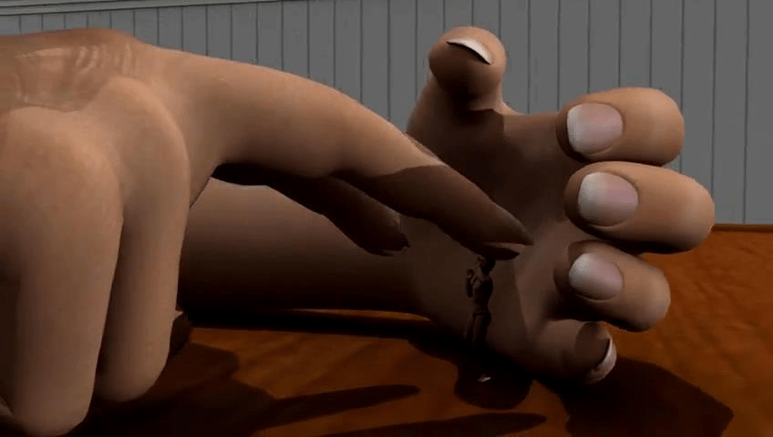
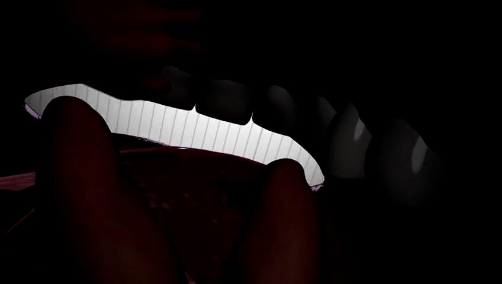

# 能和Manzi大神5 5开 ······················· 的视频

作者：Hola

TID：17726

<title>1</title> <link href="../Styles/Style.css" type="text/css" rel="stylesheet">

# 1

*本帖最後由 jiachufan1 於 2014-9-8 17:03 編輯*

<ignore_js_op> [140860529653f71.flv](forum.php?mod=attachment&aid=NDY2MDJ8YjBhODlmYTN8MTY3NDA2Nzk4M3wxODIzMHwxNzcyNg%3D%3D) *(13.2 MB, 下載次數: 9618)* 2014-9-8 17:00 上傳點擊文件名下載附件

<ignore_js_op>

**140860529653f71_2014981706.JPG** *(26.46 KB, 下載次數: 2)*

[下載附件](forum.php?mod=attachment&aid=NDY2MDN8Y2YyNDQxNDN8MTY3NDA2Nzk4M3wxODIzMHwxNzcyNg%3D%3D&nothumb=yes)

2014-9-8 17:01 上傳

<ignore_js_op>

**140860529653f71_20149817016.JPG** *(22.33 KB, 下載次數: 2)*

[下載附件](forum.php?mod=attachment&aid=NDY2MDR8ZmExNWMxZWJ8MTY3NDA2Nzk4M3wxODIzMHwxNzcyNg%3D%3D&nothumb=yes)

2014-9-8 17:01 上傳

<ignore_js_op>

**140860529653f71_20149817036.JPG** *(14.67 KB, 下載次數: 1)*

[下載附件](forum.php?mod=attachment&aid=NDY2MDV8N2Y0Nzk2MjV8MTY3NDA2Nzk4M3wxODIzMHwxNzcyNg%3D%3D&nothumb=yes)

2014-9-8 17:01 上傳

<ignore_js_op>

**140860529653f71_201498165955.JPG** *(23.13 KB, 下載次數: 1)*

[下載附件](forum.php?mod=attachment&aid=NDY2MDZ8ZjkyNWExZGV8MTY3NDA2Nzk4M3wxODIzMHwxNzcyNg%3D%3D&nothumb=yes)

2014-9-8 17:01 上傳

第一视角与第三视角 完美结合  
画面细腻

佚名大神作品
佚名：我和Manzi 5 5开
、

点击可查看大图
目标 超银河索道
好人一生平安

<title>2</title> <link href="../Styles/Style.css" type="text/css" rel="stylesheet">

# 2

[http://giantessnight.com/gnforum ... &extra=page%3D1](http://giantessnight.com/gnforum2012/forum.php?mod=viewthread&tid=17707&extra=page%3D1)

GN每个帖子都值得一看，为什么没时间看呢。。。 <title>3</title> <link href="../Styles/Style.css" type="text/css" rel="stylesheet">

# 3

> [xnr 發表於 2014-9-8 17:19](https://giantessnight.cf/gnforum2012/forum.php?mod=redirect&goto=findpost&pid=234003&ptid=17726)
> [http://giantessnight.com/gnforum2012/forum.php?mod=viewthread&tid=17707&extra=page%3D1](http://giantessnight.com/gnforum2012/forum.php?mod=viewthread&tid=17707&extra=page%3D1)
> 
> GN每个帖子都 ...

额  悲剧
不喜欢那个板块 所以根本没怎么进过

<title>4</title> <link href="../Styles/Style.css" type="text/css" rel="stylesheet">

# 4

还不错啊  做的挺细致的 <title>5</title> <link href="../Styles/Style.css" type="text/css" rel="stylesheet">

# 5

哈哈我還想說怎麼那麼像
是第二部之類的嗎
結果跟前幾天那個是完全一樣的 <title>6</title> <link href="../Styles/Style.css" type="text/css" rel="stylesheet">

# 6

人物模型属于上等。。 <title>7</title> <link href="../Styles/Style.css" type="text/css" rel="stylesheet">

# 7

支持一下，，话说貌似眼熟啊 <title>8</title> <link href="../Styles/Style.css" type="text/css" rel="stylesheet">

# 8

谢谢分享。。。非常漂亮。。。 <title>9</title> <link href="../Styles/Style.css" type="text/css" rel="stylesheet">

# 9

畫質好細膩, 值得支持. <title>10</title> <link href="../Styles/Style.css" type="text/css" rel="stylesheet">

# 10

这是游戏还是视频？？？ <title>11</title> <link href="../Styles/Style.css" type="text/css" rel="stylesheet">

# 11

很喜欢这种3D风格，大赞~~~ <title>12</title> <link href="../Styles/Style.css" type="text/css" rel="stylesheet">

# 12

第一人称好赞啊 代入感什么的都有了 <title>13</title> <link href="../Styles/Style.css" type="text/css" rel="stylesheet">

# 13

感觉好真实呀，嘿嘿嘿 <title>14</title> <link href="../Styles/Style.css" type="text/css" rel="stylesheet">

# 14

ss-manzi的视频每次看完都是虎躯一震 可惜几个老视频的载点都挂了我这里又没有备份 <title>15</title> <link href="../Styles/Style.css" type="text/css" rel="stylesheet">

# 15

This is not Manzi's work... It was made by Qmajor, in giantesscity.
High quality version is here
[https://mega.co.nz/#!GE0UQBRD!_a ... gtoDbMCH8FzwZV5yZLI](https://mega.co.nz/#!GE0UQBRD!_aYGcXZ2oa2WCB5bPiSYb41TgtoDbMCH8FzwZV5yZLI) <title>16</title> <link href="../Styles/Style.css" type="text/css" rel="stylesheet">

# 16

这个是qmajor的终结作...在DA上就有... <title>17</title> <link href="../Styles/Style.css" type="text/css" rel="stylesheet">

# 17

还是日系模型看的习惯点 <title>18</title> <link href="../Styles/Style.css" type="text/css" rel="stylesheet">

# 18

然而人设还是有毒(ಥ_ಥ) <title>19</title> <link href="../Styles/Style.css" type="text/css" rel="stylesheet">

# 19

哇塞，这个模型做的很精致的说，女主很漂亮啊 <title>20</title> <link href="../Styles/Style.css" type="text/css" rel="stylesheet">

# 20

人物模型不错，看预览图好像是吞食类。 <title>21</title> <link href="../Styles/Style.css" type="text/css" rel="stylesheet">

# 21

能和manzi大神比？赶集下载看看 <title>22</title> <link href="../Styles/Style.css" type="text/css" rel="stylesheet">

# 22

这个很棒啊！谢谢分享啊 <title>23</title> <link href="../Styles/Style.css" type="text/css" rel="stylesheet">

# 23

一直很喜欢3d。。。，很好看 <title>24</title> <link href="../Styles/Style.css" type="text/css" rel="stylesheet">

# 24

> [jiachufan1 發表於 2014-9-8 23:00](https://giantessnight.cf/gnforum2012/forum.php?mod=redirect&goto=findpost&pid=234034&ptid=17726)
> 额  悲剧
> 不喜欢那个板块 所以根本没怎么进过

本来就不会每个板都去注意
没事的我也是看到你这帖子才注意到这作品的
谢谢你啦
<title>25</title> <link href="../Styles/Style.css" type="text/css" rel="stylesheet">

# 25

这位视频作者的名字本身就是一种对大神的肯定和认同啊！ <title>26</title> <link href="../Styles/Style.css" type="text/css" rel="stylesheet">

# 26

看完了，还是喜欢manzi.         <title>27</title> <link href="../Styles/Style.css" type="text/css" rel="stylesheet">

# 27

人物模型很精致，真实，有美感。 <title>28</title> <link href="../Styles/Style.css" type="text/css" rel="stylesheet">

# 28

这个也是找了好久的，顶一个 <title>29</title> <link href="../Styles/Style.css" type="text/css" rel="stylesheet">

# 29

渲染做的跟Manzi差不多，不过我还是喜欢Manzi的模型 <title>30</title> <link href="../Styles/Style.css" type="text/css" rel="stylesheet">

# 30

我记得有一个130多mb的。。。 <title>31</title> <link href="../Styles/Style.css" type="text/css" rel="stylesheet">

# 31

这视频做的太棒了　能再做一些互动的就更好了</ignore_js_op></ignore_js_op></ignore_js_op></ignore_js_op></ignore_js_op>