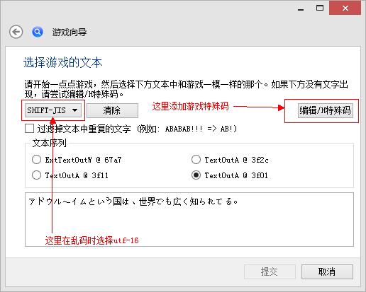

# 能翻译巨娘国2的软件有哪些啊？

作者：滑煞人

TID：21362

<title>1</title> <link href="../Styles/Style.css" type="text/css" rel="stylesheet">

# 1

vnr用了之后他只给翻译那些保存啊返回标题啊这些选项啥的。。对话根本不翻译，也不显示出来。喵翻我压根就打不开，说找不到agth主程序，可我看agth.exe就在同一个文件夹里他怎么就找不到了。。

光摁回车看cg也没啥意思。。我好歹也想了解下他们说的都是啥
<title>2</title> <link href="../Styles/Style.css" type="text/css" rel="stylesheet">

# 2

没有人吗，都是拿完cg就走吗 <title>3</title> <link href="../Styles/Style.css" type="text/css" rel="stylesheet">

# 3

我记得好像是12年的时候我也问过这个问题，在当时是没有解决办法的 <title>4</title> <link href="../Styles/Style.css" type="text/css" rel="stylesheet">

# 4

> [liyun1988 發表於 2016-7-9 19:51](https://giantessnight.cf/gnforum2012/forum.php?mod=redirect&goto=findpost&pid=299355&ptid=21362)
> 我记得好像是12年的时候我也问过这个问题，在当时是没有解决办法的

可13年的时候你还分享了一个翻译软件= =
<title>5</title> <link href="../Styles/Style.css" type="text/css" rel="stylesheet">

# 5

那可能是13年同时问的吧，那个翻译软件也不能翻页巨2 <title>6</title> <link href="../Styles/Style.css" type="text/css" rel="stylesheet">

# 6

> [liyun1988 發表於 2016-7-9 20:57](https://giantessnight.cf/gnforum2012/forum.php?mod=redirect&goto=findpost&pid=299366&ptid=21362)
> 那可能是13年同时问的吧，那个翻译软件也不能翻页巨2

额。。。那巨娘国渡航记1呢？
<title>7</title> <link href="../Styles/Style.css" type="text/css" rel="stylesheet">

# 7

喵翻能用 可是我用的时候有问题，每句话总是翻译好几遍只能看见第一句话，剩下的得往下拉好久，新鲜劲过了之后我就不用了。
而且其实你翻译了基本上也没啥用，机翻的效果不是很好除非你是脑补达人 <title>8</title> <link href="../Styles/Style.css" type="text/css" rel="stylesheet">

# 8

jBeijingV6(中日翻譯軟體)我這邊有，你需要可PM我，我也不確定能不能用，agth要看運氣，有些遊戲軟體不支援 <title>9</title> <link href="../Styles/Style.css" type="text/css" rel="stylesheet">

# 9

这游戏好老了都没翻译  感觉没希望了 <title>10</title> <link href="../Styles/Style.css" type="text/css" rel="stylesheet">

# 10

vnr应该能用，在这里的时候选择正确的对话就可以了，文本序列选错就会出现你这样的情况。 <title>11</title> <link href="../Styles/Style.css" type="text/css" rel="stylesheet">

# 11

 <ignore_js_op>[8fa368c2d5628535669f2e7691ef76c6a6ef6359.jpg](forum.php?mod=attachment&aid=NjIyNTN8YzRkYmExNTV8MTY3NDA2Nzk3OHwxODIzMHwyMTM2Mg%3D%3D&nothumb=yes) *(12.75 KB, 下載次數: 2)*

[下載附件](forum.php?mod=attachment&aid=NjIyNTN8YzRkYmExNTV8MTY3NDA2Nzk3OHwxODIzMHwyMTM2Mg%3D%3D&nothumb=yes)

2016-7-14 12:47 上傳  

</ignore_js_op> <title>12</title> <link href="../Styles/Style.css" type="text/css" rel="stylesheet">

# 12

本人靠脑补: