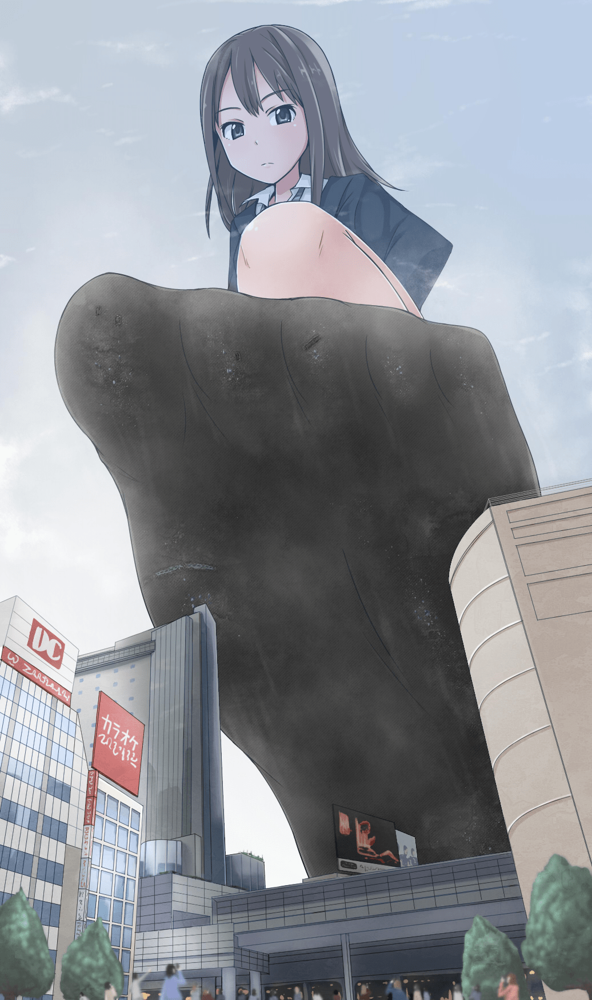

# 腦補大家YY中的女巨人口水一問

作者：芯芯

TID：21736

<title>1</title> <link href="../Styles/Style.css" type="text/css" rel="stylesheet">

# 1

*本帖最後由 zxc132132 於 2020-4-22 22:06 編輯*

假如在一個大約1000-3000米巨大的女巨人
身為一個1000米巨大的身體的side大概可以口腔可以放入大概100多輛小車輛吧

<ignore_js_op>

**3000.jpg** *(513.96 KB, 下載次數: 14)*

[下載附件](forum.php?mod=attachment&aid=NjM3NDJ8Yjg0OTJmNDZ8MTY3NDA2NjE5OHwxODIzMHwyMTczNg%3D%3D&nothumb=yes)

2016-9-2 15:05 上傳

引用寺田的圖來引誘大家YY  

3000米吧這個大概是

大家心中自己幻想時覺得

女巨人的唾液可以 溶化小車輛嗎 或是軟化的
是越巨大時唾液的溶解力量就越高?
可以的情況下又要多少時間?

很想大家來YY一下

回覆有金幣喔 新人們

<title>2</title> <link href="../Styles/Style.css" type="text/css" rel="stylesheet">

# 2

 <ignore_js_op>[main_a57d9960_イラスト12.jpg](forum.php?mod=attachment&aid=Nzk2OTd8MGJkNDYwNGV8MTY3NDA2NjE5OHwxODIzMHwyMTczNg%3D%3D&nothumb=yes) *(83.57 KB, 下載次數: 3)*

[下載附件](forum.php?mod=attachment&aid=Nzk2OTd8MGJkNDYwNGV8MTY3NDA2NjE5OHwxODIzMHwyMTczNg%3D%3D&nothumb=yes)

2019-9-18 22:20 上傳  

</ignore_js_op> <title>3</title> <link href="../Styles/Style.css" type="text/css" rel="stylesheet">

# 3

应该只会把车粘住吧..融化应该有点难 <title>4</title> <link href="../Styles/Style.css" type="text/css" rel="stylesheet">

# 4

涩谷凛........
很残念，人类唾液最有杀伤力的就是淀粉酶和溶菌酶，这些......可以想象，如果她一滴唾液滴到田地里，这片土地今年就没啥收成了,另外会杀死很多微生物......(忽略分子大小影响），所以说，要yy，做好的还是黏度，窒息之类的，很有爱
然而将接触到的一切融化......王水都表示做不到.....这太可怕.... <title>5</title> <link href="../Styles/Style.css" type="text/css" rel="stylesheet">

# 5

虽然说唾液具有初步的消化功能···但是我也没见过那个人含着个馒头就把馒头含没了。
主要还是看融不融吧···容易融的比如糖；没法融的比如铁片··· <title>6</title> <link href="../Styles/Style.css" type="text/css" rel="stylesheet">

# 6

即使巨大化了，口水也不可能变成硫酸吧..... <title>7</title> <link href="../Styles/Style.css" type="text/css" rel="stylesheet">

# 7

巨大化了 口水里的酶是否会变得更强这都很难说 <title>8</title> <link href="../Styles/Style.css" type="text/css" rel="stylesheet">

# 8

应该不会融。。。                           <title>9</title> <link href="../Styles/Style.css" type="text/css" rel="stylesheet">

# 9

话说发言底下的一行字怎么弄上去的... <title>10</title> <link href="../Styles/Style.css" type="text/css" rel="stylesheet">

# 10

粘稠是理想的，融化掉也太那啥了 <title>11</title> <link href="../Styles/Style.css" type="text/css" rel="stylesheet">

# 11

喂喂这是唾液，不是什么强酸吧。女巨人喷吐溶解液什么的，史前怪兽吗？ <title>12</title> <link href="../Styles/Style.css" type="text/css" rel="stylesheet">

# 12

但是會不會覺得
變成了giga 的星球一樣巨大的
就會有感覺可以 溶化城市哩

越巨大就可以?
<title>13</title> <link href="../Styles/Style.css" type="text/css" rel="stylesheet">

# 13

假设分子大小没有改变，那么女巨人的口水也只是数量变多了而已吧，联想普通女人的口水，也没有瞬间融化馒头小麦之类食物的能力，更何况是汽车这些。至于黏性，我认为也没有大家想的那么强。倒是味道，可能会被无限放大。。。。 <title>14</title> <link href="../Styles/Style.css" type="text/css" rel="stylesheet">

# 14

如果溶化的话,感觉有点恐怖.. <title>15</title> <link href="../Styles/Style.css" type="text/css" rel="stylesheet">

# 15

感覺就水水的吧
只是變成範圍很大很大 <title>16</title> <link href="../Styles/Style.css" type="text/css" rel="stylesheet">

# 16

融化实在是太神奇了。。。黏住软化感觉比较好 <title>17</title> <link href="../Styles/Style.css" type="text/css" rel="stylesheet">

# 17

我觉得应该是4吧……
没那么厉害 <title>18</title> <link href="../Styles/Style.css" type="text/css" rel="stylesheet">

# 18

斟酌了很久觉得4比较靠谱。因为口水中有唾液淀粉酶，可以分解部分淀粉吧，软化车子不会啦。 <title>19</title> <link href="../Styles/Style.css" type="text/css" rel="stylesheet">

# 19

胃酸的话还好说。不过唾液嘛。不觉得很腻害。黏糊糊确实 <title>20</title> <link href="../Styles/Style.css" type="text/css" rel="stylesheet">

# 20

最多黏糊糊的，融化什么的，除非你是馒头吧汽车更不可能融化了。 <title>21</title> <link href="../Styles/Style.css" type="text/css" rel="stylesheet">

# 21

吐胃酸都不能达到溶解液的效果吧。。。 <title>22</title> <link href="../Styles/Style.css" type="text/css" rel="stylesheet">

# 22

应该不会吧2333  口水没那么强 <title>23</title> <link href="../Styles/Style.css" type="text/css" rel="stylesheet">

# 23

感觉还是黏住东西比较靠谱，可能会让一些东西被泡软，不过腐蚀什么的还是算了0.0 <title>24</title> <link href="../Styles/Style.css" type="text/css" rel="stylesheet">

# 24

巨大化应该只有量增加，威力应该不太会变强吧，不过还是有杀伤力的，量大会淹死小人！ <title>25</title> <link href="../Styles/Style.css" type="text/css" rel="stylesheet">

# 25

從口水的成分來說，稍微把東西弄的稠稠的，就已經極限了吧?
要溶解人是不太可能的，不過如果真的很大時，搞不好溫度會很高
然後將金屬和物體直接融掉也不一定喔
說實話這終究是幻想，想怎樣就怎樣囉~ <title>26</title> <link href="../Styles/Style.css" type="text/css" rel="stylesheet">

# 26

额…对唾液play无爱
但是金币什么的才是真爱#(手动滑稽) <title>27</title> <link href="../Styles/Style.css" type="text/css" rel="stylesheet">

# 27

巨大化只会改变物理性质，不会改变化学性质 <title>28</title> <link href="../Styles/Style.css" type="text/css" rel="stylesheet">

# 28

粘稠吧 溶解什么的不太可能 唾液的ph'值还是很正常的？ <title>29</title> <link href="../Styles/Style.css" type="text/css" rel="stylesheet">

# 29

像uru的PrettyMelt那样加入魔法设定就可以融化了 <title>30</title> <link href="../Styles/Style.css" type="text/css" rel="stylesheet">

# 30

不懂啊  只知道会淹死       <title>31</title> <link href="../Styles/Style.css" type="text/css" rel="stylesheet">

# 31

口水是呈弱碱性的，感觉应该不会融化很多东西 <title>32</title> <link href="../Styles/Style.css" type="text/css" rel="stylesheet">

# 32

腐蚀什么的太过了吧，不过被粘住还是绰绰有余的 <title>33</title> <link href="../Styles/Style.css" type="text/css" rel="stylesheet">

# 33

讲道理 效果应该不会变强吧 <title>34</title> <link href="../Styles/Style.css" type="text/css" rel="stylesheet">

# 34

之前看過一篇日文小說,以科學的角度去說故事
當然有些完全沒法在物理學上成立的事情就用神明的惡意帶過,比如女巨人抓起小人移動速度會產生音爆,還有壓力變化之類

其中非常有趣的是,在進行身體探索階段,人類身上有的寄生蟲等比例放大,被人體弱酸溶解,要H還得算週期穿潛水服才行
<title>35</title> <link href="../Styles/Style.css" type="text/css" rel="stylesheet">

# 35

不会融 以以为是怪物了 <title>36</title> <link href="../Styles/Style.css" type="text/css" rel="stylesheet">

# 36

口水最多淹死人吧，被腐蚀有点悬 <title>37</title> <link href="../Styles/Style.css" type="text/css" rel="stylesheet">

# 37

没有相应的酶办不到溶解吧 <title>38</title> <link href="../Styles/Style.css" type="text/css" rel="stylesheet">

# 38

融化......你是口水还是魔酸啊喂!就不怕把自己舌头分解掉嘛
其实可能最多也就是一点粘稠感吧,就像你不可能只是含在嘴里来吃掉一块肉
不对,粘稠感都不一定会有,不信自己舔自己一口试试 <title>39</title> <link href="../Styles/Style.css" type="text/css" rel="stylesheet">

# 39

3000米高的人形生物肯定身体强度和构造与人类差远了。。就算真能溶解这些肌腱、软肉和流动在其中的黑暗之血也没啥好奇怪的。
MD这周又没出无敌 <title>40</title> <link href="../Styles/Style.css" type="text/css" rel="stylesheet">

# 40

粘稠吧，黏黏的多有感觉（手动滑稽） <title>41</title> <link href="../Styles/Style.css" type="text/css" rel="stylesheet">

# 41

感觉并不会吧...除非是有什么特殊体质的女巨人什么的，否则也就只是普通的唾液而已吧，想象一下你跳进一个装满唾液的容器里（大雾2333）也应该不会感觉到什么吧，不过也许会被淹死呢毕竟那可是好大一滴啊2333 <title>42</title> <link href="../Styles/Style.css" type="text/css" rel="stylesheet">

# 42

觉得只是黏住吧，想在里面游泳 <title>43</title> <link href="../Styles/Style.css" type="text/css" rel="stylesheet">

# 43

融化也太强了...这不是变大而是变异了（似乎变大包括在变异里，不管这些了） <title>44</title> <link href="../Styles/Style.css" type="text/css" rel="stylesheet">

# 44

味道肯定不会好，难道能是水果味？ <title>45</title> <link href="../Styles/Style.css" type="text/css" rel="stylesheet">

# 45

感觉来说，口水应该不具有融化所有东西的能力，但会有粘稠的感觉，但只有边缘粘性最强，比较难挣脱，就像从泳池的梯子出水一样，而口水里面的话就只素行动不便的感觉：然后就素吐口水介个行为应该会对降落的地方造成破坏，没坏都有点残，可以参考一下跳水进水时的感觉。 <title>46</title> <link href="../Styles/Style.css" type="text/css" rel="stylesheet">

# 46

应该是黏糊糊的液体的感觉 <title>47</title> <link href="../Styles/Style.css" type="text/css" rel="stylesheet">

# 47

这个高度就就很尴尬了 <title>48</title> <link href="../Styles/Style.css" type="text/css" rel="stylesheet">

# 48

我也觉得不会融，主要还是那种粘乎乎的感觉吧 <title>49</title> <link href="../Styles/Style.css" type="text/css" rel="stylesheet">

# 49

感觉融化这个设定一旦用上，基本就是残酷系文章了，场景一般比较血腥吧
<title>50</title> <link href="../Styles/Style.css" type="text/css" rel="stylesheet">

# 50

融化什么的太可怕了，黏住就好了 <title>51</title> <link href="../Styles/Style.css" type="text/css" rel="stylesheet">

# 51

*本帖最後由 sky777 於 2016-12-31 04:22 編輯*

其實舉一個例子就能發現很多問題了…
設想你正在看一篇官能小說，或是一張官能圖片，是一個1000倍的水手服短裙少女，她以一隻腳裸足、另一隻腳穿著皮鞋的姿態蹲在城市裏面，饒有興致地觀察著胯下的街道。設想你正在她目光焦點的人群之中。（也就是你是1倍）
你肯能會聯想到很多巨大無比的威壓感。比如參考系的輔助（高空的雲彩、各種尺寸的載具、地標建築等等）。比如特效的輔助（震動、轟鳴與尖叫等等）。比如物理的輔助（大地的沉降與裂紋、空氣的壓力）。
但是…你會發現少女真正1000倍巨大了的特徵，僅僅是視覺哦。

何出此言？

別忘了還有其他四感呢。聽覺，觸覺，嗅覺，味覺。
即便她是那樣的巨大，站在她的腳邊仰望著她，她所說的話語一字一句的清晰可辨，甚至仍舊是甜美的。
即便她是那樣的巨大，你斗膽伸出手去觸摸她的足趾——即便你甚至連指肚都夠不到，只是摸著底部的趾紋——卻感受到她的皮仍是柔嫩的，甚至仍舊帶有著正常的體溫。
即便她是那樣的巨大，處於她的胯下，她費洛蒙的青春味道從幾百米上方傾瀉下，但是少女誘惑的氣息卻一點也沒有變。
即便她是那樣的巨大，即便丟到了她的制服便鞋裏面，輕輕地舔了一下鞋內，卻發現仍舊是少女正常汗液的體味。

（想到哪部小說了嗎？對了，就是Junkman先生的薔薇色的黎明。上面的五感，都是以上述的矛盾出現的：面對巨大少女卻毫不陌生的五感。）

於是其實她仍舊是那個正常大小的少女。她的各種特徵仍然一模一樣的保持了1倍時的原樣。只不過她被加上了Size這個屬性，罷了。

嘛一卡。可能說的不是特別清楚，但是意思應該表述出來了，那便是：Size fetish真的是一種完美的性癖。她能夠綜合很多很多的其餘性癖而使得幻想近乎完美，而毫無違和。但是，卻至多也只是美好的幻想罷了。

<title>52</title> <link href="../Styles/Style.css" type="text/css" rel="stylesheet">

# 52

口水的话想融化车有点不可能吧。。。
<title>53</title> <link href="../Styles/Style.css" type="text/css" rel="stylesheet">

# 53

就人口腔的37度能融化车？ <title>54</title> <link href="../Styles/Style.css" type="text/css" rel="stylesheet">

# 54

黏住应该有可能，但是融化的话真心不太可能 <title>55</title> <link href="../Styles/Style.css" type="text/css" rel="stylesheet">

# 55

> [zxc132132 發表於 2016-9-2 20:12](https://giantessnight.cf/gnforum2012/forum.php?mod=redirect&goto=findpost&pid=307070&ptid=21736)
> 但是會不會覺得
> 變成了giga 的星球一樣巨大的
> 就會有感覺可以 溶化城市哩

如果giga级的话...

我感觉只是口水会变成洪水而已2333

溶化什么的貌似还是不现实啦

等等 貌似现实中叶没有GTS这种东东

好吧

<title>56</title> <link href="../Styles/Style.css" type="text/css" rel="stylesheet">

# 56

> jack369605 發表於 2016-9-2 17:14
> 涩谷凛........
> 很残念，人类唾液最有杀伤力的就是淀粉酶和溶菌酶，这些......可以想象，如果她一滴 ...

话说，唾液淀粉酶和溶菌酶是需要一定温度才能发挥作用的，况且溶菌酶的作用靶点一般为破坏细菌细胞膜表白蛋白，而土壤中的细菌几乎全部具有细胞壁，所以应该不会造成杀灭作用。而且人类唾液中只含有β淀粉酶，无法催化水解纤维素，而植物中大多为纤维素，所以也并不会杀死植物..... <title>57</title> <link href="../Styles/Style.css" type="text/css" rel="stylesheet">

# 57

开个稍微偏一点题的脑洞......说说妹子变大的成因，我觉得这分为两种情况，若是妹子的遗传物质与人类相同，但是妹子生在一个低重力，高温，高含氧量的星球，她的体细胞较地球人大，这时她没有任何护具来到地球，首先可能因为重力原因根本无法站立==然后就会缺氧....如果机体能够适应也应该处于成天睡觉的代谢状态。或是她和我们拥有同样的细胞大小，应该是她的细胞数量较多....那么从遗传物质上说，要么与我们截然不同，要么就比我们多几倍的染色体....不论如何，天然避孕...... <title>58</title> <link href="../Styles/Style.css" type="text/css" rel="stylesheet">

# 58

感觉最多黏住吧 唾液主要作用在笑话分解里占比较少的部分吧 主要是分解淀粉麦芽糖 而且感觉那么大后 估计对小人而言算是个水池了吧 <title>59</title> <link href="../Styles/Style.css" type="text/css" rel="stylesheet">

# 59

感觉巨大化以后还是参考人比较合适。
巨人的唾液如果能融化金属，那巨人本身得是什么构造才能抵御自己的唾液啊。。。 <title>60</title> <link href="../Styles/Style.css" type="text/css" rel="stylesheet">

# 60

还是黏住感觉比较靠谱。。？ <title>61</title> <link href="../Styles/Style.css" type="text/css" rel="stylesheet">

# 61

感觉吐口水这种行为不能戳到萌点。。。还是直接舔比较好呢 <title>62</title> <link href="../Styles/Style.css" type="text/css" rel="stylesheet">

# 62

不过讲道理女巨人本来就是超出常理的存在啦，拥有超越常理的唾液也不是那么不好理解。。
另外，长枪大炮对着女巨人的时候，女巨人用只要用唾液就能还击难道不会很带感吗 <title>63</title> <link href="../Styles/Style.css" type="text/css" rel="stylesheet">

# 63

比如，在里面洗个澡？？ <title>64</title> <link href="../Styles/Style.css" type="text/css" rel="stylesheet">

# 64

唾液的话。。。这么高滴下来也可以压死人了吧 <title>65</title> <link href="../Styles/Style.css" type="text/css" rel="stylesheet">

# 65

对唾液不感兴趣..不过这么大的估计都能淹死人了 <title>66</title> <link href="../Styles/Style.css" type="text/css" rel="stylesheet">

# 66

口水没有消化的功能吧 <title>67</title> <link href="../Styles/Style.css" type="text/css" rel="stylesheet">

# 67

对口水，唾液什么的没感觉，但至少不能像强酸那样吧……可能吧…… <title>68</title> <link href="../Styles/Style.css" type="text/css" rel="stylesheet">

# 68

融化。。那只限淀粉酶什么的吧。。。 <title>69</title> <link href="../Styles/Style.css" type="text/css" rel="stylesheet">

# 69

唾液淀粉酶什么的还是一样的啊 <title>70</title> <link href="../Styles/Style.css" type="text/css" rel="stylesheet">

# 70

吐口口水的话  能粘住一些东西是可以的 口腔里的唾液淀粉酶 溶菌酶...溶解不了什么的吧 <title>71</title> <link href="../Styles/Style.css" type="text/css" rel="stylesheet">

# 71

所以。。。还是更喜欢同等身高~3倍身高的GTS <title>72</title> <link href="../Styles/Style.css" type="text/css" rel="stylesheet">

# 72

应该不至于融化，但应该很粘
<title>73</title> <link href="../Styles/Style.css" type="text/css" rel="stylesheet">

# 73

这是唾液，不是什么强酸吧 <title>74</title> <link href="../Styles/Style.css" type="text/css" rel="stylesheet">

# 74

正常来说，唾液这种东西是不可能造成融化或者软化的 <title>75</title> <link href="../Styles/Style.css" type="text/css" rel="stylesheet">

# 75

如果能融化的话觉得还是是由于温度过高的原因吧……我也不大清楚，只是这样觉得，又热又湿的，想想都不舒服呢……还有啊，只是含着或者唾液就能把一切溶解，不觉得太无感了吗，应该是只能把衣服溶解之类的比较好吧。 <title>76</title> <link href="../Styles/Style.css" type="text/css" rel="stylesheet">

# 76

黏住应该有可能，但是融化的话真心不太可能 <title>77</title> <link href="../Styles/Style.css" type="text/css" rel="stylesheet">

# 77

会腐蚀东西还是挺惊悚的啦，不过既然会出现喜欢吞吃小人的（个人不喜欢的类型）女巨人，理应消化能力要很强才对，而作为人体消化系统第一道关口的唾液强度应该要强很多，可能还伴随着某种口臭，虽说这么想还是感觉有点恶心和不卫生 <title>78</title> <link href="../Styles/Style.css" type="text/css" rel="stylesheet">

# 78

如果唾液太有违常理就感觉不对啊，就像当年有人闹着要写文章的作者想看女巨人喷火一样，除了他之外没人想看。 <title>79</title> <link href="../Styles/Style.css" type="text/css" rel="stylesheet">

# 79

有没有像但丁的文章一样能治疗 <title>80</title> <link href="../Styles/Style.css" type="text/css" rel="stylesheet">

# 80

口水就是口水嘛，淹死在里面就好了 <title>81</title> <link href="../Styles/Style.css" type="text/css" rel="stylesheet">

# 81

化学成分还是不会变的吧…所以应该还是不会融… <title>82</title> <link href="../Styles/Style.css" type="text/css" rel="stylesheet">

# 82

个人觉得应该就是粘粘吧，最高软化。 <title>83</title> <link href="../Styles/Style.css" type="text/css" rel="stylesheet">

# 83

超巨大女巨人的唾液也太強了吧 <title>84</title> <link href="../Styles/Style.css" type="text/css" rel="stylesheet">

# 84

融化什么的太恐怖了。。。 <title>85</title> <link href="../Styles/Style.css" type="text/css" rel="stylesheet">

# 85

融化。。。。。。。未免有点太恐怖了。。。。。。。。。 <title>86</title> <link href="../Styles/Style.css" type="text/css" rel="stylesheet">

# 86

唾液是显弱酸性的一种溶液吧，吐在地上应该只能让少数东西软化，，，而且我觉得我的唾沫好像比男人的要稀唉，应该粘不牢吧，，，不过要是千米巨人的话砸都砸死了吧。。。。
<title>87</title> <link href="../Styles/Style.css" type="text/css" rel="stylesheet">

# 87

這問題會讓我想到URU的伕他 裏面噴出來的米青 是會把消化掉 想想挺獵奇
口水還是假定淹沒好 不過車子被淹到 想要發動可能也成泡口水車了?! <title>88</title> <link href="../Styles/Style.css" type="text/css" rel="stylesheet">

# 88

本来还想评论一下的，一看是萝莉那就算了，我不喜欢，也不能接受，抱歉了 <title>89</title> <link href="../Styles/Style.css" type="text/css" rel="stylesheet">

# 89

最多粘稠态吧。。融化什么的就太过分了╯□╰
<title>90</title> <link href="../Styles/Style.css" type="text/css" rel="stylesheet">

# 90

口水是臭的
會先臭死吧 <title>91</title> <link href="../Styles/Style.css" type="text/css" rel="stylesheet">

# 91

我個人覺得
口水的黏度很低
要黏住可能有困難
頂多是減緩行車速度的程度 <title>92</title> <link href="../Styles/Style.css" type="text/css" rel="stylesheet">

# 92

口水本来就不粘啊，又不是痰2333333 <title>93</title> <link href="../Styles/Style.css" type="text/css" rel="stylesheet">

# 93

唾液的主要成分还是水（还想是99％都是水来着），其余是一些酶咯，氨基酸咯，血型物质咯u，口腔脱落的衰老细胞之类的。从口腔里直接拿出来别说融化汽车，小人之类的，连黏住东西也不容易（只要这货巨大化之前有合理地摄入水分）。感觉唾液吧，最多只是能让小人溺水，但giga的话倒说不定可以有洪水的效果。 <title>94</title> <link href="../Styles/Style.css" type="text/css" rel="stylesheet">

# 94

粘稠是可以了感觉，融化掉也太。。。。 <title>95</title> <link href="../Styles/Style.css" type="text/css" rel="stylesheet">

# 95

虽然说幻想中的事怎么想都可以,但我觉得还是跟现实中的一样就好了,融化东西也太猎奇了... <title>96</title> <link href="../Styles/Style.css" type="text/css" rel="stylesheet">

# 96

一大团水在3000米高空落下估计都能砸死人了 <title>97</title> <link href="../Styles/Style.css" type="text/css" rel="stylesheet">

# 97

看设定吧，这个毕竟是虚假的东西，怎么设定怎么来，不是吗？
<title>98</title> <link href="../Styles/Style.css" type="text/css" rel="stylesheet">

# 98

粘稠就好了，融化还是算了 <title>99</title> <link href="../Styles/Style.css" type="text/css" rel="stylesheet">

# 99

应该不会融啊  女巨人唾液成分又不会变  又不会吐出来王水  怎么融化金属之类的。。。。 <title>100</title> <link href="../Styles/Style.css" type="text/css" rel="stylesheet">

# 100

口水都有这个属性的话那真是太可怕了 <title>101</title> <link href="../Styles/Style.css" type="text/css" rel="stylesheet">

# 101

可以黏住微小的东西，包括人或者汽车，可以随着时间去逐渐对微小的人体造成一定伤害，但不至于融化，关于汽车等硬件物品不能融化，最多起到黏住的作用减缓其移动 <title>102</title> <link href="../Styles/Style.css" type="text/css" rel="stylesheet">

# 102

这贴子是有多古老了呀????.不过话说确实也还没回复过，发表一下我个人的看法：正常一点的女巨人大概像图中的千倍这样的话口水一滴都得有几米的直径，体积都是得是十万升起的.然后，估计就是能直接砸死人吧（高空），然后粘稠确实也有，但不是很明显，应该就是拖慢一点东西在里面的移动速度.其他属性没那么猎奇的话应该都是溶解不了活人车呀啥的 <title>103</title> <link href="../Styles/Style.css" type="text/css" rel="stylesheet">

# 103

新的xp，被口水融化控，感觉比丸吞还有意思 <title>104</title> <link href="../Styles/Style.css" type="text/css" rel="stylesheet">

# 104

人就算变大口水也不会提高腐蚀性吧。 <title>105</title> <link href="../Styles/Style.css" type="text/css" rel="stylesheet">

# 105

这个问题完全可以自己含一个干净点的铁片，如果你能给它含化了，那命题就成立了</ignore_js_op>