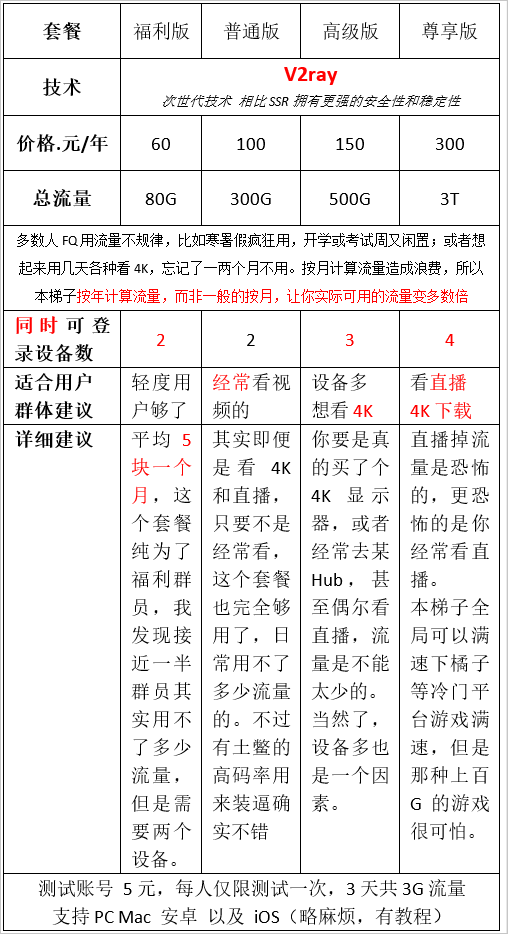
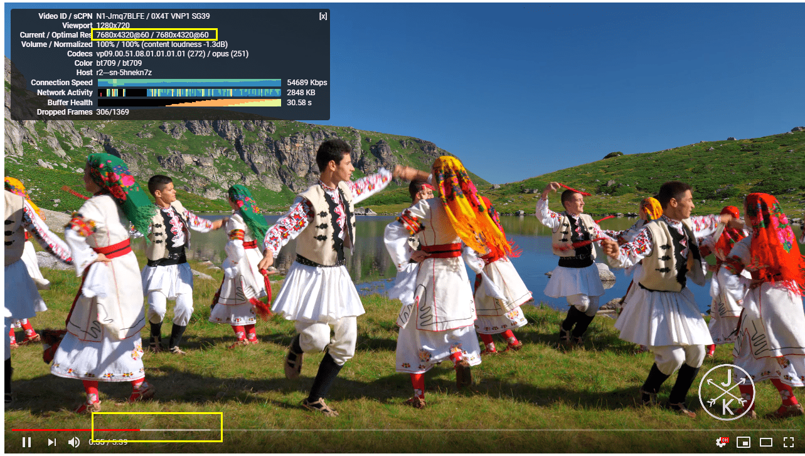

# 自己搭建了个翻墙，有需要的人可以来入股，现在出来不...

作者：紫色欧石楠

TID：26518

<title>1</title> <link href="../Styles/Style.css" type="text/css" rel="stylesheet">

# 1

*本帖最後由 smai999 於 2019-3-5 20:39 編輯*

网上混久了，各家的翻墙都用过，便宜的不稳定，收费的买不起，有时候一下好多家都暴毙，如果出不来可能长时间出不来，很尴尬
后来我和一些小伙伴合资弄了个服务器，我出技术，大家出钱
**这个梯子是自己搭建的，目前已经运行了一年左右，打算一直坚持下去**
需要的，请加QQ群：787188247
**但是劳烦请不要讨论GTS内容，隐私，大家都懂****PS：海外可以通过本梯子访问国内** 价格参考下面：
<ignore_js_op>

**瀑布梯子套餐和价格.png** *(87.5 KB, 下載次數: 0)*

[下載附件](forum.php?mod=attachment&aid=NzY5MTR8M2Q3NmJiNDl8MTY3NDA2Njg2MnwxODIzMHwyNjUxOA%3D%3D&nothumb=yes)

2019-3-5 09:48 上傳

节点使用了暴力加速，不仅高峰期仍能保持不错的速度，白天更能轻松8K
<ignore_js_op>

**TIM图片20190305144857.png** *(1.4 MB, 下載次數: 0)*

[下載附件](forum.php?mod=attachment&aid=NzY5MTV8ZTljNWZlNTZ8MTY3NDA2Njg2MnwxODIzMHwyNjUxOA%3D%3D&nothumb=yes)

2019-3-5 14:50 上傳

另外，我愿意拿出五份福利版梯子送给GN的核心会员，毕竟有你们的存在，才有我们大众这么多优质资源看
一共5份，先到先得哦！要核心会员
还剩5/5份（实时更新）

<title>2</title> <link href="../Styles/Style.css" type="text/css" rel="stylesheet">

# 2

图片放不大，大概说一下推荐大家买一年60的基本就够用了，详细的说明群里的群共享文件里面有说明，也有教程 <title>3</title> <link href="../Styles/Style.css" type="text/css" rel="stylesheet">

# 3

可以有，但是暂时还没必要
先马克一下，一直运行的话以后会有机会的 <title>4</title> <link href="../Styles/Style.css" type="text/css" rel="stylesheet">

# 4

冒昧地问一下，服务器买了哪家的？ <title>5</title> <link href="../Styles/Style.css" type="text/css" rel="stylesheet">

# 5

> [米莉恩 發表於 2019-3-5 11:50](https://giantessnight.cf/gnforum2012/forum.php?mod=redirect&goto=findpost&pid=399142&ptid=26518)
> 可以有，但是暂时还没必要
> 先马克一下，一直运行的话以后会有机会的 ...

嗯嗯，很多时候就是留个备用，万一断线了比较尴尬
可以先加群苟着
<title>6</title> <link href="../Styles/Style.css" type="text/css" rel="stylesheet">

# 6

 早点出现就好了。。我买了半年的VPN花了240。。。。还有两个月才到期. <title>7</title> <link href="../Styles/Style.css" type="text/css" rel="stylesheet">

# 7

大哥你认真的么？baacould无限流量一年才150 <title>8</title> <link href="../Styles/Style.css" type="text/css" rel="stylesheet">

# 8

*本帖最後由 smai999 於 2019-3-5 19:23 編輯*

> [dickman 發表於 2019-3-5 18:20](https://giantessnight.cf/gnforum2012/forum.php?mod=redirect&goto=findpost&pid=399208&ptid=26518)
> 大哥你认真的么？baacould无限流量一年才150

你说的这个我没听过，这是老实话
但是我知道外面卖这东西的很多

我想说，无限流量，都是幌子，流量都是钱，说白了只是知道你用不了多少，或者大范围的人群平均用量很少。
就好像无限免费续杯，真的无限吗？现在各大VPS的价格，贵的多贵的都有，但是速度快的，流量都不便宜，不说无限，你每个月1T，坚持一年，150块一年那种绝对封你号，因为亏N倍
（小水管龟速除外）

我这个是自己搞的，会一直搞下去，是国内的，你能加到我的QQ，我觉得用起来不会比任何一家差

<title>9</title> <link href="../Styles/Style.css" type="text/css" rel="stylesheet">

# 9

这个尊享版打游戏玩美服之类的够用么 <title>10</title> <link href="../Styles/Style.css" type="text/css" rel="stylesheet">

# 10

> [规划局hhh 發表於 2019-3-5 20:09](https://giantessnight.cf/gnforum2012/forum.php?mod=redirect&goto=findpost&pid=399235&ptid=26518)
> 这个尊享版打游戏玩美服之类的够用么

打游戏需要的流量很小，那个福利版就够了
但是打游戏需要超低的延迟，我这里满足不了

所以打游戏的话，还是要月供买加速器
<title>11</title> <link href="../Styles/Style.css" type="text/css" rel="stylesheet">

# 11

> [smai999 發表於 2019-3-5 20:28](https://giantessnight.cf/gnforum2012/forum.php?mod=redirect&goto=findpost&pid=399240&ptid=26518)
> 打游戏需要的流量很小，那个福利版就够了
> 但是打游戏需要超低的延迟，我这里满足不了

把流量用完了可以续费么（我的用量介于150-300档，我是担心150档不一定够用但是300档太多了）
<title>12</title> <link href="../Styles/Style.css" type="text/css" rel="stylesheet">

# 12

技术大手子？支持一下~ <title>13</title> <link href="../Styles/Style.css" type="text/css" rel="stylesheet">

# 13

> [smai999 發表於 2019-3-5 20:28](https://giantessnight.cf/gnforum2012/forum.php?mod=redirect&goto=findpost&pid=399240&ptid=26518)
> 打游戏需要的流量很小，那个福利版就够了
> 但是打游戏需要超低的延迟，我这里满足不了

把流量用完了可以续费么（我的用量介于150-300档，我是担心150档不一定够用但是300档太多了）
<title>14</title> <link href="../Styles/Style.css" type="text/css" rel="stylesheet">

# 14

*本帖最後由 ssn21 於 2019-3-5 23:33 編輯*

大佬可以确保VPN稳定吗

我个人需求的话，速度流量都不如稳定重要
<title>15</title> <link href="../Styles/Style.css" type="text/css" rel="stylesheet">

# 15

先mark一下，我的也快到期了 <title>16</title> <link href="../Styles/Style.css" type="text/css" rel="stylesheet">

# 16

> [紫色欧石楠 發表於 2019-3-5 21:15](https://giantessnight.cf/gnforum2012/forum.php?mod=redirect&goto=findpost&pid=399259&ptid=26518)
> 把流量用完了可以续费么（我的用量介于150-300档，我是担心150档不一定够用但是300档太多了）
> ...

当然没问题啦！，。。。xx
<title>17</title> <link href="../Styles/Style.css" type="text/css" rel="stylesheet">

# 17

> [ssn21 發表於 2019-3-5 23:32](https://giantessnight.cf/gnforum2012/forum.php?mod=redirect&goto=findpost&pid=399287&ptid=26518)
> 大佬可以确保VPN稳定吗
> 
> 我个人需求的话，速度流量都不如稳定重要

我不能保证服务器一定不会挂但是我能保证这个服务器一年绝对不会挂超过三次
并且24小时内恢复
<title>18</title> <link href="../Styles/Style.css" type="text/css" rel="stylesheet">

# 18

已经有不少人加群买梯子啦</ignore_js_op></ignore_js_op>