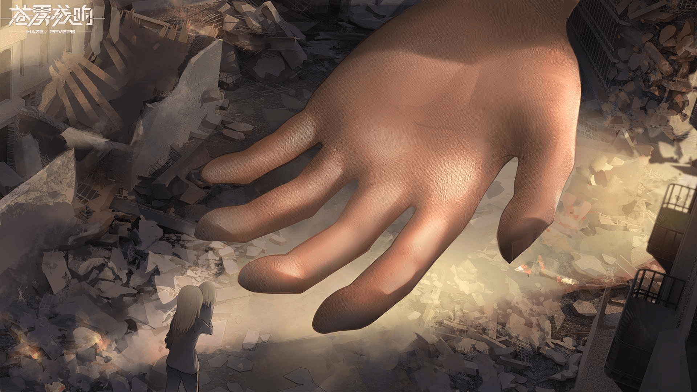

# 苍雾残响—是一款巨大娘手游

作者：放逐之锋

TID：29229

<title>1</title> <link href="../Styles/Style.css" type="text/css" rel="stylesheet">

# 1

HI！大家好，我是苍雾残响的制作人，这款游戏将是一款货真价实的巨大娘游戏。但本作不会有H情节，主要还是描写战争、末日、亲情。如有什么问题，可以留言，我会抽空回答。

<title>2</title> <link href="../Styles/Style.css" type="text/css" rel="stylesheet">

# 2

 <ignore_js_op>[弗兰卡救人2.jpg](forum.php?mod=attachment&aid=ODQ0OTF8MWU5YWQ3MmV8MTY3NDA3MjIxOXwxODIzMHwyOTIyOQ%3D%3D&nothumb=yes) *(227.87 KB, 下載次數: 7)*

[下載附件](forum.php?mod=attachment&aid=ODQ0OTF8MWU5YWQ3MmV8MTY3NDA3MjIxOXwxODIzMHwyOTIyOQ%3D%3D&nothumb=yes)

2020-8-7 16:26 上傳  

</ignore_js_op> <ignore_js_op>[弗兰卡救人.jpg](forum.php?mod=attachment&aid=ODQ0OTB8OGUyODg4M2V8MTY3NDA3MjIxOXwxODIzMHwyOTIyOQ%3D%3D&nothumb=yes) *(253.74 KB, 下載次數: 13)*

[下載附件](forum.php?mod=attachment&aid=ODQ0OTB8OGUyODg4M2V8MTY3NDA3MjIxOXwxODIzMHwyOTIyOQ%3D%3D&nothumb=yes)

2020-8-7 16:25 上傳  

</ignore_js_op> <ignore_js_op>[对峙.jpg](forum.php?mod=attachment&aid=ODQ0ODl8MjQxOWVhMTJ8MTY3NDA3MjIxOXwxODIzMHwyOTIyOQ%3D%3D&nothumb=yes) *(218.52 KB, 下載次數: 4)*

[下載附件](forum.php?mod=attachment&aid=ODQ0ODl8MjQxOWVhMTJ8MTY3NDA3MjIxOXwxODIzMHwyOTIyOQ%3D%3D&nothumb=yes)

2020-8-7 16:25 上傳  

</ignore_js_op> <title>3</title> <link href="../Styles/Style.css" type="text/css" rel="stylesheet">

# 3

shut up and take my ducat!
问题的话……请问大概啥时候能上线呢？ <title>4</title> <link href="../Styles/Style.css" type="text/css" rel="stylesheet">

# 4

看了下taptap上都有了，真是大手笔啊。

玩法和具体设定上没透露太多，只看立绘和插画还不错。希望成品是不错的游戏。 <title>5</title> <link href="../Styles/Style.css" type="text/css" rel="stylesheet">

# 5

上一个我听说的游戏是Ragnastrike Angels，也是30~40米的妹子打入侵的敌人，请了深崎暮人做了3d还是凉了。

一个很麻烦的问题：怎么回避Ragnastrike Angels开场让人索然无味、刷图时完全体现不出GTS等吸引人的要素的问题呢？ <title>6</title> <link href="../Styles/Style.css" type="text/css" rel="stylesheet">

# 6

就算是仅仅吧gts当做萌属性的话，感觉在发展上还是困难重重啊，甚至有可能既吸引不到圈内人又吸引不到圈外人的情况...感觉真的太难了。 <title>7</title> <link href="../Styles/Style.css" type="text/css" rel="stylesheet">

# 7

贴吧说今年年底会有内测诶还看到一个说啥为啥这游戏角色都这么高的23333 <title>8</title> <link href="../Styles/Style.css" type="text/css" rel="stylesheet">

# 8

制作人果然也是圈内人，前段时间在tap上看到宣传就被吓到了
期待 <title>9</title> <link href="../Styles/Style.css" type="text/css" rel="stylesheet">

# 9

在此支持，看法建议会放在taptap上面，加油~ <title>10</title> <link href="../Styles/Style.css" type="text/css" rel="stylesheet">

# 10

為什麼要抄襲？

<title>11</title> <link href="../Styles/Style.css" type="text/css" rel="stylesheet">

# 11

已经在TapTap上预约了，请问是什么类型的游戏呢？ <title>12</title> <link href="../Styles/Style.css" type="text/css" rel="stylesheet">

# 12

不意外應該是公主連結的那種玩法沒錯，沒玩過的總該聽過刀塔傳奇，就是那種風格，討論釋出的畫面也是那樣，他們徵才也是朝那種方向在走，估計這幾個資料片就是唯一GTS的CG畫面 <title>13</title> <link href="../Styles/Style.css" type="text/css" rel="stylesheet">

# 13

> [xxx99 發表於 2020-8-7 18:12](https://giantessnight.cf/gnforum2012/forum.php?mod=redirect&goto=findpost&pid=444185&ptid=29229)
> 為什麼要抄襲？

楼主已经在过往的帖子对此问题回应了，请参考：

[https://giantessnight.com/gnforum2012/forum.php?mod=viewthread&tid=29005&page=2#pid441050](https://giantessnight.com/gnforum2012/forum.php?mod=viewthread&tid=29005&page=2#pid441050)
<title>14</title> <link href="../Styles/Style.css" type="text/css" rel="stylesheet">

# 14

玩是必须玩的~~！！  什么时候上线呢 <title>15</title> <link href="../Styles/Style.css" type="text/css" rel="stylesheet">

# 15

圈子曝光什麼的我倒是不擔心，畢竟巨大娘相關的一般向作品也很多，對圈外人來說就是一種特色而已吧。

關於遊戲最想問的是它的遊戲性如何，畢竟遊戲本身有趣與屬性平衡才是根本至於巨大娘這個屬性，實在有點擔心兩面不討好的情況，對圈內來說口味太淡，對圈外來說又太重口......甚至還沒上市就被圈內人負評，希望遊戲性能彌補這一切吧。 <title>16</title> <link href="../Styles/Style.css" type="text/css" rel="stylesheet">

# 16

没啥问题，就等着上线了 <title>17</title> <link href="../Styles/Style.css" type="text/css" rel="stylesheet">

# 17

果然因为之前的抄袭事件在圈内引起不小的震动。。还是建议小心行事，另外个人觉得3 40米大小属于正好的size大小,太大不好沟通。非常期待游戏实际表现，马上就去taptap预约。 <title>18</title> <link href="../Styles/Style.css" type="text/css" rel="stylesheet">

# 18

赶紧去tap上预个约，期待剧情。
我坛大佬也太多了吧？（小声bb） <title>19</title> <link href="../Styles/Style.css" type="text/css" rel="stylesheet">

# 19

.
之前就聽說過這款遊戲，沒想到是玩真的。
更沒想到製作人居然會在這裡現身。

作為一個沒有玩過多少手游、以及自己創作都給坑了的人，給不了什麼建議，
只希望你們能創作出很棒的作品！讓大眾不要再用獵奇的眼光看我們GTS了。 <title>20</title> <link href="../Styles/Style.css" type="text/css" rel="stylesheet">

# 20

关注你们挺久了，我觉得贵游目前放出的人物图片全都有点幼龄化（虽然幼龄化但是发育得比成人还过分），希望能够有不同画风的人物 <title>21</title> <link href="../Styles/Style.css" type="text/css" rel="stylesheet">

# 21

震惊，性感同好在线制作游戏，特意去下了个taptap预约，希望游戏能火。 <title>22</title> <link href="../Styles/Style.css" type="text/css" rel="stylesheet">

# 22

没有h，很难满足众多绅士的口味，希望能有大量cg弥补 <title>23</title> <link href="../Styles/Style.css" type="text/css" rel="stylesheet">

# 23

> [xxx99 發表於 2020-8-7 18:12](https://giantessnight.cf/gnforum2012/forum.php?mod=redirect&goto=findpost&pid=444185&ptid=29229)
> 為什麼要抄襲？

不要没完没了 你这样会让唯一的火种熄灭的制作人已经道歉了

而且这种构图在各种机器人格纳库绘画中很常见的好吧
<title>24</title> <link href="../Styles/Style.css" type="text/css" rel="stylesheet">

# 24

是不是二头身Q版回合制战斗？十连抽有保底吗？需要为了强化而刷刷刷吗？有体力什么的限制吗？ <title>25</title> <link href="../Styles/Style.css" type="text/css" rel="stylesheet">

# 25

必定预约！！现在我立马就去！ <title>26</title> <link href="../Styles/Style.css" type="text/css" rel="stylesheet">

# 26

这背景设定我想起了重装战姬。
其实从现在透露的情报来看区别一般手游的亮点其实不多，和其他手游对比没有优势之处。
想要吸引人不能单纯靠XP。
只求别暴死，我想氪金。 <title>27</title> <link href="../Styles/Style.css" type="text/css" rel="stylesheet">

# 27

> [dfggggx 發表於 2020-8-7 23:06](https://giantessnight.cf/gnforum2012/forum.php?mod=redirect&goto=findpost&pid=444224&ptid=29229)
> 没有h，很难满足众多绅士的口味，希望能有大量cg弥补

毕竟是个要上架的手游而不是在DL或者大咪咪上卖的黄油，带h还怎么过焚化部这关。。讲真能多几张有巨娘的cg都算烧高香了
<title>28</title> <link href="../Styles/Style.css" type="text/css" rel="stylesheet">

# 28

之前看到宣传就关注了微博预约了tap，不过现在的宣传都是立绘和插图，游戏内容本身还是一团迷雾，虽然很期待，姑且还是打一个问号。
巨大娘属性对我而言加分非常多，但最后还是得落实到游戏本身“好不好玩”的问题上来，如果不好玩，也只是去尝一波鲜就跑路而已。最近的新手游没太多看得对眼的，这个算其中之一，希望成品至少是让人觉得“想接着玩下去”的程度，能有更多惊喜就更棒了。 <title>29</title> <link href="../Styles/Style.css" type="text/css" rel="stylesheet">

# 29

惊现制作人，之前已有耳闻，没想到真的是同好之作，tql <title>30</title> <link href="../Styles/Style.css" type="text/css" rel="stylesheet">

# 30

这么好的作品，还是圈内人的，必须支持，必须期待！ <title>31</title> <link href="../Styles/Style.css" type="text/css" rel="stylesheet">

# 31

> [mj001 發表於 2020-8-8 01:58](https://giantessnight.cf/gnforum2012/forum.php?mod=redirect&goto=findpost&pid=444245&ptid=29229)
> 毕竟是个要上架的手游而不是在DL或者大咪咪上卖的黄油，带h还怎么过焚化部这关。。讲真能多几张有巨娘的c ...

巨大娘cg不多，但是普通的cg也不能少，公主连接那么火就是因为cg多，还有动画，主题音乐不错也是很重要的 <title>32</title> <link href="../Styles/Style.css" type="text/css" rel="stylesheet">

# 32

居然是圈内人的大作，首先膜拜一下。不过我们这个圈子确实存在出圈难的问题，虽然不能对一款游戏就能将gts文化发扬光大抱有太大的希望，不过应该可以在某种程度上增加外界对我们这个圈子的包容度，这是我们每一个同好值得高兴的事了，谢谢了。 <title>33</title> <link href="../Styles/Style.css" type="text/css" rel="stylesheet">

# 33

啊这……居然是自己人
之前在群里看到了，以为只是擦边球而已，没想到真的是圈内作品
很期待，真的很期待，但因为某些原因可能明年六月份后时间才会比较充裕
不过我觉得既然是一款商业化游戏，重心还是放在如何吸引普通玩家上
所谓的让外界增加对我们这个圈子的包容度，嘛，不抱有太大希望
还有我想起了之前一款叫 一姬当千 的手游，里面就有巨大娘要素，也是我入坑的根源（想想真是好随便啊） <title>34</title> <link href="../Styles/Style.css" type="text/css" rel="stylesheet">

# 34

> [kloude 發表於 2020-8-7 17:09](https://giantessnight.cf/gnforum2012/forum.php?mod=redirect&goto=findpost&pid=444160&ptid=29229)
> 上一个我听说的游戏是Ragnastrike Angels，也是30~40米的妹子打入侵的敌人，请了深崎暮人做了3d还是凉了。
> ...

其实在刷图体现巨大娘元素，基本就没办法过审了，一般只能在周边系统下文章。做动态更新，否则政审都过不去，这点看贴吧就知道了!
<title>35</title> <link href="../Styles/Style.css" type="text/css" rel="stylesheet">

# 35

> [猫头咕咕鹰 發表於 2020-8-7 16:58](https://giantessnight.cf/gnforum2012/forum.php?mod=redirect&goto=findpost&pid=444157&ptid=29229)
> shut up and take my ducat!
> 问题的话……请问大概啥时候能上线呢？

年前会测试一次，然后看版号的审核速度了！明年应该会先上外服，国服版号审核真的非常难！
<title>36</title> <link href="../Styles/Style.css" type="text/css" rel="stylesheet">

# 36

> [dfggggx 發表於 2020-8-8 07:29](https://giantessnight.cf/gnforum2012/forum.php?mod=redirect&goto=findpost&pid=444259&ptid=29229)
> 巨大娘cg不多，但是普通的cg也不能少，公主连接那么火就是因为cg多，还有动画，主题音乐不错也是很重要的 ...

主线插画应该有100多张，还是全日语CV，也不是什么大作！其实就是自己爆肝，为了省点外包费吧，但是玩法还是有点意思，而且也不肝，希望能凑合活着吧。下一作，看能不能做进击的巨人那种3D项目了。
<title>37</title> <link href="../Styles/Style.css" type="text/css" rel="stylesheet">

# 37

> [xxx99 發表於 2020-8-7 18:12](https://giantessnight.cf/gnforum2012/forum.php?mod=redirect&goto=findpost&pid=444185&ptid=29229)
> 為什麼要抄襲？

这张是我们外发日本的一张图，在构图上确实相似，我们已然道歉了！并且后续你们就会看到，圈内大佬的合作插画了。
<title>38</title> <link href="../Styles/Style.css" type="text/css" rel="stylesheet">

# 38

> [诸君我喜欢 發表於 2020-8-7 18:55](https://giantessnight.cf/gnforum2012/forum.php?mod=redirect&goto=findpost&pid=444193&ptid=29229)
> 才3，40m吗？不太过瘾啊 要是能二段巨大化来个数百上千米就好了2333
> 当然了，支持肯定要支持的！ ...

一般原罪的BOSS级角色，身高一般会在百米至上千米左右。所以BOSS讨伐上，基本巨大娘要素还是有的。
<title>39</title> <link href="../Styles/Style.css" type="text/css" rel="stylesheet">

# 39

> [ZetaWocorde 發表於 2020-8-8 08:49](https://giantessnight.cf/gnforum2012/forum.php?mod=redirect&goto=findpost&pid=444264&ptid=29229)
> 啊这……居然是自己人
> 之前在群里看到了，以为只是擦边球而已，没想到真的是圈内作品
> 很期待，真的很期待， ...

主打的是机战也是有原因的，大部分玩家其实不知道GTS啥的，要让大众能理解，还得循循渐进！
<title>40</title> <link href="../Styles/Style.css" type="text/css" rel="stylesheet">

# 40

> [xiaojianwen500 發表於 2020-8-8 09:02](https://giantessnight.cf/gnforum2012/forum.php?mod=redirect&goto=findpost&pid=444265&ptid=29229)
> 其实在刷图体现巨大娘元素，基本就没办法过审了，一般只能在周边系统下文章。做动态更新，否则政审都过不 ...

巨大娘元素就不能过审？没有露点没有血腥暴力，审核的人不会那么严格吧
<title>41</title> <link href="../Styles/Style.css" type="text/css" rel="stylesheet">

# 41

那么ios什么时候可以玩到嘞
<title>42</title> <link href="../Styles/Style.css" type="text/css" rel="stylesheet">

# 42

> [dfggggx 發表於 2020-8-8 09:23](https://giantessnight.cf/gnforum2012/forum.php?mod=redirect&goto=findpost&pid=444271&ptid=29229)
> 巨大娘元素就不能过审？没有露点没有血腥暴力，审核的人不会那么严格吧
> ...

一样的，禁止暴露人体性感曲线及形状，内衣也不准！
<title>43</title> <link href="../Styles/Style.css" type="text/css" rel="stylesheet">

# 43

支持，不过并不看好。一个是版号能否获取是个未知数，另一个是目前的情报很难让我提起兴趣，除了巨大娘这一噱头。
另外看到有人说会是跟公主链接差不多的玩法，那基本上是与我无关了。
个人真的很讨厌这种社交联机要素很重的游戏，我只想当个自闭养成玩家。个人喜好，不喜勿喷。 <title>44</title> <link href="../Styles/Style.css" type="text/css" rel="stylesheet">

# 44

太强了，我在企鹅，但是完全想不到能引导制作出一个游戏，当初毕业应该做游戏策划的。、。 <title>45</title> <link href="../Styles/Style.css" type="text/css" rel="stylesheet">

# 45

> [泡面 發表於 2020-8-8 09:47](https://giantessnight.cf/gnforum2012/forum.php?mod=redirect&goto=findpost&pid=444278&ptid=29229)
> 太强了，我在企鹅，但是完全想不到能引导制作出一个游戏，当初毕业应该做游戏策划的。、。 ...

一般大厂很难开项目，所以我才一直以社团的名义，收编进去。。这样就能做点自己顺眼的
<title>46</title> <link href="../Styles/Style.css" type="text/css" rel="stylesheet">

# 46

*本帖最後由 jack369605 於 2020-8-8 17:07 編輯*

p站上看到了大佬发的图，gn看了看还真是圈内，楼主加油，你们是g圈手游的希望
毕竟gts游戏还是很乐意支持的，但是感觉能否留住玩家其实才是最重要的，比如fgo这么多年，玩法上也没什么创新，胜在月世界背景、剧情和人设，抛去背景，其实人设在剧情里的表现应该会给玩家埋下对人物的情感，这样也更容易给玩家种下情怀。
除此之外只要卡池不是太毒，手感和ui比较顺手应该就不会遇到大的挫折了。
一点个人的想法，在玩了很多款手游之后感觉能坚持玩的有两种，一种是农药类的社交游戏，毕竟认识的很多人也玩，一种就是不怎么肝，而且在剧情或人设方面能留住人的游戏（也就是情怀，比如废狗第六七章的剧情简直刺激）。
另外欢迎楼主随时爆料，期待游戏 <title>47</title> <link href="../Styles/Style.css" type="text/css" rel="stylesheet">

# 47

在taptap上居然有诶，没想到是圈里大佬做的 <title>48</title> <link href="../Styles/Style.css" type="text/css" rel="stylesheet">

# 48

搞不了黄色的话 估计也没有丸吞了吧 <title>49</title> <link href="../Styles/Style.css" type="text/css" rel="stylesheet">

# 49

阿这 这就下回tap去看看大佬的手笔 <title>50</title> <link href="../Styles/Style.css" type="text/css" rel="stylesheet">

# 50

看画风也感觉是一款用心的游戏，希望可以早些上架appstore <title>51</title> <link href="../Styles/Style.css" type="text/css" rel="stylesheet">

# 51

> [xiaojianwen500 發表於 2020-8-8 09:03](https://giantessnight.cf/gnforum2012/forum.php?mod=redirect&goto=findpost&pid=444266&ptid=29229)
> 年前会测试一次，然后看版号的审核速度了！明年应该会先上外服，国服版号审核真的非常难！
> ...

那意思是不是说今明两年左右，国内朋友是玩不到了，只能去外服对吧！
另外冒昧的问一下，你们投入了多少资金，现在有些担心回不了本！
<title>52</title> <link href="../Styles/Style.css" type="text/css" rel="stylesheet">

# 52

感谢大佬分享，加油啊 <title>53</title> <link href="../Styles/Style.css" type="text/css" rel="stylesheet">

# 53

其实版号方面倒是也可以借鉴一下雀魂，取消了国服，但是仍然可以从国内连接亚服，当然，还是希望能够过审，多吸引一些创作还是很好的。 <title>54</title> <link href="../Styles/Style.css" type="text/css" rel="stylesheet">

# 54

我的氪之魂已经饥渴难耐，如果有实机演示先放出来就好了。 <title>55</title> <link href="../Styles/Style.css" type="text/css" rel="stylesheet">

# 55

千万别和谐啊                         <title>56</title> <link href="../Styles/Style.css" type="text/css" rel="stylesheet">

# 56

请问会开测试服吗，论坛内的朋友们可以直接获取测试服渠道吗（贪心） <title>57</title> <link href="../Styles/Style.css" type="text/css" rel="stylesheet">

# 57

嘛...果然是圈内人在做的吗
之前因为构图太像黑乌龙被挂之后火出了圈
还是期待一下吧 <title>58</title> <link href="../Styles/Style.css" type="text/css" rel="stylesheet">

# 58

没想到真是圈内人做的啊，那得支持一下了 <title>59</title> <link href="../Styles/Style.css" type="text/css" rel="stylesheet">

# 59

这就去预约！！没想到可以在论坛看到制作人 <title>60</title> <link href="../Styles/Style.css" type="text/css" rel="stylesheet">

# 60

已预约，真心希望游戏能做好 <title>61</title> <link href="../Styles/Style.css" type="text/css" rel="stylesheet">

# 61

圈内人的游戏啊，我马上去看看 <title>62</title> <link href="../Styles/Style.css" type="text/css" rel="stylesheet">

# 62

> [18号 發表於 2020-8-9 01:10](https://giantessnight.cf/gnforum2012/forum.php?mod=redirect&goto=findpost&pid=444365&ptid=29229)
> 那意思是不是说今明两年左右，国内朋友是玩不到了，只能去外服对吧！
> 另外冒昧的问一下，你们投入了多少 ...

计划全日语CV和百张插画吧。。。。投入不低于700W左右，目前日本地区已经代理给B站了！不是什么大作，但是凑合能玩！
<title>63</title> <link href="../Styles/Style.css" type="text/css" rel="stylesheet">

# 63

> [喵喵miao 發表於 2020-8-9 09:53](https://giantessnight.cf/gnforum2012/forum.php?mod=redirect&goto=findpost&pid=444389&ptid=29229)
> 其实版号方面倒是也可以借鉴一下雀魂，取消了国服，但是仍然可以从国内连接亚服，当然，还是希望能够过审， ...

商业运作的事情，作为制作人，一般是没有权利参与的。我能做的就是尽力在资源有限的情况下，把东西做好吧！也是只能如此了！
<title>64</title> <link href="../Styles/Style.css" type="text/css" rel="stylesheet">

# 64

> [wxy112300 發表於 2020-8-10 00:56](https://giantessnight.cf/gnforum2012/forum.php?mod=redirect&goto=findpost&pid=444537&ptid=29229)
> 嘛...果然是圈内人在做的吗
> 之前因为构图太像黑乌龙被挂之后火出了圈
> 还是期待一下吧 ...

一言难尽，总之后续的插画基本我们就自己做了，没有外包了！ <title>65</title> <link href="../Styles/Style.css" type="text/css" rel="stylesheet">

# 65

之前看到宣传图以为是擦边 竟然真的是圈内作品啊 第一次思考手游要怎么做？怎么吸引人？这种问题

提个小建议其实感觉可以借鉴明日方舟类型的游戏 做成塔防类 主角在指挥中心 指挥巨大妹子阻挡怪物入侵

这样是不是也也是一种选择？
<title>66</title> <link href="../Styles/Style.css" type="text/css" rel="stylesheet">

# 66

狂喜，按捺不住这份想快点测试的心情啊！ <title>67</title> <link href="../Styles/Style.css" type="text/css" rel="stylesheet">

# 67

加油＾０＾~大手子！！ <title>68</title> <link href="../Styles/Style.css" type="text/css" rel="stylesheet">

# 68

虽然圈内人做的游戏是一定要去支持一下的，但是最终能不能留住人还是要看游戏性和剧情文案啊。最后祝贵司游戏大火！ <title>69</title> <link href="../Styles/Style.css" type="text/css" rel="stylesheet">

# 69

要是从Google play那里下载下来会是什么服呢
顺便，今天逛日本BBS的时候也看到了残雾残响的好评[http://mercury.bbspink.com/test/ ... 1590922968/l50?v=pc](http://mercury.bbspink.com/test/read.cgi/erodoujin/1590922968/l50?v=pc)在815和下面几楼
<title>70</title> <link href="../Styles/Style.css" type="text/css" rel="stylesheet">

# 70

> [妈的智障 發表於 2020-8-26 00:23](https://giantessnight.cf/gnforum2012/forum.php?mod=redirect&goto=findpost&pid=446142&ptid=29229)
> 要是从Google play那里下载下来会是什么服呢
> 顺便，今天逛日本BBS的时候也看到了残雾残响的好评{: ...

啊！应该会先上台服或者其他华语地区，支持繁体！ <title>71</title> <link href="../Styles/Style.css" type="text/css" rel="stylesheet">

# 71

加油8 <title>72</title> <link href="../Styles/Style.css" type="text/css" rel="stylesheet">

# 72

之前在p站看到预览图的，滋瓷亿下 <title>73</title> <link href="../Styles/Style.css" type="text/css" rel="stylesheet">

# 73

> [xiaojianwen500 發表於 2020-8-27 18:24](https://giantessnight.cf/gnforum2012/forum.php?mod=redirect&goto=findpost&pid=446285&ptid=29229)
> 啊！应该会先上台服或者其他华语地区，支持繁体！

有台服有繁體！給你一個大大的讚！ <title>74</title> <link href="../Styles/Style.css" type="text/css" rel="stylesheet">

# 74

期待成品！不知道ios段能不能顺利上架，要不然就得通过模拟器玩了 <title>75</title> <link href="../Styles/Style.css" type="text/css" rel="stylesheet">

# 75

> [Kacha39 發表於 2020-9-2 13:07](https://giantessnight.cf/gnforum2012/forum.php?mod=redirect&goto=findpost&pid=446741&ptid=29229)
> 期待成品！不知道ios段能不能顺利上架，要不然就得通过模拟器玩了

配合和谐。。。然后动态热更新。。。。基本就能解决！苹果还是不难得！难的是广电审核！ <title>76</title> <link href="../Styles/Style.css" type="text/css" rel="stylesheet">

# 76

还是安卓方便点 苹果整这些太费劲 <title>77</title> <link href="../Styles/Style.css" type="text/css" rel="stylesheet">

# 77

也去预约了下，不知道成品会怎么样 <title>78</title> <link href="../Styles/Style.css" type="text/css" rel="stylesheet">

# 78

遊戲看起來是香的
但某方面則是極致惡臭
嗯
我就在旁看看就好 <title>79</title> <link href="../Styles/Style.css" type="text/css" rel="stylesheet">

# 79

什么时候出哇⊙ω⊙手游荒！！ <title>80</title> <link href="../Styles/Style.css" type="text/css" rel="stylesheet">

# 80

难得有gts手游了，开服后一定支持！ <title>81</title> <link href="../Styles/Style.css" type="text/css" rel="stylesheet">

# 81

真的十分期待，机娘和巨大娘全部都很对我的口味