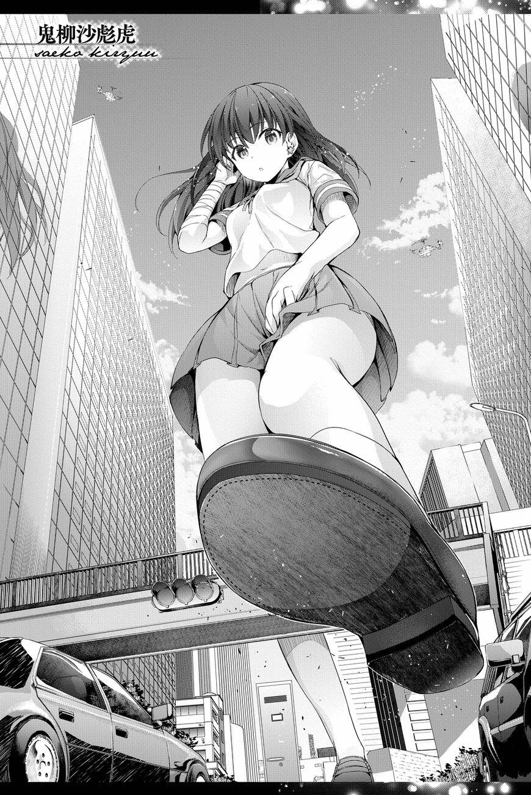
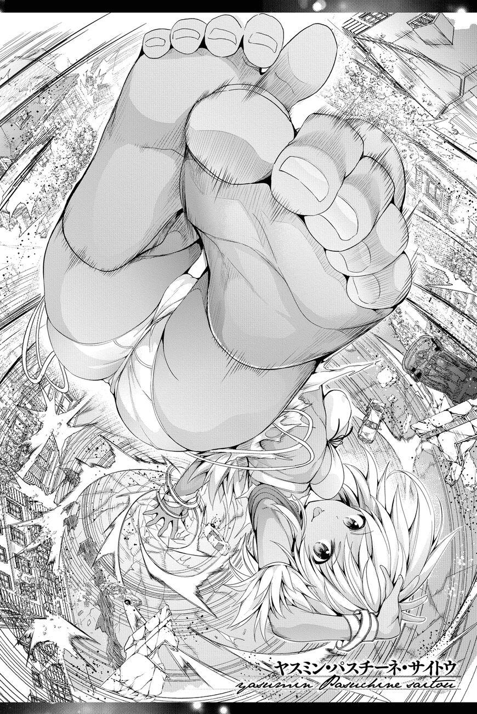
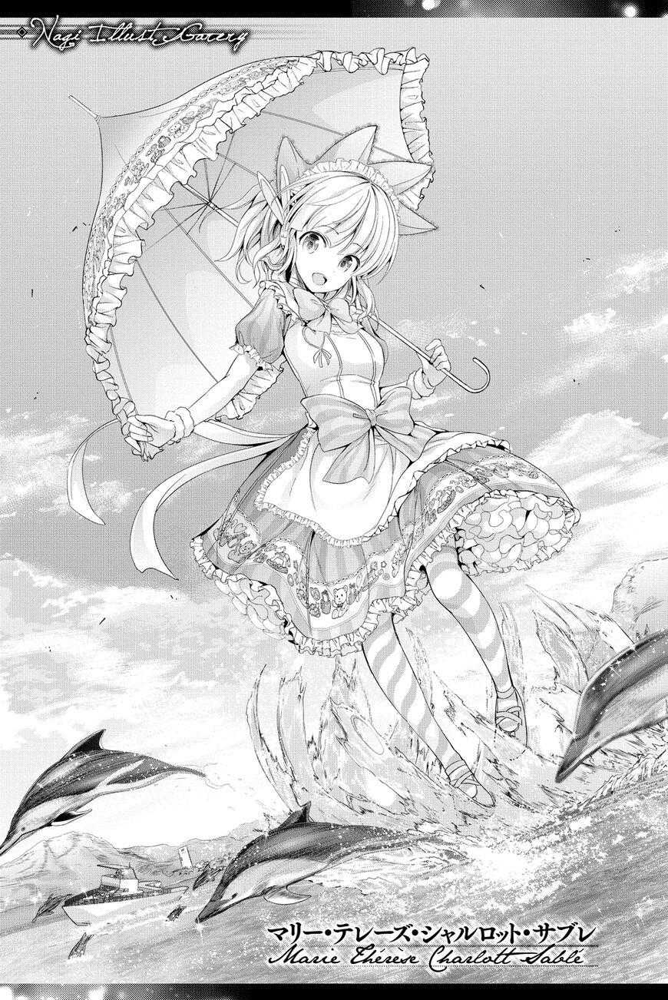
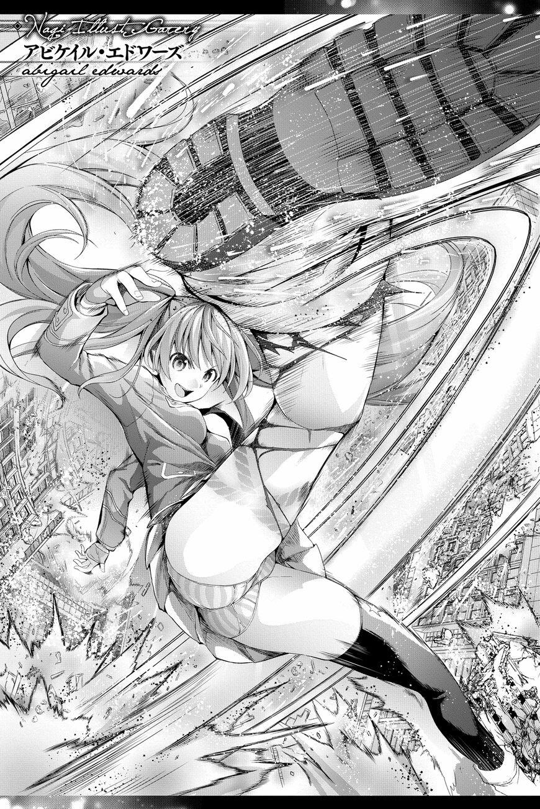
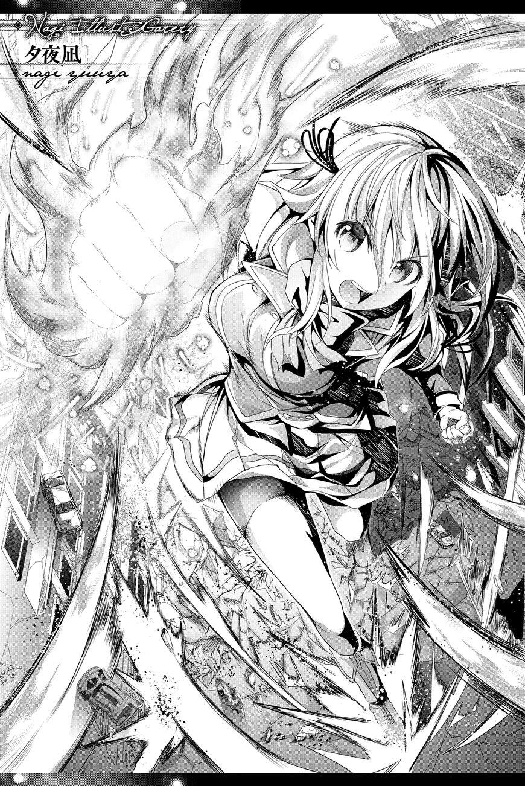

# 草，才发现《大攻者 凪》这本，可惜腰斩了

作者：leo1223

TID：30598

<title>1</title> <link href="../Styles/Style.css" type="text/css" rel="stylesheet">

# 1

呜呜呜，难得一见的gts本就没了

现在异种族巨少女六重奏又好像没在更新

话说gts正经连载的漫画就只有那个《巨大的她》和《超弩级少女4946 》吧？

何时再有作者搞个gts就好了 <title>2</title> <link href="../Styles/Style.css" type="text/css" rel="stylesheet">

# 2

为什么市场永远是重口鬼畜当道，连点普通搞色情的gts都没有呢 <title>3</title> <link href="../Styles/Style.css" type="text/css" rel="stylesheet">

# 3

> [诸君我喜欢 發表於 2021-3-25 13:16](https://giantessnight.cf/gnforum2012/forum.php?mod=redirect&goto=findpost&pid=463623&ptid=30598)
> 因为人口基数小，还有最重要一点就是付费用户数量少，就拿我们国内圈子来举例子，大多都是白嫖，没多少愿 ...

gts算比较小众了，还是希望可以至少大众一点的，到扶她那种程度也好啊

<title>4</title> <link href="../Styles/Style.css" type="text/css" rel="stylesheet">

# 4

> [dfggggx 發表於 2021-3-25 13:03](https://giantessnight.cf/gnforum2012/forum.php?mod=redirect&goto=findpost&pid=463622&ptid=30598)
> 为什么市场永远是重口鬼畜当道，连点普通搞色情的gts都没有呢

说白了就是gts是小众xp

而且gts漫画不搞黄色好像就没啥可以写的

倒是擦边球有时不少
<title>5</title> <link href="../Styles/Style.css" type="text/css" rel="stylesheet">

# 5

> [诸君我喜欢 發表於 2021-3-25 13:16](https://giantessnight.cf/gnforum2012/forum.php?mod=redirect&goto=findpost&pid=463623&ptid=30598)
> 因为人口基数小，还有最重要一点就是付费用户数量少，就拿我们国内圈子来举例子，大多都是白嫖，没多少愿 ...

但是就作品而言我觉得很明显扶她多很多吧

不过扶她倒是不能再明面上讲，gts不露骨的可以
<title>6</title> <link href="../Styles/Style.css" type="text/css" rel="stylesheet">

# 6

*本帖最後由 小霸王 於 2021-3-25 14:56 編輯*

原来巨大的她还在连载吗，当时看了好像好久没更新都忘了这漫画了。
<title>7</title> <link href="../Styles/Style.css" type="text/css" rel="stylesheet">

# 7

巨大的她真的是有点可惜啊.......后面因为某些原因只汉化到十几话。只能去外网看英文版的，不知道有没有圈内大佬有汉化版本 <title>8</title> <link href="../Styles/Style.css" type="text/css" rel="stylesheet">

# 8

> [小霸王 發表於 2021-3-25 14:53](https://giantessnight.cf/gnforum2012/forum.php?mod=redirect&goto=findpost&pid=463629&ptid=30598)
> 原来巨大的她还在连载吗，当时看了好像好久没更新都忘了这漫画了。

巨大的她不错，没腰斩什么的，就是感觉有点短
<title>9</title> <link href="../Styles/Style.css" type="text/css" rel="stylesheet">

# 9

> [kale 發表於 2021-3-25 16:49](https://giantessnight.cf/gnforum2012/forum.php?mod=redirect&goto=findpost&pid=463633&ptid=30598)
> 巨大的她真的是有点可惜啊.......后面因为某些原因只汉化到十几话。只能去外网看英文版的，不知道有没有圈 ...

幸好我读得懂英文，虽然如果有汉化更好
<title>10</title> <link href="../Styles/Style.css" type="text/css" rel="stylesheet">

# 10

> [黒茶鯖虎 發表於 2021-3-25 17:57](https://giantessnight.cf/gnforum2012/forum.php?mod=redirect&goto=findpost&pid=463638&ptid=30598)
> 听说是因为后面有辱华元素，所以后面章节没有汉化，想看的话可以去看英肉
> ...

……有吗？没感觉，我记得只是有打中国，但是这本来就是国家打国家的（最终boss是美国？）

可能避嫌吧
<title>11</title> <link href="../Styles/Style.css" type="text/css" rel="stylesheet">

# 11

> [黒茶鯖虎 發表於 2021-3-25 18:18](https://giantessnight.cf/gnforum2012/forum.php?mod=redirect&goto=findpost&pid=463642&ptid=30598)
> 我也只是听说的。。。我之前有在动漫之家评论区看见有人说这漫画后面严重辱华，所以汉化组17话后才停止汉 ...

啊……希望可以有人接坑吧

虽然我看完了英文的但是还是中文比较好
<title>12</title> <link href="../Styles/Style.css" type="text/css" rel="stylesheet">

# 12

我看了这个贴子才知道有这个漫画，可是现在动漫之家app没有日漫区了，动漫之家社区版也不知道在哪下... <title>13</title> <link href="../Styles/Style.css" type="text/css" rel="stylesheet">

# 13

> [leo1223 發表於 2021-3-25 16:58](https://giantessnight.cf/gnforum2012/forum.php?mod=redirect&goto=findpost&pid=463635&ptid=30598)
> 幸好我读得懂英文，虽然如果有汉化更好

英文虽然也懂，但是看起来真的感觉不如中文舒服啊……只希望后面可以有大佬接坑，跳过争议的那几话也行
<title>14</title> <link href="../Styles/Style.css" type="text/css" rel="stylesheet">

# 14

> [诸君我喜欢 發表於 2021-3-26 02:40](https://giantessnight.cf/gnforum2012/forum.php?mod=redirect&goto=findpost&pid=463693&ptid=30598)
> yysy确实，那个《巨大的她》后面几话汉化出来肯定会引起一场腥风血雨的骂战的。。。更搞不好还会引起国内 ...

就是这种情况吧，要说乳化我觉得算不上
但是肯定会有人带节奏，毕竟现在二极管多

<title>15</title> <link href="../Styles/Style.css" type="text/css" rel="stylesheet">

# 15

> [诸君我喜欢 發表於 2021-3-26 11:32](https://giantessnight.cf/gnforum2012/forum.php?mod=redirect&goto=findpost&pid=463722&ptid=30598)
> 所以说还是不要再提这部漫画汉化为好，不管这部漫画有没有真的辱华，总之确实是碰了国内的敏感辱华红线， ...

唉，真心希望有一天可以有一本真正的gts连载
目前魔都那本倒是有个有巨大化的能力，希望可以多出场

（其实《大攻者 凪》这本虽说是gts……但是战斗的是后和gts没什么关系，因为也不是和小人打……但是或许本来会有呢？可惜永远不知道了）

<title>16</title> <link href="../Styles/Style.css" type="text/css" rel="stylesheet">

# 16

巨大的她我在日亚淘了前六本，去秋叶原的时候顺便把第七本也补齐了
感觉内容没啥敏感的，只能说觉得现在这气氛只要不是夸中国实在太厉害的就算乳化了吧。
剧情虽然也就那样不过也算挺有趣的，难得的有完整发行的GTS漫画。
这作者应该也算个圈内，因为画过不止一本，之前还有大彼女。
当然超弩级少女也一样买了收藏了
大攻者凪嘛，感觉还只算是擦边本吧 <title>17</title> <link href="../Styles/Style.css" type="text/css" rel="stylesheet">

# 17

> [wxy112300 發表於 2021-3-28 00:02](https://giantessnight.cf/gnforum2012/forum.php?mod=redirect&goto=findpost&pid=463862&ptid=30598)
> 巨大的她我在日亚淘了前六本，去秋叶原的时候顺便把第七本也补齐了
> 感觉内容没啥敏感的，只能说觉得现在这 ...

确实不算敏感……也不是针对中国

但是肯定会有人喷

大攻者凪……作为一个gts漫来说，很大程度上没有小人和巨人的互动（可能还没发展到那个程度就斩了，总之就是可惜啦）
<title>18</title> <link href="../Styles/Style.css" type="text/css" rel="stylesheet">

# 18

发在图片分享了……不过也发在这里吧

<ignore_js_op>

**56dfd6ea1b06c8f4dc0b1b84d5b18428.jpg** *(363.9 KB, 下載次數: 0)*

[下載附件](forum.php?mod=attachment&aid=ODgwOTF8MWQxOTUxYjh8MTY3NDA2ODQ4OXwxODIzMHwzMDU5OA%3D%3D&nothumb=yes)

2021-3-28 15:01 上傳

<ignore_js_op>

**3f369426b4466d9b4589cffcbed0c69c.jpg** *(380.63 KB, 下載次數: 0)*

[下載附件](forum.php?mod=attachment&aid=ODgwOTN8ODkwNDUzZTR8MTY3NDA2ODQ4OXwxODIzMHwzMDU5OA%3D%3D&nothumb=yes)

2021-3-28 15:01 上傳

<ignore_js_op>

**4c0764cd66c9b43870b3040c4de971f6.jpg** *(321.25 KB, 下載次數: 0)*

[下載附件](forum.php?mod=attachment&aid=ODgwOTJ8MzVlMTZmMTJ8MTY3NDA2ODQ4OXwxODIzMHwzMDU5OA%3D%3D&nothumb=yes)

2021-3-28 15:01 上傳

<ignore_js_op>

**72aa27ea04b2cda5f959e71216282ac0.jpg** *(402.7 KB, 下載次數: 0)*

[下載附件](forum.php?mod=attachment&aid=ODgwOTR8Y2I1ZDA2YzV8MTY3NDA2ODQ4OXwxODIzMHwzMDU5OA%3D%3D&nothumb=yes)

2021-3-28 15:01 上傳

<ignore_js_op>

**9912c6cc42a434b48f08e9ad42ff0785.jpg** *(379.59 KB, 下載次數: 0)*

[下載附件](forum.php?mod=attachment&aid=ODgwOTB8ZTM1M2JjNTB8MTY3NDA2ODQ4OXwxODIzMHwzMDU5OA%3D%3D&nothumb=yes)

2021-3-28 15:01 上傳</ignore_js_op></ignore_js_op></ignore_js_op></ignore_js_op></ignore_js_op>