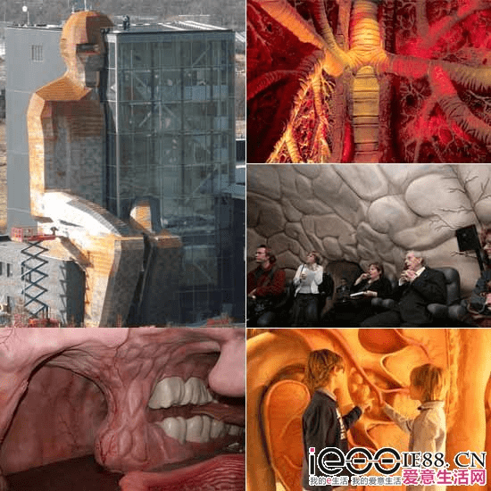
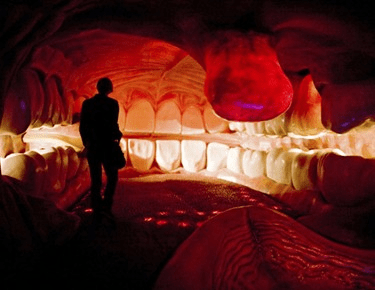
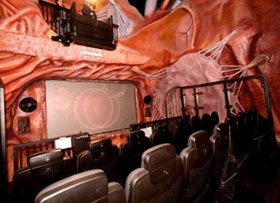

# 荷兰人体博物馆

作者：yudish

TID：14508

<title>1</title> <link href="../Styles/Style.css" type="text/css" rel="stylesheet">

# 1

*本文章最後由 sunnygoon 於 2013-6-5 05:30 編輯*

很老的建筑了.
对vore控来说,应该算是不错的体验...当然你得脑补这是个美女.

**参观流程**
参观者由膝盖下方进入“人体”，依次向上穿过子宫、消化道和其它人体器官等9层楼。参观中可以看到人体的造血过程，观看受精过程的3D影片，还可以看一眼咽喉的内部与声带。
在博物馆的不同区域，可以倾听中文耳机的讲解。人体顶端可以找到人体的“控制中心”和“脑部展示”。
在返回途中将经过一个“医疗信息中心”，既可以了解到很多关于健康和医疗的知识，而且可以参与各种互动测试，并得到一张体检报告。

****血液“自救”****
游客从膝盖进入“巨人”体内后，能看到周围四壁和天花板，布满了腿部骨骼和肌肉的立体造型，旁边墙上的屏幕上，则播放着骨髓是如何制造血细胞的，红红绿绿的血细胞不停运动。  

**食物消化**
在整个“人体之旅”中，参观者随时可以在巨大的人体器官内或旁边停下来，仔细观察这些栩栩如生的器官，也可以看到墙壁上的肌肉组织和血管模型、两米高的心肝肺肾，还能在软绵绵的舌头弹床上观察烂牙。

在“消化道”区域内，这里有比真人还大的各种“消化器官”，食道、胃、肠、肝脏、胰腺、胆囊等。参观者可以看到奶酪三明治被咽下后，落入胃液的场景，可以看到红血球在肺部的毛细血管中吐出二氧化碳、吸收氧气，之后来到心脏并被发送到全身各处。

**生命孕育**
游客还可以现场见证地球上最大的奇迹：生命创造。黑暗中，数百万精子，经过一场争分夺秒、“生死攸关”的大赛跑，最后完成其制造生命的使命。随后，显微镜摄影图片，则显示了胎儿长大的奇妙过程。
.

<title>2</title> <link href="../Styles/Style.css" type="text/css" rel="stylesheet">

# 2

 <ignore_js_op>[1.jpg](forum.php?mod=attachment&aid=MzQ2NTd8N2ViNTljNTF8MTY3NDA2ODAxN3wxODIzMHwxNDUwOA%3D%3D&nothumb=yes) *(71.28 KB, 下載次數: 1)*

[下載附件](forum.php?mod=attachment&aid=MzQ2NTd8N2ViNTljNTF8MTY3NDA2ODAxN3wxODIzMHwxNDUwOA%3D%3D&nothumb=yes)

2013-6-5 05:26 上傳  

</ignore_js_op> <ignore_js_op>[2.jpg](forum.php?mod=attachment&aid=MzQ2NTh8NDY1MjEzOWF8MTY3NDA2ODAxN3wxODIzMHwxNDUwOA%3D%3D&nothumb=yes) *(27.72 KB, 下載次數: 0)*

[下載附件](forum.php?mod=attachment&aid=MzQ2NTh8NDY1MjEzOWF8MTY3NDA2ODAxN3wxODIzMHwxNDUwOA%3D%3D&nothumb=yes)

2013-6-5 05:26 上傳  

</ignore_js_op> <ignore_js_op>[3.jpg](forum.php?mod=attachment&aid=MzQ2NTl8NDlkYmJlM2J8MTY3NDA2ODAxN3wxODIzMHwxNDUwOA%3D%3D&nothumb=yes) *(33.91 KB, 下載次數: 0)*

[下載附件](forum.php?mod=attachment&aid=MzQ2NTl8NDlkYmJlM2J8MTY3NDA2ODAxN3wxODIzMHwxNDUwOA%3D%3D&nothumb=yes)

2013-6-5 05:26 上傳  

</ignore_js_op> <title>3</title> <link href="../Styles/Style.css" type="text/css" rel="stylesheet">

# 3

.这是gt啊，没有胸部，，， <title>4</title> <link href="../Styles/Style.css" type="text/css" rel="stylesheet">

# 4

我怎么觉得很恐怖 <title>5</title> <link href="../Styles/Style.css" type="text/css" rel="stylesheet">

# 5

vore控也得强力的脑补等级啊 <title>6</title> <link href="../Styles/Style.css" type="text/css" rel="stylesheet">

# 6

可是那个超大巨人会不会和进击里的那货是一个级别的 <title>7</title> <link href="../Styles/Style.css" type="text/css" rel="stylesheet">

# 7

脑部还好，真见到有点恐怖啊！！ <title>8</title> <link href="../Styles/Style.css" type="text/css" rel="stylesheet">

# 8

如果有钱了一定要去看一看…… <title>9</title> <link href="../Styles/Style.css" type="text/css" rel="stylesheet">

# 9

有時太寫實不一定有好效果..
躺在舌頭上觀察爛牙我笑了 <title>10</title> <link href="../Styles/Style.css" type="text/css" rel="stylesheet">

# 10

这需要多强的脑补能力啊！ 而且最好就我一人 <title>11</title> <link href="../Styles/Style.css" type="text/css" rel="stylesheet">

# 11

不是萌妹子无爱啊 <title>12</title> <link href="../Styles/Style.css" type="text/css" rel="stylesheet">

# 12

要是把外形设置成美女样该多好啊 <title>13</title> <link href="../Styles/Style.css" type="text/css" rel="stylesheet">

# 13

好想在那巨大的嘴裡打槍 <title>14</title> <link href="../Styles/Style.css" type="text/css" rel="stylesheet">

# 14

有看過類似的展覽，但是入口是從嘴巴進入 <title>15</title> <link href="../Styles/Style.css" type="text/css" rel="stylesheet">

# 15

.
這讓我想到某個人收藏了很多原意是教學用的健康教育漫畫……
明明是用來讓小學生學習人體消化道構造的，竟然看了會有感覺＝ ＝
我們果然是一群很奇才的人 <title>16</title> <link href="../Styles/Style.css" type="text/css" rel="stylesheet">

# 16

看到这突然想起来 原来某个迪士尼 好像也有人体冒险的5D放映厅 <title>17</title> <link href="../Styles/Style.css" type="text/css" rel="stylesheet">

# 17

这种场景不用脑补也很希望经历，毕竟这个时代里如果不是碰到鲸鱼的话，没那么多机会让你切身感受被吞到嘴里是什么感觉的... <title>18</title> <link href="../Styles/Style.css" type="text/css" rel="stylesheet">

# 18

这个知道 <title>19</title> <link href="../Styles/Style.css" type="text/css" rel="stylesheet">

# 19

看着有点恶心，不过有机会还是想亲身体验下 <title>20</title> <link href="../Styles/Style.css" type="text/css" rel="stylesheet">

# 20

好逼真喔!  <title>21</title> <link href="../Styles/Style.css" type="text/css" rel="stylesheet">

# 21

好歹把外表做的可爱一点。。 <title>22</title> <link href="../Styles/Style.css" type="text/css" rel="stylesheet">

# 22

估计我去现场看了会吐 <title>23</title> <link href="../Styles/Style.css" type="text/css" rel="stylesheet">

# 23

这是大学活动吗还是宣传个啥 <title>24</title> <link href="../Styles/Style.css" type="text/css" rel="stylesheet">

# 24

我去过一次，不让照相啊啊。。。入口是从屁股进去的。而且还是中文讲解器 <title>25</title> <link href="../Styles/Style.css" type="text/css" rel="stylesheet">

# 25

> [xiakeyao250 發表於 2013-6-5 07:12](https://giantessnight.cf/gnforum2012/forum.php?mod=redirect&goto=findpost&pid=190576&ptid=14508)
> .这是gt啊，没有胸部，，，

可是也没有阴茎啊！倒是有子宫。