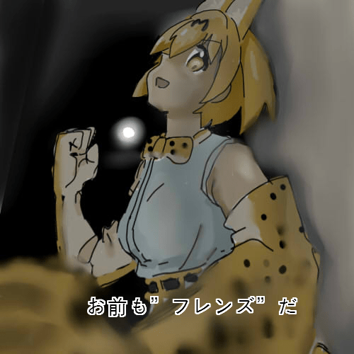

# 萬代未來更名財團B(笑)

作者：ckw

TID：22720

<title>1</title> <link href="../Styles/Style.css" type="text/css" rel="stylesheet">

# 1

*本帖最後由 ckw 於 2017-3-6 02:40 編輯*

和GTS沒甚麼關係。（本區版版沒規定必需與GTS有關）

[http://m.weibo.cn/status/4078606827695789](http://m.weibo.cn/status/4078606827695789)
財團B由於weibo原因需要改名，向網民徵詢意見，然後財團B一致獲得好評。但財團B傷心表示：你们要知道每次公司例会的口号是"为了孩子们的笑脸"啊！这名字跟"为了收割零花钱"似得....好忧桑

財團B你的親兒子名字愈來愈長的巴巴托斯手指偷膠(TV版)耶，3200日元的東西也能省那點膠，親兒子特權(･∀･)？
話說IBO作為財團B的親兒子也快要完結，坊間也說好，但我一集IBO都沒看過。最近反而在追兒童向的獸娘動物園，看了年輕十年(･∀･)（因為我黑心啊）
雖然也想看為美好世界2但似乎被視頻網買了獨佔版權(´･ω･`)

==========
原本想說WIKI的可信性，但最後還是還了
起因是看零戰的航程，然後看到中文WIKI說零戰使用了易燃性鎂鋁合金(黑人？)
蛋戰主要起火原不是因為機翼油箱？
五十嵐甚麼铝的成分接近7000系的7075合金，但7000系合金是使用鋅元素，雖然也有鎂但成不足2~3%。五十男女並不是WIKI說的美女合金，更沒有大量的鎂，也沒有美女。
以前也有看WIKI把7.62×54mmR的R當7.62×54mm Russia的錯誤。R是指Rimmed突緣。不過民間編集也就民間程度。 <title>2</title> <link href="../Styles/Style.css" type="text/css" rel="stylesheet">

# 2

本论坛的每个帖子都应该跟GTS有关，不然这里大家都在灌水可就不好了 <title>3</title> <link href="../Styles/Style.css" type="text/css" rel="stylesheet">

# 3

*本帖最後由 ckw 於 2017-3-6 15:41 編輯*

> xnr 發表於 2017-3-6 12:11
> 本论坛的每个帖子都应该跟GTS有关，不然这里大家都在灌水可就不好了

無GTS不等於灌水，沒有直接必然。
問翻城牆也沒GTS關係但還是有人問。對我來說要查翻城牆，在GN以外問會更好。

例如以前有報紙仆僅恵是南韓第一個女總統，因為是女性所南韓未來風生水起。其實執政力和性別沒有必然關係。（但我估計有些人意識過餘，看到講總統就以為和政治有必然關係，其實也是沒有必然）
蘇聯拉7和雅克9因為數量破千所以是人海戰的炮灰（但德國bf109也破千。），數量多也不一定是炮灰。

現在GN最好多的灌水不就在小說區？上個月我看某人被某個growth控開新文炮轟後，一出獄後的第一天回50帖，90%在小說區發，某個z翻譯員也去投訴那傢伙灌水。當他把自己分數洗到能買漫畫區，之後就潛水了（估計只有點不是英文數字的中文字數即使內容空乏就不算灌水。）

最後回文不對題又算不算灌水？（所以快說零錢終結者）因為首回覆會決定之後樓如何歪樓，不然就歪樓。 <title>4</title> <link href="../Styles/Style.css" type="text/css" rel="stylesheet">

# 4

说骗钱什么的。财团B还不好意思承认自己是财团了咯。。话说最近汇率变动和成本上涨一类的。。反正日系胶产物似乎价格就各种日天。。。。然后国内各种X桃子X班的第三方泛滥。
反正财团偷胶就偷胶吧。。也是好久不拼胶达了。。感觉这烂手也就只能玩玩FTOYS的小飞机了。。
兽娘动物园好看啊，真好看啊。好久不看番的都揭棺而起了。。

<title>5</title> <link href="../Styles/Style.css" type="text/css" rel="stylesheet">

# 5

> [紫色欧石楠 發表於 2017-3-6 16:13](https://giantessnight.cf/gnforum2012/forum.php?mod=redirect&goto=findpost&pid=325606&ptid=22720)
> 说骗钱什么的。财团B还不好意思承认自己是财团了咯。。话说最近汇率变动和成本上涨一类的。。反正日系胶产 ...

1月神意DA做的跟財團B一樣，價錢和質量吊壓財團B和大班翻模。
畢竟財團B人力成本高和老闆薪金高，因為財團B膠系模型是真正的made in日本。財團B成品不肯定是不是代工，SYSTEM WEAPON好像就是made in Vietnam(據評測塗裝不好)。

(你也是＂朋友＂)
<ignore_js_op>

**6514627.jpg** *(100.72 KB, 下載次數: 0)*

[下載附件](forum.php?mod=attachment&aid=NjcxMDl8YjBmMTRhOTJ8MTY3NDA2NzcwNHwxODIzMHwyMjcyMA%3D%3D&nothumb=yes)

2017-3-6 17:59 上傳</ignore_js_op>