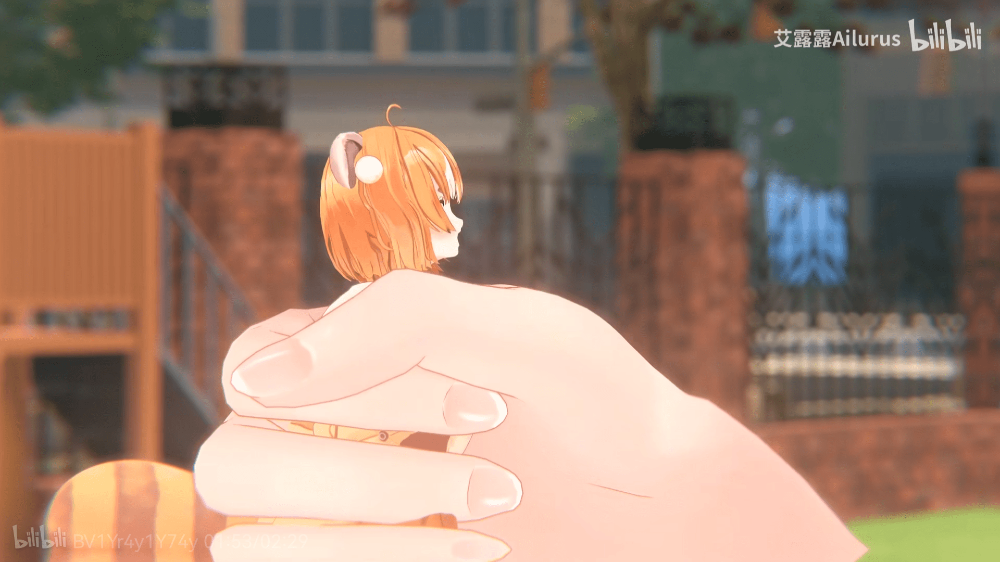
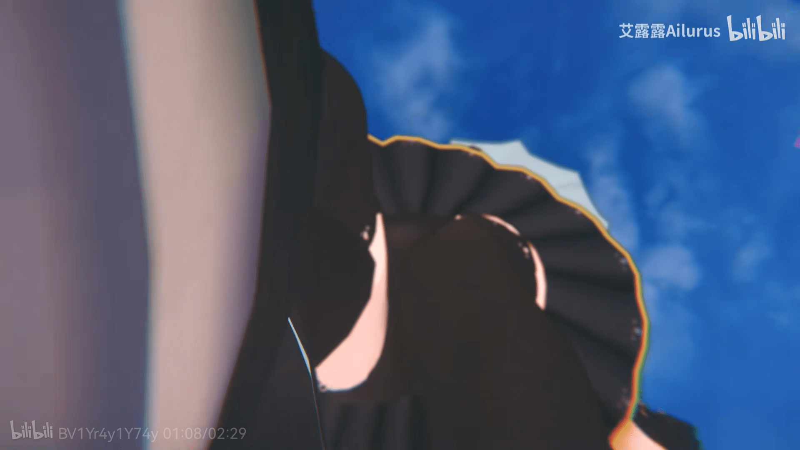

# 虚研社2期生 艾露露新视频里面出现大量GTS元素

作者：qishiweibutong

TID：32557

<title>1</title> <link href="../Styles/Style.css" type="text/css" rel="stylesheet">

# 1

*本帖最後由 qishiweibutong 於 2022-2-2 13:50 編輯*

视频链接：
[https://www.bilibili.com/video/BV1Yr4y1Y74y](https://www.bilibili.com/video/BV1Yr4y1Y74y)
视频截图：

<ignore_js_op>

**12243916437797252.png** *(1.86 MB, 下載次數: 0)*

[下載附件](forum.php?mod=attachment&aid=OTM1NDl8MGE4Njc4NjR8MTY3NDA2NTY2NXwxODIzMHwzMjU1Nw%3D%3D&nothumb=yes)

2022-2-2 13:49 上傳

<ignore_js_op>

**11237516437797062.png** *(1.13 MB, 下載次數: 0)*

[下載附件](forum.php?mod=attachment&aid=OTM1NDh8MWQ0OGNjYmR8MTY3NDA2NTY2NXwxODIzMHwzMjU1Nw%3D%3D&nothumb=yes)

2022-2-2 13:49 上傳

<ignore_js_op>

**6730416437798102.png** *(735.13 KB, 下載次數: 0)*

[下載附件](forum.php?mod=attachment&aid=OTM1NDd8ZmZmMDM5ZTd8MTY3NDA2NTY2NXwxODIzMHwzMjU1Nw%3D%3D&nothumb=yes)

2022-2-2 13:49 上傳

自从上一次虚研社的【虚研会058】越大的女孩越招人爱（[https://www.bilibili.com/video/B ... id_from=333.337.0.0](https://www.bilibili.com/video/BV17K4y1N7hu?from=search&seid=12256631679669348099&spm_id_from=333.337.0.0)）
以非常内行的角度向圈外介绍GTS之后，大家就有怀疑虚研社内部的编剧或者模型师混入了我们圈子的同好。
这次的又一次很好的证明。

给不太懂的同好介绍一下，艾露露，视频主角，小小的很可爱，设定是小熊猫，住在虚研社经纪人杨宝的鞋子里（我当初一听就等着有粉丝做GTS二创，没想到是官方先动手了）。
希望大家点个关注，支持一下艾露露，支持一下虚研社，一是这是在变相曲线支持gts圈子传教，二是虚研社本身内容也挺不错，可以是同好除了gts之外的一点内容消遣。

<title>2</title> <link href="../Styles/Style.css" type="text/css" rel="stylesheet">

# 2

好耶！更期待他们后面的视频创作了 难得还有组织和团体会做GTS内容。。。 <title>3</title> <link href="../Styles/Style.css" type="text/css" rel="stylesheet">

# 3

这 艾露露蛮可爱啊啊………⁄(⁄ ⁄ ⁄ω⁄ ⁄ ⁄)⁄住艾露露鞋里QVQ <title>4</title> <link href="../Styles/Style.css" type="text/css" rel="stylesheet">

# 4

虚研会的内容挺硬核的，可惜视频势日渐式微，虚研社这么多年依然在探索道路
希望大家多多关注这群努力产出优秀内容的创作者 <title>5</title> <link href="../Styles/Style.css" type="text/css" rel="stylesheet">

# 5

挺色的！                                    </ignore_js_op></ignore_js_op></ignore_js_op>