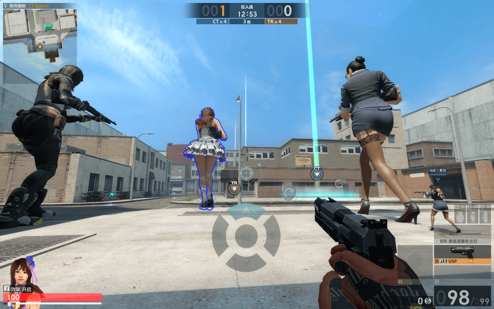

# 蛋拐兔2要出巨人战模式了。。

作者：月月月月食

TID：23590

<title>1</title> <link href="../Styles/Style.css" type="text/css" rel="stylesheet">

# 1

*本帖最後由 月食 於 2017-8-2 19:26 編輯*

有兴趣的小伙伴可以去试试

<ignore_js_op>

**423.png** *(2.25 MB, 下載次數: 1)*

[下載附件](forum.php?mod=attachment&aid=NjkwMjd8NWY4ZGVmMjN8MTY3NDA2NzQ2NXwxODIzMHwyMzU5MA%3D%3D&nothumb=yes)

2017-8-2 19:25 上傳

只让上传一张图。。那就先来三个妹子的吧233
<title>2</title> <link href="../Styles/Style.css" type="text/css" rel="stylesheet">

# 2

额，蛋拐兔没听说过，是不是我孤陋寡闻了？ <title>3</title> <link href="../Styles/Style.css" type="text/css" rel="stylesheet">

# 3

啥玩意？csol2？那个东西里的巨人真的有必要去看吗。。 <title>4</title> <link href="../Styles/Style.css" type="text/css" rel="stylesheet">

# 4

记得本来就有一个叫做巨人厨房的地图…… <title>5</title> <link href="../Styles/Style.css" type="text/css" rel="stylesheet">

# 5

蛋拐现在还有人碰吗各种烂神器，好好的射击游戏愣是给做成辣鸡了 <title>6</title> <link href="../Styles/Style.css" type="text/css" rel="stylesheet">

# 6

话说当年抽中荒漠金鹰的时候高兴坏了，还和同学炫耀了好一阵子
<title>7</title> <link href="../Styles/Style.css" type="text/css" rel="stylesheet">

# 7

csol2？还不如打csgo呢。 <title>8</title> <link href="../Styles/Style.css" type="text/css" rel="stylesheet">

# 8

CSGO公测了，还有必要玩CSOL2吗，连唯一值得玩的捉迷藏模式也被满地的开黑和挂毁了 <title>9</title> <link href="../Styles/Style.css" type="text/css" rel="stylesheet">

# 9

刚去试了一下，怎么说他好呢……
其实画面还不错啦，巨人的身高大约在10m左右，人物还算比较精细。
比较坑的一点就是，巨人的造型就是自己角色的放大版，所以如果你选了个男角色，那游戏里出现的就会是个男巨人。
然而现在似乎是在大量派送女角色来着？所以这个其实不是最坑的。
最坑的是这模式操作起来相当费劲，反正我觉得玩起来没啥意思，所以最后我干脆就放弃游戏，专注于欣赏各式各样的巨大妹子了 <title>10</title> <link href="../Styles/Style.css" type="text/css" rel="stylesheet">

# 10

> [max 發表於 2017-8-2 16:03](https://giantessnight.cf/gnforum2012/forum.php?mod=redirect&goto=findpost&pid=342531&ptid=23590)
> 刚去试了一下，怎么说他好呢……
> 其实画面还不错啦，巨人的身高大约在10m左右，人物还算比较精细。
> 比较坑 ...

哈哈 刚开始操作是够费劲的 不过玩多就熟练了 那个附身技能是最好用的~
PS：我一直用的是奈奈酱 真是各种眼福</ignore_js_op>