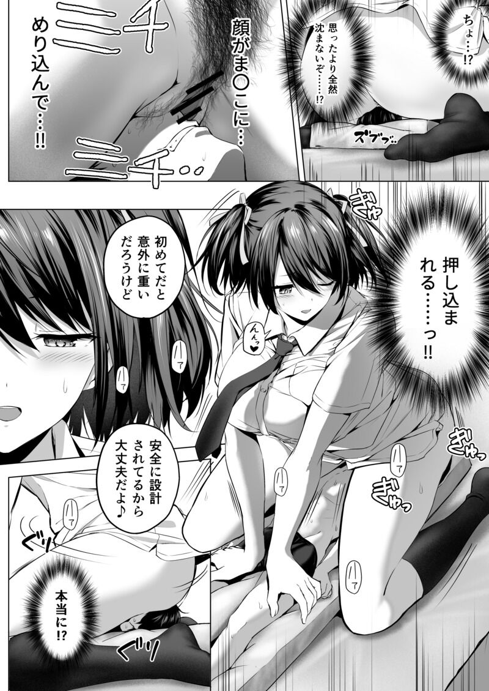

# 蜂蜜老师新作预告

作者：Lcxzyr

TID：34558

<title>1</title> <link href="../Styles/Style.css" type="text/css" rel="stylesheet">

# 1

<ignore_js_op>

**main_8d1256be-a590-48aa-8c3a-52ef5499e184.png** *(193.42 KB, 下載次數: 0)*

[下載附件](forum.php?mod=attachment&aid=MTAwOTYzfDc2YzAyZTY1fDE2NzQwNjkyMjV8MTgyMzB8MzQ1NTg%3D&nothumb=yes)

2022-12-13 16:26 上傳

来自fantia：[https://fantia.jp/posts/1645491](https://fantia.jp/posts/1645491)

にばい！３サンプルページ
2倍！3 样本页

今月の漫画更新は、制作中の【にばい！３　前編】のワンシーンを紹介させていただきます。

男子が潰れてしまわないよう、特殊な道具を使って顔面騎乗をしているシーン。本編では中盤にあたります。

这个月的漫画更新，请允许我介绍制作中的【2倍! 3前篇】的一个场景。

为了不让男生被压扁，使用特殊道具骑在脸上的场景。正篇是在中盘的位置。

话说蜂蜜老师竟然还想到回来画《2倍！》系列，那天国的《妹＞兄》有没有可能。。。（想peach
<title>2</title> <link href="../Styles/Style.css" type="text/css" rel="stylesheet">

# 2

已经好久没看到蜜蜂老师出的长篇漫画了爷青结 <title>3</title> <link href="../Styles/Style.css" type="text/css" rel="stylesheet">

# 3

蜂蜜老师的mini本是真的好冲，表妹的那本我冲了不下十次 <title>4</title> <link href="../Styles/Style.css" type="text/css" rel="stylesheet">

# 4

蜂蜜好久沒新作了
但對這系列的興趣不大

個人希望出的是那部破壞神消滅文明的續作
tera級大好 <title>5</title> <link href="../Styles/Style.css" type="text/css" rel="stylesheet">

# 5

蜂蜜老师的作品都是一等一的棒，期待中 <title>6</title> <link href="../Styles/Style.css" type="text/css" rel="stylesheet">

# 6

还是稍微带点fart才有看的意思，一般这种看多还是有点腻了 <title>7</title> <link href="../Styles/Style.css" type="text/css" rel="stylesheet">

# 7

几年了，终于出新作了
二倍系列以前都是放尿之类的重口内容，私心还是希望出那种表妹的温柔系阿...总感觉好久没见到画风可爱的大车本了 <title>8</title> <link href="../Styles/Style.css" type="text/css" rel="stylesheet">

# 8

说实在dre那种 图片配一段文章的模式感觉比hatsumi老师好一点 <title>9</title> <link href="../Styles/Style.css" type="text/css" rel="stylesheet">

# 9

> [nijack89 發表於 2022-12-13 22:02](https://giantessnight.cf/gnforum2012/forum.php?mod=redirect&goto=findpost&pid=521859&ptid=34558)
> 蜂蜜好久沒新作了
> 但對這系列的興趣不大

我也是，2倍感觉有点太小了，而且破坏神的那个刻画很细腻
<title>10</title> <link href="../Styles/Style.css" type="text/css" rel="stylesheet">

# 10

好耶，蜜蜂大大的两倍特别对味，也算是我Mini gts的启蒙了 <title>11</title> <link href="../Styles/Style.css" type="text/css" rel="stylesheet">

# 11

> [s孙晓美 發表於 2022-12-14 20:55](https://giantessnight.cf/gnforum2012/forum.php?mod=redirect&goto=findpost&pid=521927&ptid=34558)
> 说实在dre那种 图片配一段文章的模式感觉比hatsumi老师好一点

DRE图都很好，就是文章不会日语看不懂2333不知道有没有人能译成中文的

<title>12</title> <link href="../Styles/Style.css" type="text/css" rel="stylesheet">

# 12

好图好本子，感谢楼主分享。btw，蜂蜜确实算是相对高产了呃呃</ignore_js_op>