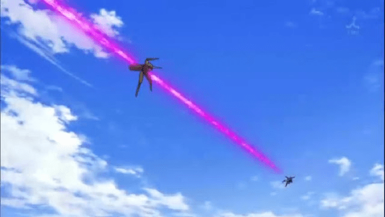

# 被射穿的吐糟

作者：wtman

TID：13094

<title>1</title> <link href="../Styles/Style.css" type="text/css" rel="stylesheet">

# 1

現實中，我們只是一介凡人，在社會上只有被射穿的命運
<ignore_js_op>

**穿.jpg** *(32.96 KB, 下載次數: 0)*

[下載附件](forum.php?mod=attachment&aid=MzAzMzN8YmUxZjJhMDJ8MTY3NDA2ODU4OHwxODIzMHwxMzA5NA%3D%3D&nothumb=yes)

2012-8-18 21:03 上傳

所以吾等只在網路上想找些溫柔輕鬆的gts文看。
有時感到GN的新文章數目低落，而且少了溫柔惡作劇系的gts(眾:你不是喜歡用光束炮射穿妹子的?)
其實我只是一個伸手眾，自己寫不出，就觀望大大寫個巨大少女到城市遊玩的gts文。
溫柔惡作劇系，就是不是腹黑到取你我狗命的遊玩(註解我也不清楚~)就是玩耍啊，不是拿出光束炮射穿城市大破壞啊!
腫麼就是寫不出?扼腕中。然後被一炮射穿。 <title>2</title> <link href="../Styles/Style.css" type="text/css" rel="stylesheet">

# 2

"我們只是一介凡人，在社會上只有被射穿的命運"

要努力传递正能量啊朋友！ <title>3</title> <link href="../Styles/Style.css" type="text/css" rel="stylesheet">

# 3

呵呵，其实本人感觉科幻战争系列的GTS作品读起来很累啊。 <title>4</title> <link href="../Styles/Style.css" type="text/css" rel="stylesheet">

# 4

文章果然开始温柔系好啊</ignore_js_op>