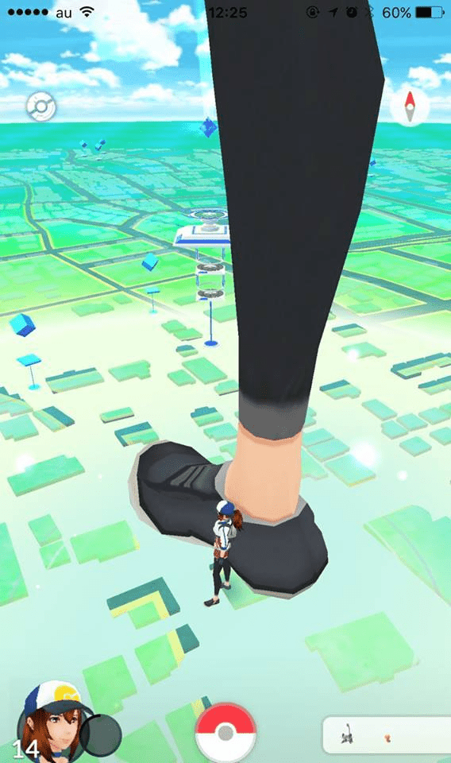

# 被颱風吹成白癡，想上網看抱怨文，意外看到的pokemon go.....

作者：迷途小喵

TID：21827

<title>1</title> <link href="../Styles/Style.css" type="text/css" rel="stylesheet">

# 1

<ignore_js_op>

**14364917_1697401363919216_68855214496255179_n.jpg** *(54.1 KB, 下載次數: 0)*

[下載附件](forum.php?mod=attachment&aid=NjQxNzV8ODdlNGUzZjZ8MTY3NDA2NzQyMnwxODIzMHwyMTgyNw%3D%3D&nothumb=yes)

2016-9-15 09:58 上傳

恩...神奇的bug

被颱風吹成白癡......
然後近期內可能沒有甚麼心力更新GTS的東西了
因為正在打算投稿Comico...

<title>2</title> <link href="../Styles/Style.css" type="text/css" rel="stylesheet">

# 2

好想玩pokemon go的，可是中国不支持。。。 <title>3</title> <link href="../Styles/Style.css" type="text/css" rel="stylesheet">

# 3

> [qreeper 發表於 2016-9-15 10:03](https://giantessnight.cf/gnforum2012/forum.php?mod=redirect&goto=findpost&pid=308537&ptid=21827)
> 好想玩pokemon go的，可是中国不支持。。。

其實沒有特別好玩 已經很多人不玩了
<title>4</title> <link href="../Styles/Style.css" type="text/css" rel="stylesheet">

# 4

> [qreeper 發表於 2016-9-15 10:03](https://giantessnight.cf/gnforum2012/forum.php?mod=redirect&goto=findpost&pid=308537&ptid=21827)
> 好想玩pokemon go的，可是中国不支持。。。

臺灣小不拉機都可以搞成這樣(人群和城鄉差距)
中國會大暴動的

話說這張圖是哪裡轉來的，想朝聖一下
<title>5</title> <link href="../Styles/Style.css" type="text/css" rel="stylesheet">

# 5

噗，什么鬼bug能弄出这样的 <title>6</title> <link href="../Styles/Style.css" type="text/css" rel="stylesheet">

# 6

[http://www.pixiv.net/member_illu ... ;illust_id=33120952](http://www.pixiv.net/member_illust.php?mode=medium&illust_id=33120952)
瀬尾の預言，早在13年瀬尾已經畫出PKMGO概念 <title>7</title> <link href="../Styles/Style.css" type="text/css" rel="stylesheet">

# 7

咳咳……这怎么了……bug吗
<title>8</title> <link href="../Styles/Style.css" type="text/css" rel="stylesheet">

# 8

可惜这个游戏貌似不能在中国玩... <title>9</title> <link href="../Styles/Style.css" type="text/css" rel="stylesheet">

# 9

话说这个游戏不是已经过气了吗 <title>10</title> <link href="../Styles/Style.css" type="text/css" rel="stylesheet">

# 10

这游戏过气了吧，现在才进天朝，这游戏的开发商想的赚钱想的真美</ignore_js_op>