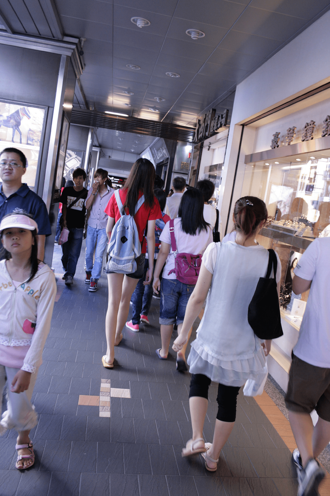
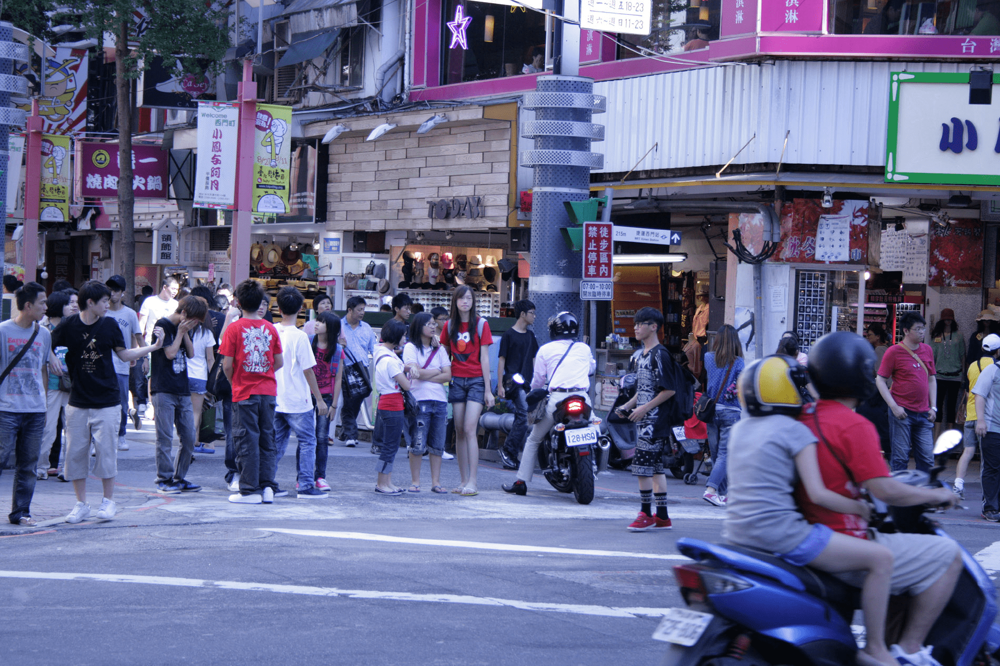

# 西門町美腿高妹

作者：mythbuster

TID：11029

<title>1</title> <link href="../Styles/Style.css" type="text/css" rel="stylesheet">

# 1

此女大約180，極苗條但不骨感,大概只有50公斤 <title>2</title> <link href="../Styles/Style.css" type="text/css" rel="stylesheet">

# 2

 <ignore_js_op>[sebun023.jpg](forum.php?mod=attachment&aid=MjYxODZ8ZTNjZWQyNTF8MTY3NDA3MDA5NnwxODIzMHwxMTAyOQ%3D%3D&nothumb=yes) *(435.97 KB, 下載次數: 38)*

[下載附件](forum.php?mod=attachment&aid=MjYxODZ8ZTNjZWQyNTF8MTY3NDA3MDA5NnwxODIzMHwxMTAyOQ%3D%3D&nothumb=yes)

2011-9-21 22:21 上傳  

</ignore_js_op> <title>3</title> <link href="../Styles/Style.css" type="text/css" rel="stylesheet">

# 3

這是等紅燈時候,見對面高挑女於是拍下,
等她過馬路,又跟上去,拍下前面那張 <title>4</title> <link href="../Styles/Style.css" type="text/css" rel="stylesheet">

# 4

 <ignore_js_op>[sebun020.jpg](forum.php?mod=attachment&aid=MjYxODd8NGI4YTY4MmN8MTY3NDA3MDA5NnwxODIzMHwxMTAyOQ%3D%3D&nothumb=yes) *(631.02 KB, 下載次數: 15)*

[下載附件](forum.php?mod=attachment&aid=MjYxODd8NGI4YTY4MmN8MTY3NDA3MDA5NnwxODIzMHwxMTAyOQ%3D%3D&nothumb=yes)

2011-9-21 22:26 上傳  

</ignore_js_op> <title>5</title> <link href="../Styles/Style.css" type="text/css" rel="stylesheet">

# 5

讚拉
腿又白又細 <title>6</title> <link href="../Styles/Style.css" type="text/css" rel="stylesheet">

# 6

这种美白纤瘦细长的美腿就连我这个对现实裸足不感冒的化石也要融化了。。特别是第一张从背面看上去可任意联想的感觉，彷如断臂的维纳斯。。！ <title>7</title> <link href="../Styles/Style.css" type="text/css" rel="stylesheet">

# 7

我就等这个呢？话说台湾长腿高女多吗？
我个人腿短而且粗，所以很喜欢这类的

[ *本帖最後由 qq1353856991 於 2011-9-22 12:48 編輯* ] <title>8</title> <link href="../Styles/Style.css" type="text/css" rel="stylesheet">

# 8

给力啊  身材是不错 腿好看 就是脸，，，看不清楚 <title>9</title> <link href="../Styles/Style.css" type="text/css" rel="stylesheet">

# 9

樓上可以點擊查看大圖~
在背後拍照……
始終自己不敢把手機拿出來呀~！ <title>10</title> <link href="../Styles/Style.css" type="text/css" rel="stylesheet">

# 10

....................(戴上西洋假髮)，是......是貝多芬呀，魂淡!

貝多芬的眼神多麼迷幻啊!

這.....是男扮女裝的神馬幻覺吧? <title>11</title> <link href="../Styles/Style.css" type="text/css" rel="stylesheet">

# 11

看背影真是极品了，但是看不清脸啊。幻想中。。。。。 <title>12</title> <link href="../Styles/Style.css" type="text/css" rel="stylesheet">

# 12

好图，其实超喜欢这个区，不过最近有些沉寂啊 <title>13</title> <link href="../Styles/Style.css" type="text/css" rel="stylesheet">

# 13

長腿永遠惹人遐想