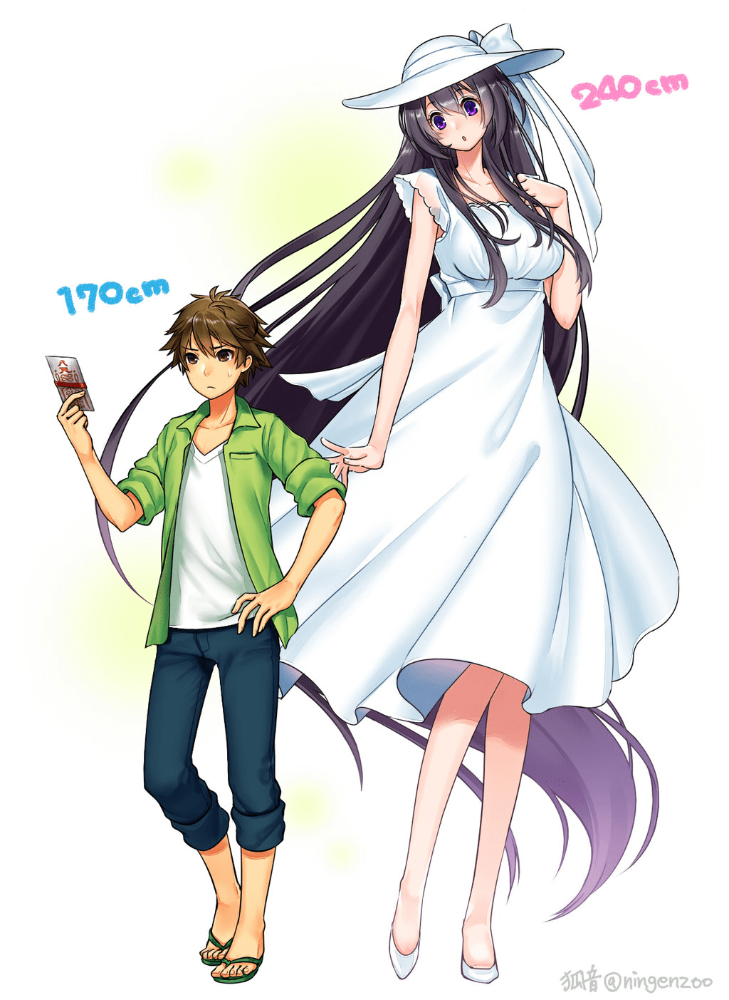

# 話說GN好像都不好＂八尺様＂？

作者：jf99

TID：22368

<title>1</title> <link href="../Styles/Style.css" type="text/css" rel="stylesheet">

# 1

*本帖最後由 wongvict 於 2017-1-3 03:31 編輯*

最近不知道這個叫[八尺大人（八尺様）](http://syarecowa.moo.jp/196-2/71.html)是什麼可以Google一下。
[http://ruby.komica.org/html/E9-83-BD-E5-B8-82-E5-82-B3-E8-AA-AA-](http://ruby.komica.org/html/E9-83-BD-E5-B8-82-E5-82-B3-E8-AA-AA-.html#p8a4622c)
[http://www.pixiv.net/search.php?s_mode=s_tag_full&word=%E5%85%AB%E5%B0%BA%E6%A7%98](http://www.pixiv.net/search.php?s_mode=s_tag_full&word=%E5%85%AB%E5%B0%BA%E6%A7%98)
嚴格來說這個也是近年才留傳日本的恐怖都市傳說，而且只是傾向高大女人系，不屬於GTS，GN之前都有人發過，不過就是反應冷淡。
果然萌化才會有人留意。
<ignore_js_op>

**hachihakusama_by_kohn_nz-d8pwhbk.jpg** *(221 KB, 下載次數: 2)*

[下載附件](forum.php?mod=attachment&aid=NjYxNjF8MGIyOWExZGR8MTY3NDA2NzM5NHwxODIzMHwyMjM2OA%3D%3D&nothumb=yes)

2017-1-3 02:23 上傳

<title>2</title> <link href="../Styles/Style.css" type="text/css" rel="stylesheet">

# 2

原来八尺sama的八尺是身高的八尺。。。

我一直以为是八咫烏的八尺。。。

然后八咫烏 = 乌灵路空，所以我一直一位八尺sama说的是那只笨鸟。。。

不过阿空我很萌哦！ <title>3</title> <link href="../Styles/Style.css" type="text/css" rel="stylesheet">

# 3

我想大部分的人都會跟你說因為八尺不夠高大吧

一堆人對巨大娘的喜好都是幾千幾萬倍開始算起的

雖然我自己還滿喜歡就是八尺這種大小就是 <title>4</title> <link href="../Styles/Style.css" type="text/css" rel="stylesheet">

# 4

谁说的，我就很喜欢这种风格 <title>5</title> <link href="../Styles/Style.css" type="text/css" rel="stylesheet">

# 5

本人第一时间下了快乐巡和都市传说三   就为了看一眼八尺大人   单手打字以示清白 <title>6</title> <link href="../Styles/Style.css" type="text/css" rel="stylesheet">

# 6

[http://giantessnight.com/gnforum2012/forum.php?mod=viewthread&tid=20083](http://giantessnight.com/gnforum2012/forum.php?mod=viewthread&tid=20083)
[http://giantessnight.com/gnforum2012/forum.php?mod=viewthread&tid=18412](http://giantessnight.com/gnforum2012/forum.php?mod=viewthread&tid=18412)

我就默默地貼上這兩個連結
其實比起GIGA我也比較喜歡MINI的
不過成長還是我的主要喜好 <title>7</title> <link href="../Styles/Style.css" type="text/css" rel="stylesheet">

# 7

话说这图是动画的人设？ <title>8</title> <link href="../Styles/Style.css" type="text/css" rel="stylesheet">

# 8

对西瓜不感兴趣，不过上个月漫画里番都有涉及，知道的人应该会更多吧。当然怪谈的那个最后不知道有多少人会被吓软。 <title>9</title> <link href="../Styles/Style.css" type="text/css" rel="stylesheet">

# 9

说白了就是比例差还不够啦，压迫感，屈辱感，代入感都上不了等级，就缩小男来说，大多数人还是喜欢厘米级或是微米级的缩小男 <title>10</title> <link href="../Styles/Style.css" type="text/css" rel="stylesheet">

# 10

這種身高差還是滿代感的 <title>11</title> <link href="../Styles/Style.css" type="text/css" rel="stylesheet">

# 11

这个似乎连mini都还不够 <title>12</title> <link href="../Styles/Style.css" type="text/css" rel="stylesheet">

# 12

也许很多人都觉得不够高吧 <title>13</title> <link href="../Styles/Style.css" type="text/css" rel="stylesheet">

# 13

谁说的，超喜欢萌化版的，一直找不到那个关于这个的番在哪能看 <title>14</title> <link href="../Styles/Style.css" type="text/css" rel="stylesheet">

# 14

我倒是喜欢这个比例，足够了！ <title>15</title> <link href="../Styles/Style.css" type="text/css" rel="stylesheet">

# 15

比例差再高点我就get到了</ignore_js_op>