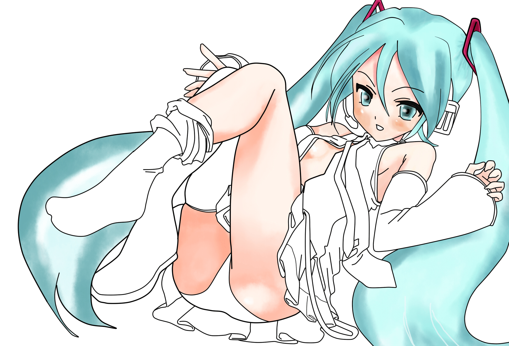

# 誰教我一下繪圖：(

作者：pliod

TID：12286

<title>1</title> <link href="../Styles/Style.css" type="text/css" rel="stylesheet">

# 1

電繪高手們！
可以請教你們如何不用貝茲拉線就可以打草稿嗎？

貝茲固然不錯，但耗時超長且線條比較死板（也可以說有特色其實..）
我覺得我用鉛筆畫稿，線條至少是流暢的;且骨架不會不對..
但用繪版打稿都會超亂（手抖）

然後上色有很不知道該怎麼弄
陰影不是太髒就是不協調

以上網路都沒什麼教阿...
有人說我手畫圖已經可以轉電繪了我才轉
但現在看起來還是不行阿...

可以有人用下面那張我未完成的描線初音跟我講解嗎ˊˋ
非常謝謝喔！

[ *本帖最後由 pliod 於 2012-5-12 06:20 編輯* ] <title>2</title> <link href="../Styles/Style.css" type="text/css" rel="stylesheet">

# 2

 <ignore_js_op>[miku.jpg](forum.php?mod=attachment&aid=Mjg0NzR8YTgyZGQ4YzZ8MTY3NDA2OTcxMnwxODIzMHwxMjI4Ng%3D%3D&nothumb=yes) *(843.21 KB, 下載次數: 1)*

[下載附件](forum.php?mod=attachment&aid=Mjg0NzR8YTgyZGQ4YzZ8MTY3NDA2OTcxMnwxODIzMHwxMjI4Ng%3D%3D&nothumb=yes)

2012-5-12 06:15 上傳  

</ignore_js_op> <title>3</title> <link href="../Styles/Style.css" type="text/css" rel="stylesheet">

# 3

看起來已經很專業了阿! <title>4</title> <link href="../Styles/Style.css" type="text/css" rel="stylesheet">

# 4

楼主实力这么强了。。。果然是学无止尽啊。。。 <title>5</title> <link href="../Styles/Style.css" type="text/css" rel="stylesheet">

# 5

很不错了啊再用电脑加工下下 <title>6</title> <link href="../Styles/Style.css" type="text/css" rel="stylesheet">

# 6

能畫成這樣已經很猛了耶 <title>7</title> <link href="../Styles/Style.css" type="text/css" rel="stylesheet">

# 7

自己也是非常不成熟的绘图，所以只能给以我的观点来说的不同之处：
1，其实熟能生巧，多用铅笔打稿最后修改线稿时用铅笔、笔直接可以画出来很流畅的线条的，比如腿部的分辨率明显看出不协调，目前我的解决方法是把图片整体的分辨率弄非常大，大到看不到曲线部分因为分辨率原因的像素点空白。←不推荐。（已经点开大图）另外，如果是钢笔线条的话改变线条颜色和粗细可以明显改善整体效果……
2，涂色神马的，我以前也是随性子随着部位一点一点涂，但是发觉不如全部先打好底色再修改好，因为颜色与颜色之间的配合通过整体可以一开始就能看出来了。
3，变色部分用图层比单涂好多了……实在懒得弄也要用模糊等工具做出颜色渐变……

以上是我口胡的…… <title>8</title> <link href="../Styles/Style.css" type="text/css" rel="stylesheet">

# 8

倒是沒想過把陰影或皺摺之類的用不同圖層!
線條好像要多練繪圖板才可以
謝謝建議我試試看!