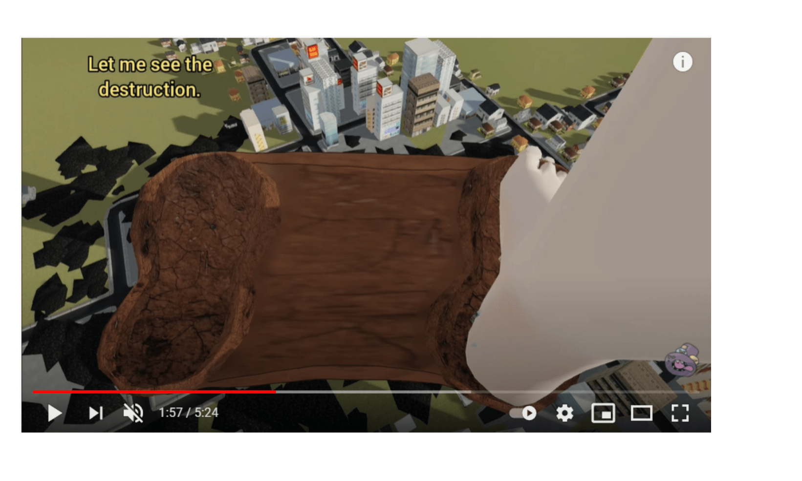

# 請問這踩踏效果在MMD是怎麽做出來的

作者：(别）看我的

TID：31051

<title>1</title> <link href="../Styles/Style.css" type="text/css" rel="stylesheet">

# 1

*本帖最後由 (别）看我的 於 2021-6-6 23:11 編輯*

這個踩完之後的脚印是怎麽弄的？是要弄一個“脚印” 的Object出來嗎？
另外問一下MMD的素材（城市，場景）怎麽做出來的？新手 啥都不太懂...
<ignore_js_op>

**Giantess Rin destroys an entire city - YouTube - Google Chrome 6_6_2021 19_08_00.png** *(1.11 MB, 下載次數: 0)*

[下載附件](forum.php?mod=attachment&aid=ODkxMTV8ZWM1ZTQxZjd8MTY3NDA2OTU5OHwxODIzMHwzMTA1MQ%3D%3D&nothumb=yes)

2021-6-6 23:07 上傳

<title>2</title> <link href="../Styles/Style.css" type="text/css" rel="stylesheet">

# 2

腳印的部份就是一個Object
在腳踩下去的同時
把這個Object顯現出來，看起來就像真的踩下去的腳印一樣
城市那些也都是模型 <title>3</title> <link href="../Styles/Style.css" type="text/css" rel="stylesheet">

# 3

> [Cocytus 發表於 2021-6-7 10:00](https://giantessnight.cf/gnforum2012/forum.php?mod=redirect&goto=findpost&pid=470565&ptid=31051)
> 腳印的部份就是一個Object
> 在腳踩下去的同時
> 把這個Object顯現出來，看起來就像真的踩下去的腳印一樣

懂了 謝謝大佬
網上好像找不到足印的Object 是要自己做嗎？
<title>4</title> <link href="../Styles/Style.css" type="text/css" rel="stylesheet">

# 4

> [(别）看我的 發表於 2021-6-7 21:04](https://giantessnight.cf/gnforum2012/forum.php?mod=redirect&goto=findpost&pid=470606&ptid=31051)
> 懂了 謝謝大佬
> 網上好像找不到足印的Object 是要自己做嗎？

網路上應該是有吧
要在找一下
因為我沒有再做城市破壞的圖，所以就沒有在找這類型的Object</ignore_js_op>