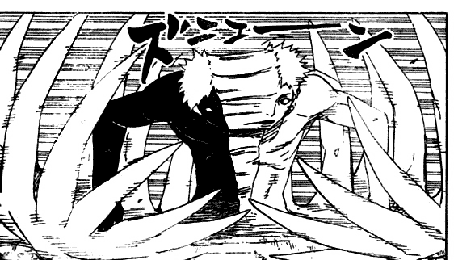

# 請教獸女區的版主...

作者：全員逃走中

TID：14081

<title>1</title> <link href="../Styles/Style.css" type="text/css" rel="stylesheet">

# 1

獸女區的版主RL是兩個人的合稱嗎？還是一個人叫RL？最近爬文看得有點亂啊...
不過文章還算寫得不錯啦...
請論壇的老人幫我這個長期潛水擋解答一下好嗎？ <title>2</title> <link href="../Styles/Style.css" type="text/css" rel="stylesheet">

# 2

據說R是本體，也就是右手，而L是基友，也就是左手 <title>3</title> <link href="../Styles/Style.css" type="text/css" rel="stylesheet">

# 3

其实R跟L是同一个人不同的精神状态 <title>4</title> <link href="../Styles/Style.css" type="text/css" rel="stylesheet">

# 4

*本文章最後由 wtman 於 2013-3-9 21:41 編輯*

其實L&R是ゼツ...........
<ignore_js_op>

**jetsu.png** *(36.34 KB, 下載次數: 0)*

[下載附件](forum.php?mod=attachment&aid=MzMzOTF8OWI0MWM2MDB8MTY3NDA2ODUzNHwxODIzMHwxNDA4MQ%3D%3D&nothumb=yes)

2013-3-9 21:41 上傳

左(L)是白色，右(R)是黑色，話說f島有十萬兵力，應該全部是ゼツ的分體........... <title>5</title> <link href="../Styles/Style.css" type="text/css" rel="stylesheet">

# 5

据说就像是黑旗和白旗的样子白天一起打飞机晚上一起造飞机，之后第二日再打如此反复，为什么总感觉像是精神分裂的说，快说实话吧你是不是精神分裂 <title>6</title> <link href="../Styles/Style.css" type="text/css" rel="stylesheet">

# 6

又有點像祆教(Zoroastrianism)中的阿胡拉·馬自達，與安格拉·曼紐兩個對立神的鬥爭...........
傳送門:[http://baike.baidu.com/view/100510.htm](http://baike.baidu.com/view/100510.htm)
膜拜F島島主! <title>7</title> <link href="../Styles/Style.css" type="text/css" rel="stylesheet">

# 7

你們喔............ <title>8</title> <link href="../Styles/Style.css" type="text/css" rel="stylesheet">

# 8

什么嘛，同素异形体？</ignore_js_op>