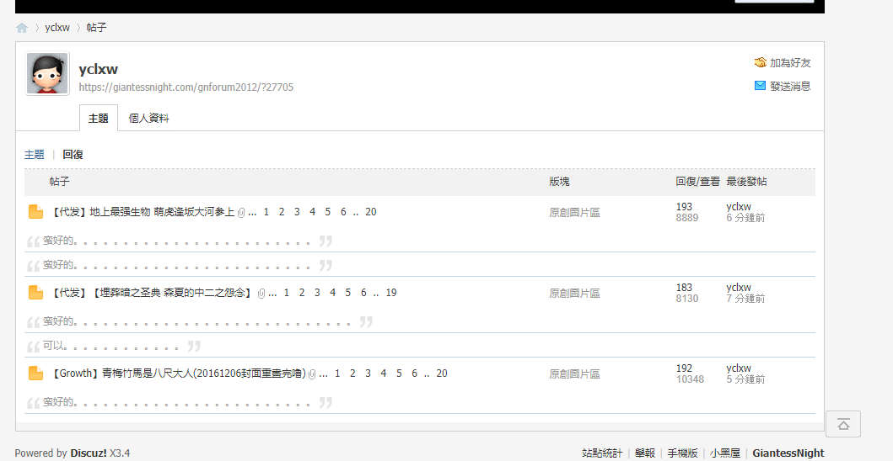

# 請管理員速斬除根

作者：迷途小喵

TID：25333

<title>1</title> <link href="../Styles/Style.css" type="text/css" rel="stylesheet">

# 1

我真的不想老是發這種文
但老是有這種事情發生
所以還是貼出來請盡速處理
這個一定很快就會刷到買徽章的
<ignore_js_op>

**image.png** *(64.06 KB, 下載次數: 0)*

[下載附件](forum.php?mod=attachment&aid=NzI3OTJ8OTVhOWNjMWJ8MTY3NDA2NzA4M3wxODIzMHwyNTMzMw%3D%3D&nothumb=yes)

2018-6-10 21:38 上傳

<title>2</title> <link href="../Styles/Style.css" type="text/css" rel="stylesheet">

# 2

看这种名字就知道是随便刷的小号，不好管理啊 <title>3</title> <link href="../Styles/Style.css" type="text/css" rel="stylesheet">

# 3

最近两天挖坟贴的很多,管理员大佬还请辛苦留意一下了. <title>4</title> <link href="../Styles/Style.css" type="text/css" rel="stylesheet">

# 4

话说，这样的贴是发在谈天区更好还是站务区更好？ <title>5</title> <link href="../Styles/Style.css" type="text/css" rel="stylesheet">

# 5

封IP即可。。。。。。一劳永逸，管他在注册几个 <title>6</title> <link href="../Styles/Style.css" type="text/css" rel="stylesheet">

# 6

我说最近怎么老会觉得有老帖更新呢，原来是这样 <title>7</title> <link href="../Styles/Style.css" type="text/css" rel="stylesheet">

# 7

嗯？话说小喵啥时候成了实习版主了？恭喜啊ｸﾞｯ!(๑•̀ㅂ•́)و✧ <title>8</title> <link href="../Styles/Style.css" type="text/css" rel="stylesheet">

# 8

干脆出个正常向的话题集 在里面扯淡也不用担心 还能混分 <title>9</title> <link href="../Styles/Style.css" type="text/css" rel="stylesheet">

# 9

很多时候话题太敏感 都不愿意嗦话 又想混分 <title>10</title> <link href="../Styles/Style.css" type="text/css" rel="stylesheet">

# 10

小喵终于可以不用发帖求助了</ignore_js_op>