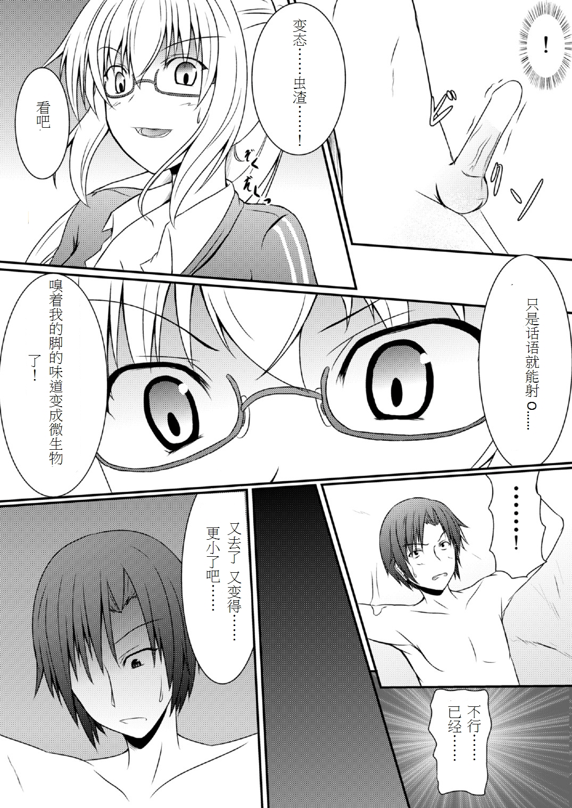

# 變相放置PLAY

作者：萝莉控的大叔

TID：19059

<title>1</title> <link href="../Styles/Style.css" type="text/css" rel="stylesheet">

# 1

在漫畫區看到的
什麼都不需要做
只需要罵幾句

<ignore_js_op>

**030.jpg** *(1002.22 KB, 下載次數: 0)*

[下載附件](forum.php?mod=attachment&aid=NTIxNjN8ZWZlNDE1YjJ8MTY3NDA2ODE2N3wxODIzMHwxOTA1OQ%3D%3D&nothumb=yes)

2015-5-30 11:30 上傳

就可以達到效果
實在是高手級別的PLAY（現實中根本不可能吧 語言就能O？

第一次見到這種
O一次縮小一次
最後絕對是比微米還小的
<title>2</title> <link href="../Styles/Style.css" type="text/css" rel="stylesheet">

# 2

这个漫画叫什么名？ <title>3</title> <link href="../Styles/Style.css" type="text/css" rel="stylesheet">

# 3

漫画名称是《復合型縮小瓦斯效果測定》
这就是所谓的念力oo了 <title>4</title> <link href="../Styles/Style.css" type="text/css" rel="stylesheet">

# 4

或许最后会比蜂蜜大大那个little game还小!? <title>5</title> <link href="../Styles/Style.css" type="text/css" rel="stylesheet">

# 5

> [sillybat 發表於 2015-5-30 16:12](https://giantessnight.cf/gnforum2012/forum.php?mod=redirect&goto=findpost&pid=256090&ptid=19059)
> 漫画名称是《復合型縮小瓦斯效果測定》
> 这就是所谓的念力oo了

您有这部吗，求发- -~
<title>6</title> <link href="../Styles/Style.css" type="text/css" rel="stylesheet">

# 6

> [huang123ja 發表於 2015-5-30 16:35](https://giantessnight.cf/gnforum2012/forum.php?mod=redirect&goto=findpost&pid=256096&ptid=19059)
> 或许最后会比蜂蜜大大那个little game还小!?

感觉应该是一个性质的 只不过这个是要射
<title>7</title> <link href="../Styles/Style.css" type="text/css" rel="stylesheet">

# 7

> [飛鳥 發表於 2015-5-30 17:27](https://giantessnight.cf/gnforum2012/forum.php?mod=redirect&goto=findpost&pid=256102&ptid=19059)
> 感觉应该是一个性质的 只不过这个是要射

射不动了怎么办.......

<title>8</title> <link href="../Styles/Style.css" type="text/css" rel="stylesheet">

# 8

估计最后精尽人亡╭(°A°`)╮ <title>9</title> <link href="../Styles/Style.css" type="text/css" rel="stylesheet">

# 9

这个，，一定会射不动的， 太敏感了 <title>10</title> <link href="../Styles/Style.css" type="text/css" rel="stylesheet">

# 10

有点不舍得买漫画勋章眼看就要到了ˊ_>ˋ <title>11</title> <link href="../Styles/Style.css" type="text/css" rel="stylesheet">

# 11

这个好像看过了= =在贴吧看的 <title>12</title> <link href="../Styles/Style.css" type="text/css" rel="stylesheet">

# 12

很不错但是.............徽章彩钢刚没啊！！ <title>13</title> <link href="../Styles/Style.css" type="text/css" rel="stylesheet">

# 13

在漫画区里有，确实非常棒的，漫画 <title>14</title> <link href="../Styles/Style.css" type="text/css" rel="stylesheet">

# 14

好像看过了 0.0 貌似看的是没有翻译的吧。。 <title>15</title> <link href="../Styles/Style.css" type="text/css" rel="stylesheet">

# 15

這一部真的很棒,特別是對抖m來說</ignore_js_op>