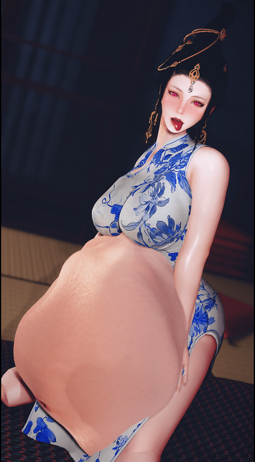

# 设想一下，如果进入了游戏中，并变成了巨大少女

作者：haji030103

TID：33709

<title>1</title> <link href="../Styles/Style.css" type="text/css" rel="stylesheet">

# 1

*本帖最後由 haji030103 於 2022-7-19 09:48 編輯*

**我平时最喜欢玩的莫过于上古卷轴了，在这个游戏中，本体的自由度就很高，打了mod之后更甚了，大多数玩家称自己的角色为“女儿”，“老婆”，但是我比较特殊（女装），所以我一般会代入自己进入游戏，之前总是将自己代入为RBQ的视角，而不知什么原因又觉醒了S这个隐藏属性，所以就想如果变成了GTS会怎么样，之前发了几个帖子也是这种风格的，但是上古卷轴受限于引擎原因，加之也是一个老游戏了，所以这个游戏的GTS只可远观，不可亵玩，但是Devourment这个mod也是可以和VORE这个XP有关的，所以设想一下也是可以的，如果可以直接作为GTS吞掉敌人，吞掉BOSS也不免是一种既解气，又很瑟琴的方式。**
<title>2</title> <link href="../Styles/Style.css" type="text/css" rel="stylesheet">

# 2

 <ignore_js_op>[ScreenShot2817.png](forum.php?mod=attachment&aid=OTc3Mzh8NTBkYWE0YTR8MTY3NDA2NTQ3OXwxODIzMHwzMzcwOQ%3D%3D&nothumb=yes) *(816.1 KB, 下載次數: 0)*

[下載附件](forum.php?mod=attachment&aid=OTc3Mzh8NTBkYWE0YTR8MTY3NDA2NTQ3OXwxODIzMHwzMzcwOQ%3D%3D&nothumb=yes)

2022-7-19 09:48 上傳  

</ignore_js_op> <title>3</title> <link href="../Styles/Style.css" type="text/css" rel="stylesheet">

# 3

然后因为小脚趾撞到无敌的电线杆当场暴毙？大体积模型碰到无法破坏地形是一种灾难，以前mc打变身mod会卡死在各种地方。 <title>4</title> <link href="../Styles/Style.css" type="text/css" rel="stylesheet">

# 4

> [默Sheep 發表於 2022-7-18 19:35](https://giantessnight.cf/gnforum2012/forum.php?mod=redirect&goto=findpost&pid=509809&ptid=33709)
> 然后因为小脚趾撞到无敌的电线杆当场暴毙？大体积模型碰到无法破坏地形是一种灾难，以前mc打变身mod会卡死 ...

**上古卷轴的世界，魔法世界，除了古老的矮人工业就没有别的了**
<title>5</title> <link href="../Styles/Style.css" type="text/css" rel="stylesheet">

# 5

想是怎么想，但是操作起来的技术难度可能还是有的吧..我也喜欢yy平时玩的游戏加入gts来着...但是。 <title>6</title> <link href="../Styles/Style.css" type="text/css" rel="stylesheet">

# 6

> [freepenguin2 發表於 2022-7-19 20:35](https://giantessnight.cf/gnforum2012/forum.php?mod=redirect&goto=findpost&pid=509909&ptid=33709)
> 想是怎么想，但是操作起来的技术难度可能还是有的吧..我也喜欢yy平时玩的游戏加入gts来着...但是。 ...

**魔法世界，连龙和哥布林都有，GTS感觉应该不会太难实现吧**
<title>7</title> <link href="../Styles/Style.css" type="text/css" rel="stylesheet">

# 7

N网有一个SIZE matterMOD，SE版一直在更新，但是更新的版本需要使用Skyrim Platform这个MOD，但是我不会装大佬可以去试一试 <title>8</title> <link href="../Styles/Style.css" type="text/css" rel="stylesheet">

# 8

> [2878632 發表於 2022-7-20 14:24](https://giantessnight.cf/gnforum2012/forum.php?mod=redirect&goto=findpost&pid=509961&ptid=33709)
> N网有一个SIZE matterMOD，SE版一直在更新，但是更新的版本需要使用Skyrim Platform这个MOD，但是我不会装: ...

**那个GIANTESS mod呀，我用了，有很多的bug，最后还是删除了，很多脚本停留在传奇版，第一人称也有问题**
<title>9</title> <link href="../Styles/Style.css" type="text/css" rel="stylesheet">

# 9

> [haji030103 發表於 2022-7-20 11:48](https://giantessnight.cf/gnforum2012/forum.php?mod=redirect&goto=findpost&pid=509952&ptid=33709)
> 魔法世界，连龙和哥布林都有，GTS感觉应该不会太难实现吧

也得有人做才行哇，唉，什么主题才有gts呢。战神5的那个女的不是巨人族的吗，不知道能不能巨大化。其他游戏的话，真的想不到多少了。然后就是，生活中的擦边其实很多，需要自己去挖掘，什么什么，的。嗯。
<title>10</title> <link href="../Styles/Style.css" type="text/css" rel="stylesheet">

# 10

啊这，感觉还是带入自己是女巨人，然后去UB小人比较能接受一点 <title>11</title> <link href="../Styles/Style.css" type="text/css" rel="stylesheet">

# 11

> [咕咕的攸栗 發表於 2022-7-21 08:02](https://giantessnight.cf/gnforum2012/forum.php?mod=redirect&goto=findpost&pid=510017&ptid=33709)
> 啊这，感觉还是带入自己是女巨人，然后去UB小人比较能接受一点

**上古卷轴的世界想要UB小人的难度还是很高的，那种内部的事情很容易穿模，所以还是这种丸吞比较好实现，而且丸吞还得是SAMESIZE，毕竟这个游戏的远景效果很差，如果看太远就会很卡。**