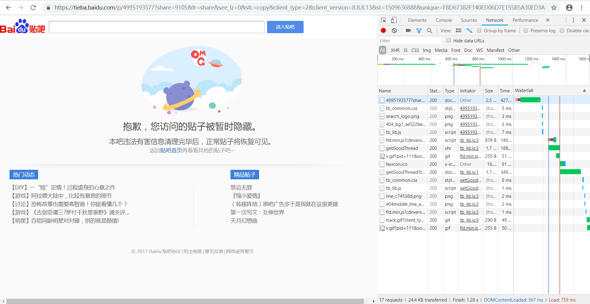
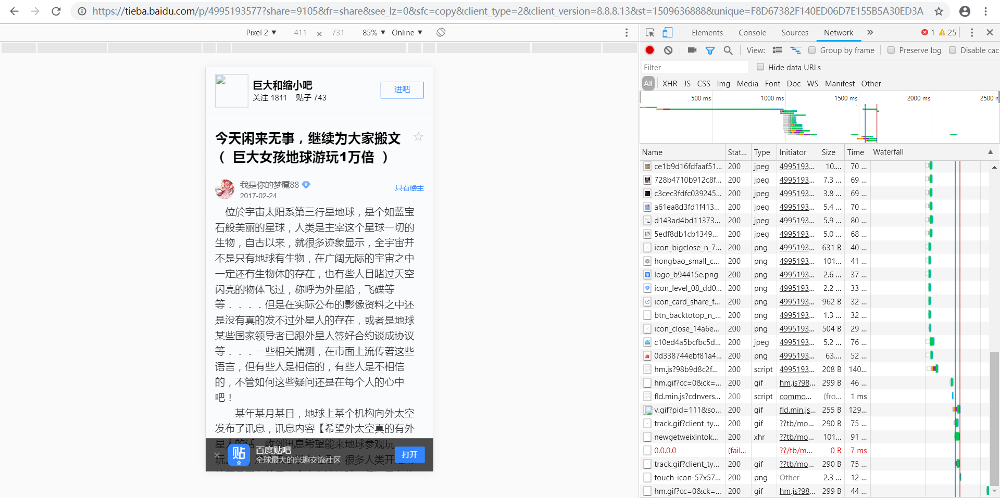
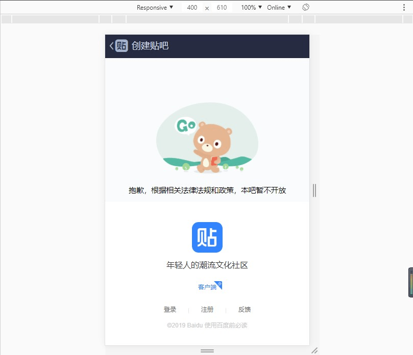
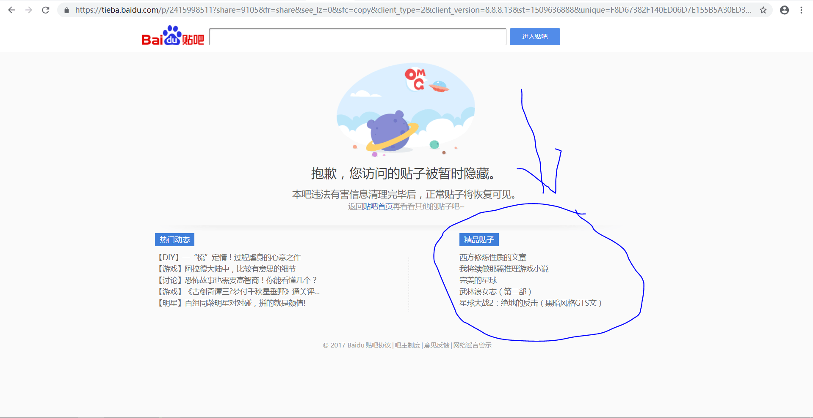
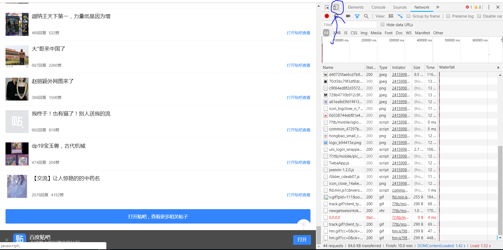
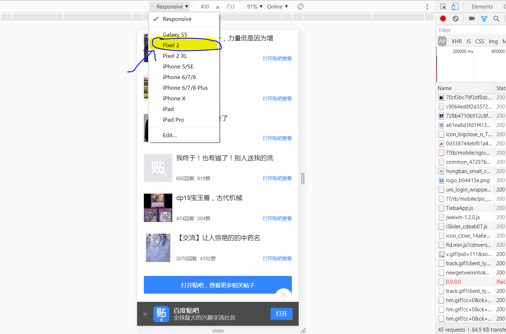
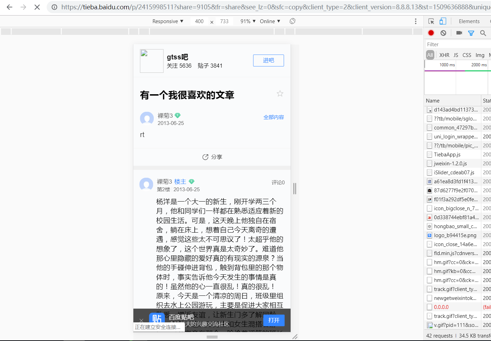

# 访问被封贴吧文章的方法

作者：GN-0000

TID：26367

<title>1</title> <link href="../Styles/Style.css" type="text/css" rel="stylesheet">

# 1

前提是有原文链接。
百度的WAP服务器有缓存，以前吧内的文章通过改useragent可以切换到WAP版，可以访问。

直接访问：
<ignore_js_op>

**捕获2.PNG** *(180.31 KB, 下載次數: 3)*

[下載附件](forum.php?mod=attachment&aid=NzYzNzd8YmIyMzQzMzZ8MTY3NDA2OTQzN3wxODIzMHwyNjM2Nw%3D%3D&nothumb=yes)

2019-2-2 01:28 上傳

更改后访问：
<ignore_js_op>

**捕获.PNG** *(210.92 KB, 下載次數: 1)*

[下載附件](forum.php?mod=attachment&aid=NzYzNzh8ZDZhZDcxYzh8MTY3NDA2OTQzN3wxODIzMHwyNjM2Nw%3D%3D&nothumb=yes)

2019-2-2 01:28 上傳

<title>2</title> <link href="../Styles/Style.css" type="text/css" rel="stylesheet">

# 2

等等。。。有点厉害。。。

不过，这需要有留着以前的文章的地址才行对吧？

因为贴吧本身没有了，所以没有办法找到以前的文章了 <title>3</title> <link href="../Styles/Style.css" type="text/css" rel="stylesheet">

# 3

其实我想说，我不懂英文，你发的图片，我一个都没看明白，能不能指点下？ <title>4</title> <link href="../Styles/Style.css" type="text/css" rel="stylesheet">

# 4

用百度快照也可以访问 <title>5</title> <link href="../Styles/Style.css" type="text/css" rel="stylesheet">

# 5

哇。。。哪有没有大佬能帮忙找一下三个妹子破坏城市啊，那篇我惦记好久了。。。 <title>6</title> <link href="../Styles/Style.css" type="text/css" rel="stylesheet">

# 6

实际上，这很看运气。 <title>7</title> <link href="../Styles/Style.css" type="text/css" rel="stylesheet">

# 7

 <ignore_js_op>[批注 2019-02-02 202056.jpg](forum.php?mod=attachment&aid=NzYzODZ8OGJjMDhkM2J8MTY3NDA2OTQzN3wxODIzMHwyNjM2Nw%3D%3D&nothumb=yes) *(42.97 KB, 下載次數: 0)*

[下載附件](forum.php?mod=attachment&aid=NzYzODZ8OGJjMDhkM2J8MTY3NDA2OTQzN3wxODIzMHwyNjM2Nw%3D%3D&nothumb=yes)

2019-2-2 20:22 上傳  

</ignore_js_op> <title>8</title> <link href="../Styles/Style.css" type="text/css" rel="stylesheet">

# 8

> [Dawnrise 發表於 2019-2-2 16:12](https://giantessnight.cf/gnforum2012/forum.php?mod=redirect&goto=findpost&pid=396058&ptid=26367)
> 用百度快照也可以访问

是的，但是百度快照有时候会缺楼，看不到全文。
<title>9</title> <link href="../Styles/Style.css" type="text/css" rel="stylesheet">

# 9

> [study 發表於 2019-2-2 20:22](https://giantessnight.cf/gnforum2012/forum.php?mod=redirect&goto=findpost&pid=396082&ptid=26367)
> 实际上，这很看运气。

机型要改一下，改成pixel 2。
如果依旧不能访问，还要改一下URL，把htt去除文字ps://ti去除文字eba.baidu.com/p/xxxxxxxxx?后面的全部去掉（那段xxxxxx是一串数字），用?share=9105&fr=share&see_lz=0&sfc=copy&client_type=2&client_version=8.8.8.13&st=1509636888&unique=F8D67382F140ED06D7E155B5A30ED3A&see_lz=1代替。
<title>10</title> <link href="../Styles/Style.css" type="text/css" rel="stylesheet">

# 10

*本帖最後由 hhyy 於 2019-2-2 22:44 編輯*

> [狐乐 發表於 2019-2-2 05:42](https://giantessnight.cf/gnforum2012/forum.php?mod=redirect&goto=findpost&pid=396007&ptid=26367)
> 等等。。。有点厉害。。。
> 
> 不过，这需要有留着以前的文章的地址才行对吧？

我是在旧手机上找到的浏览记录，其实记得文章名字的话用百度也可以搜索出来，再提取链接转换即可。
而且可以在和谐页面找。
<ignore_js_op>

**12121211212.PNG** *(116 KB, 下載次數: 0)*

[下載附件](forum.php?mod=attachment&aid=NzYzOTF8YTkwODE2ZTN8MTY3NDA2OTQzN3wxODIzMHwyNjM2Nw%3D%3D&nothumb=yes)

2019-2-2 22:40 上傳

<title>11</title> <link href="../Styles/Style.css" type="text/css" rel="stylesheet">

# 11

> [斯巴达 發表於 2019-2-2 18:30](https://giantessnight.cf/gnforum2012/forum.php?mod=redirect&goto=findpost&pid=396068&ptid=26367)
> 哇。。。哪有没有大佬能帮忙找一下三个妹子破坏城市啊，那篇我惦记好久了。。。 ...

起码要知道文章名，知道文章名恢复的可能性更高。 <title>12</title> <link href="../Styles/Style.css" type="text/css" rel="stylesheet">

# 12

> [q179151371 發表於 2019-2-2 12:12](https://giantessnight.cf/gnforum2012/forum.php?mod=redirect&goto=findpost&pid=396028&ptid=26367)
> 其实我想说，我不懂英文，你发的图片，我一个都没看明白，能不能指点下？ ...

不需要懂英语，英语我也不懂啊[捂脸]。
我说一下具体步骤。
1.在百度或旧手机浏览记录找到原文链接，例如百度gtss吧找到的一篇文章：htt去除文字ps://tie去除文字ba.baidu.com/p/2415998511?pn=0&&red_tag=0559618290，这篇文章直接打是打不开的。

2.按F12，进入开发者模式，谷歌浏览器右边会多出一个栏目。按一下左上角长得像手机的键，如图。
<ignore_js_op>

**1234.PNG** *(269.14 KB, 下載次數: 0)*

[下載附件](forum.php?mod=attachment&aid=NzYzODd8ZWY1OGYwNWV8MTY3NDA2OTQ1M3wxODIzMHwyNjM2Nw%3D%3D&nothumb=yes)

2019-2-2 22:29 上傳

3.然后左侧上部分会有选择机型的框，选择pixel 2。
<ignore_js_op>

**12345.PNG** *(148.78 KB, 下載次數: 0)*

[下載附件](forum.php?mod=attachment&aid=NzYzODh8ZTI0YzQwN2J8MTY3NDA2OTQ1M3wxODIzMHwyNjM2Nw%3D%3D&nothumb=yes)

2019-2-2 22:32 上傳

4.更改文章网址，例如上面的htt去除文字ps://tie去除文字ba.baidu.com/p/2415998511?pn=0&&red_tag=0559618290，把htt（去除文字）ps://tie（去除文字）ba.baidu.com/p/2415998511?后面的部分用share=9105&fr=share&see_lz=0&sfc=copy&client_type=2&client_version=8.8.8.13&st=1509636888&unique=F8D67382F140ED06D7E155B5A30ED3A&see_lz=1代替。
例如上面的网址就变成：htt（去除文字）ps://tie（去除文字）ba.baidu.com/p/2415998511?share=9105&fr=share&see_lz=0&sfc=copy&client_type=2&client_version=8.8.8.13&st=1509636888&unique=F8D67382F140ED06D7E155B5A30ED3A&see_lz=1。

5.按回车。
<ignore_js_op>

**111111111.PNG** *(134.41 KB, 下載次數: 0)*

[下載附件](forum.php?mod=attachment&aid=NzYzODl8MTNkMWNiODJ8MTY3NDA2OTQ1M3wxODIzMHwyNjM2Nw%3D%3D&nothumb=yes)

2019-2-2 22:36 上傳

然后就完成了。

ps。在被和谐的页面也可以找到文章链接：
<ignore_js_op>

**12121211212.PNG** *(116 KB, 下載次數: 0)*

[下載附件](forum.php?mod=attachment&aid=NzYzOTB8NTk1MmU1NGV8MTY3NDA2OTQ1M3wxODIzMHwyNjM2Nw%3D%3D&nothumb=yes)

2019-2-2 22:39 上傳

<title>13</title> <link href="../Styles/Style.css" type="text/css" rel="stylesheet">

# 13

我去 lz这个真的很硬核 <title>14</title> <link href="../Styles/Style.css" type="text/css" rel="stylesheet">

# 14

> [hhyy 發表於 2019-2-2 22:39](https://giantessnight.cf/gnforum2012/forum.php?mod=redirect&goto=findpost&pid=396092&ptid=26367)
> 不需要懂英语，英语我也不懂啊[捂脸]。
> 我说一下具体步骤。
> 1.在百度或旧手机浏览记录找到原文链接，例如 ...

2345或者ie浏览器呢？要怎么用？f12没反应
<title>15</title> <link href="../Styles/Style.css" type="text/css" rel="stylesheet">

# 15

> [hhyy 發表於 2019-2-2 22:20](https://giantessnight.cf/gnforum2012/forum.php?mod=redirect&goto=findpost&pid=396090&ptid=26367)
> 起码要知道文章名，知道文章名恢复的可能性更高。

这片文我前几年也在贴吧看到过写的很好，名字大概就是三个妹子破坏城市之类？不知道有没有在gn发过
<title>16</title> <link href="../Styles/Style.css" type="text/css" rel="stylesheet">

# 16

aff.antss008.com/aff/a9hX            <title>17</title> <link href="../Styles/Style.css" type="text/css" rel="stylesheet">

# 17

前面加https://         VPN， <title>18</title> <link href="../Styles/Style.css" type="text/css" rel="stylesheet">

# 18

> oppo 發表於 2019-2-6 13:13
> aff.antss008.com/aff/a9hX

前面加https://           ，是VPN哦 <title>19</title> <link href="../Styles/Style.css" type="text/css" rel="stylesheet">

# 19

> [q179151371 發表於 2019-2-3 16:47](https://giantessnight.cf/gnforum2012/forum.php?mod=redirect&goto=findpost&pid=396135&ptid=26367)
> 2345或者ie浏览器呢？要怎么用？f12没反应

用谷歌浏览器，ie太难用了，2345太流氓，没用过。 <title>20</title> <link href="../Styles/Style.css" type="text/css" rel="stylesheet">

# 20

谢谢提供方法，可以看贴吧一些东西了 <title>21</title> <link href="../Styles/Style.css" type="text/css" rel="stylesheet">

# 21

*本帖最後由 aplmike 於 2019-2-27 20:10 編輯*

说一下吧。注：本文会出现技术术语。
  楼主说的方法有些麻烦，其实就是改ua，来避过百度。可以通过常见的改ua工具，如user agent switcher，不仅可在电脑操作，还可在firefox手机版使用。在firefox的附加组件（英文版叫addon）里可以找到。附一个pixel 2的ua。
Mozilla/5.0 (Linux; Android 8.0; Pixel 2 Build/OPD3.170816.012) AppleWebKit/537.36 (KHTML, like Gecko) Chrome/67.0.3396.87 Mobile Safari/537.36
  再说说关于贴吧文章的事，由于文章被封，很少有能找到的文章，个人的方法比较笨，就是遍历，百度贴吧是通过/p/后面的序号来为文章排序的，我可以构思一个bash脚本通过遍历文章序号进行curl一下，设定几个这方面的关键字，若包含关键字，就保存文章序号，没有就跳过，因为遍历，肯定会极其消耗时间，所以建议用一些内存大点，流量多点的服务器，估计至少要十天，我比较穷，有钱的大佬可以试一下，服务器一个月大概要40人民币。 <title>22</title> <link href="../Styles/Style.css" type="text/css" rel="stylesheet">

# 22

我倒是知道如果贴吧被封，贴子如果收藏过是可以看的</ignore_js_op></ignore_js_op></ignore_js_op></ignore_js_op></ignore_js_op></ignore_js_op></ignore_js_op>