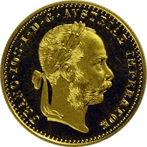

# 话说奖励点是怎么得的啊？

作者：ganbalakun

TID：26744

<title>1</title> <link href="../Styles/Style.css" type="text/css" rel="stylesheet">

# 1

求解，只看到dault了，没看到奖励点的得法 <title>2</title> <link href="../Styles/Style.css" type="text/css" rel="stylesheet">

# 2

现在奖励点没啥用，原来有个银河铁道，进去要用奖励点 <title>3</title> <link href="../Styles/Style.css" type="text/css" rel="stylesheet">

# 3

奖励点的话，一个算40个积分来着.然后那是Ducat，而不是dault，这里neta的是最早由中世纪威尼斯共和国铸造的一种纯金金币。也就是杜卡特金币，后来很多国家都有铸造
比如这就是奥地利帝国铸造的一枚Ducat，上面是弗兰茨约瑟夫皇帝头戴月桂冠的图像。
说起戴月桂冠，古罗马的元首或者奥古斯都或者后来所称的皇帝在加冕就是头戴月桂环的。而在德语中皇帝就是Kaiser，也就是凯撒欸。
<title>4</title> <link href="../Styles/Style.css" type="text/css" rel="stylesheet">

# 4

 <ignore_js_op>[Gold-Dukaten-KFJ.jpg](forum.php?mod=attachment&aid=Nzc4MjF8OWUyMmQxZTR8MTY3NDA2NjgzMnwxODIzMHwyNjc0NA%3D%3D&nothumb=yes) *(28.13 KB, 下載次數: 0)*

[下載附件](forum.php?mod=attachment&aid=Nzc4MjF8OWUyMmQxZTR8MTY3NDA2NjgzMnwxODIzMHwyNjc0NA%3D%3D&nothumb=yes)

2019-4-19 17:34 上傳  

</ignore_js_op> <title>5</title> <link href="../Styles/Style.css" type="text/css" rel="stylesheet">

# 5

我的话就是努力的写文章，写出大家喜欢的文章，自然有些时候就会有大佬给你点评一下，顺便给几个奖励点作为奖励 <title>6</title> <link href="../Styles/Style.css" type="text/css" rel="stylesheet">

# 6

现在的奖励点没啥用了.
当然可以用来撑高积分.
最开始的时候漫画去都是要靠奖励点进的,还有个银河铁道