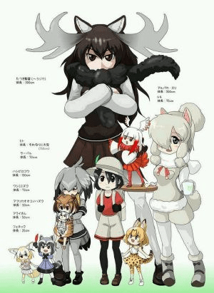
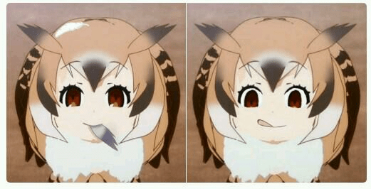
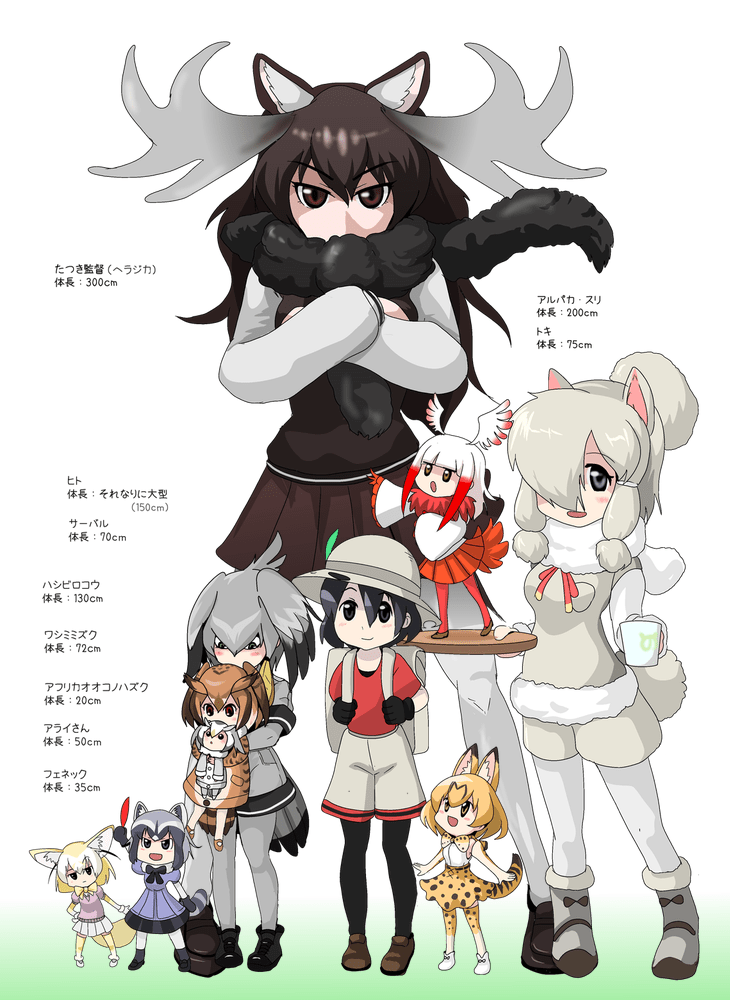
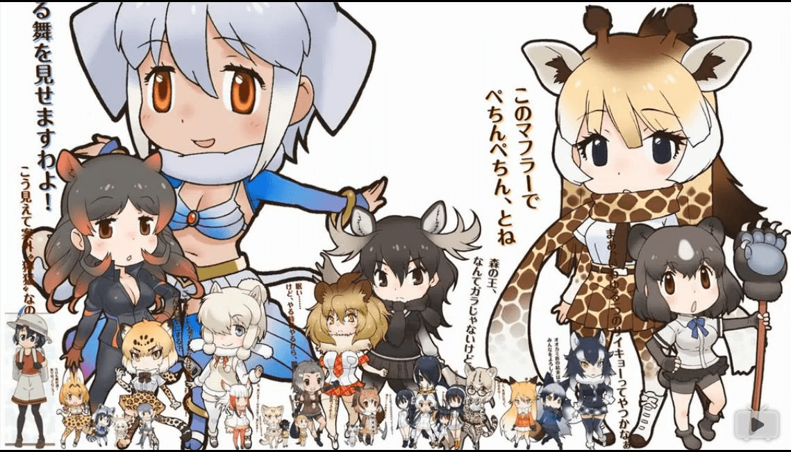

# 话说有人看兽娘动物园嘛～

作者：(12345)

TID：22936

<title>1</title> <link href="../Styles/Style.css" type="text/css" rel="stylesheet">

# 1

*本帖最後由 nub7091 於 2017-4-17 22:20 編輯*

真实体型大小对比一图流～ <ignore_js_op>

**IMG_4258.JPG** *(41.7 KB, 下載次數: 3)*

[下載附件](forum.php?mod=attachment&aid=Njc1Nzd8YTc0ZmQwYzN8MTY3NDA2ODgxOHwxODIzMHwyMjkzNg%3D%3D&nothumb=yes)

2017-4-17 22:17 上傳

<title>2</title> <link href="../Styles/Style.css" type="text/css" rel="stylesheet">

# 2

这样看来，薮猫真的好可爱呢 <title>3</title> <link href="../Styles/Style.css" type="text/css" rel="stylesheet">

# 3

图片有点小，我想起了疯狂动物城的鼹鼠国。也就那样吧，太动物化了就没意思了 <title>4</title> <link href="../Styles/Style.css" type="text/css" rel="stylesheet">

# 4

<ignore_js_op>

**58b60fed54e736d18c94383b91504fc2d46269bc.jpg** *(25.47 KB, 下載次數: 0)*

[下載附件](forum.php?mod=attachment&aid=Njc1ODl8ZTVjYjYxMjV8MTY3NDA2ODgxOHwxODIzMHwyMjkzNg%3D%3D&nothumb=yes)

2017-4-18 18:37 上傳

比如说这种的？
<title>5</title> <link href="../Styles/Style.css" type="text/css" rel="stylesheet">

# 5

一群人全是friends!!! <title>6</title> <link href="../Styles/Style.css" type="text/css" rel="stylesheet">

# 6

圖太小+1
看不出來換算大小的依據，
如果是用身高的話有長頸鹿，用體重逆推的話有非洲象。

.....好吧，其實我對這兩個角色都沒愛(掩面 <title>7</title> <link href="../Styles/Style.css" type="text/css" rel="stylesheet">

# 7

果然还是接受不了动物的设定啊 <title>8</title> <link href="../Styles/Style.css" type="text/css" rel="stylesheet">

# 8

哇 是擅長還原真實比例的朋友呢!!

我本人非常不推薦看動物朋友
只要看超過4集
等醒來以後已經看到12集尾了
據統計資料顯示前4集跟眾多動畫相比收視率都是墊底
但是到第4集以後就開始瘋狂ˊ飆升
最後超越當期的動畫到第一名
我不知道理由是什麼啦
我只知道我醒來了以後就快完結了

順便提醒一下雖然都是獸娘
但是它們跟人類都差不多
而且衣服和鞋子都可以脫...
只有小部分是皮毛或是耳朵
反正跟CosPlay差不多
還有前面3集我都還是清醒的
而且很想放棄不看
尤其是第1集
想要接觸動物朋友的朋友請撐過前幾集 <title>9</title> <link href="../Styles/Style.css" type="text/css" rel="stylesheet">

# 9

*本帖最後由 克里亞 於 2017-4-20 01:00 編輯*

幫支援大一點點的圖
<ignore_js_op>

**1492298553363.png** *(475.9 KB, 下載次數: 2)*

[下載附件](forum.php?mod=attachment&aid=Njc1OTR8ZDYwYjRhNTl8MTY3NDA2ODgxOHwxODIzMHwyMjkzNg%3D%3D&nothumb=yes)

2017-4-20 00:35 上傳

劇情中.動物朋友的感覺確實是像一堆coser
但本體還是動物的原因.動物朋友們不時都有些令人會心一笑的舉動
在一路上認識動物的同時.約在3.4話開始.
主角卡邦開始有了些作為人類的功能(善於組織與協調)
與動物朋友們相處.用靈感幫助各位動物們解決難題
彼此互相幫忙的情景很是令人欣慰(現實就...)

雖沒特別研究.但有一些特殊的設定.
對於一些喜歡考究的朋友來說是蠻有吸引力的
(私心覺得漫畫.遊戲.動畫.可能是同世界觀/不同時間軸的時事演變挺有吸引力的
.而演變的方向慢慢回歸自然.人類從主宰轉變成從旁協助這樣)

轉個巴哈姆特看到的.[來源](https://home.gamer.com.tw/creationDetail.php?sn=3510741)

可能看這部作品時.要先能自我分別甚麼是幼稚.甚麼是純真吧
小小洗頻.請多見諒～

<title>10</title> <link href="../Styles/Style.css" type="text/css" rel="stylesheet">

# 10

<ignore_js_op>

**360截图20170420010806905.jpg** *(145.67 KB, 下載次數: 0)*

[下載附件](forum.php?mod=attachment&aid=Njc1OTV8MTNmMmI3N2F8MTY3NDA2ODgxOHwxODIzMHwyMjkzNg%3D%3D&nothumb=yes)

2017-4-20 01:08 上傳

要论身高大小可能就变成类似舰娘那种方向的讨论了。不过，没有浮莲子的日子好难过啊
<title>11</title> <link href="../Styles/Style.css" type="text/css" rel="stylesheet">

# 11

哇，原来大家都是喜欢gts的friends呢！（被打飞
论身高大小的话。。。。还是有点内容可说的，不太好发展起来就是。。 <title>12</title> <link href="../Styles/Style.css" type="text/css" rel="stylesheet">

# 12

原来这里也有这么多的friends啊！
すごい！
たーのしー！ <title>13</title> <link href="../Styles/Style.css" type="text/css" rel="stylesheet">

# 13

哦哦，是擅长胎归的friends啊~ <title>14</title> <link href="../Styles/Style.css" type="text/css" rel="stylesheet">

# 14

当时追着看的，头一次追番追的这么厉害</ignore_js_op></ignore_js_op></ignore_js_op></ignore_js_op>