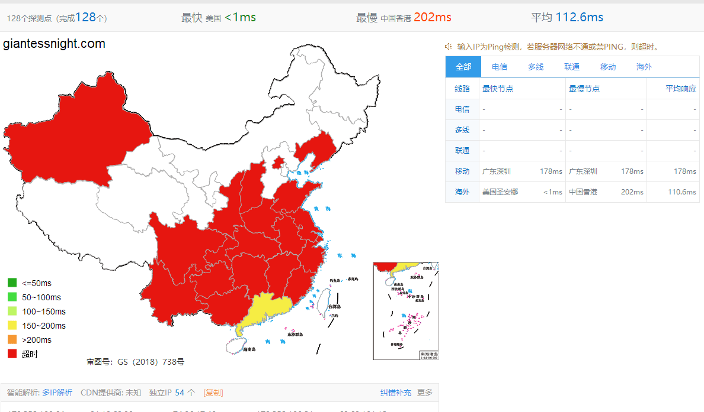

# 话说论坛又被墙了吗

作者：langborghini

TID：25442

<title>1</title> <link href="../Styles/Style.css" type="text/css" rel="stylesheet">

# 1

突然发现加了s也进不去了，必须翻墙才能进来 <title>2</title> <link href="../Styles/Style.css" type="text/css" rel="stylesheet">

# 2

目前山东这里还是正常的。。 <title>3</title> <link href="../Styles/Style.css" type="text/css" rel="stylesheet">

# 3

我这边也是墙了，不开VPN的话访问https也不行。 <title>4</title> <link href="../Styles/Style.css" type="text/css" rel="stylesheet">

# 4

北京没问题呀，可怕。。。 <title>5</title> <link href="../Styles/Style.css" type="text/css" rel="stylesheet">

# 5

深圳没问题（以前有给墙过吗？） <title>6</title> <link href="../Styles/Style.css" type="text/css" rel="stylesheet">

# 6

江苏，墙了，又要回到翻墙的日子了吗 <title>7</title> <link href="../Styles/Style.css" type="text/css" rel="stylesheet">

# 7

郑州，挂VPN上的，反正正常是上不了了，应该是系统的事吧，估计不是被墙了 <title>8</title> <link href="../Styles/Style.css" type="text/css" rel="stylesheet">

# 8

时不时会有点问题，多试几次。。或者挂上vpn也行嘛 <title>9</title> <link href="../Styles/Style.css" type="text/css" rel="stylesheet">

# 9

刚刚试了一下发现一开始能上，过一会就不行了…… <title>10</title> <link href="../Styles/Style.css" type="text/css" rel="stylesheet">

# 10

牆外表示沒問題，不是網站上不了 <title>11</title> <link href="../Styles/Style.css" type="text/css" rel="stylesheet">

# 11

广州没问题，之前要用vpn <title>12</title> <link href="../Styles/Style.css" type="text/css" rel="stylesheet">

# 12

我在湖北表示被墙了啊， <title>13</title> <link href="../Styles/Style.css" type="text/css" rel="stylesheet">

# 13

陕西，好像是墙了             <title>14</title> <link href="../Styles/Style.css" type="text/css" rel="stylesheet">

# 14

广东表示，是被墙了。真是，， <title>15</title> <link href="../Styles/Style.css" type="text/css" rel="stylesheet">

# 15

挂VPN上的，上海人士…… <title>16</title> <link href="../Styles/Style.css" type="text/css" rel="stylesheet">

# 16

我去，昨天回完今天发现上不了了，挂了梯子才进来。 <title>17</title> <link href="../Styles/Style.css" type="text/css" rel="stylesheet">

# 17

上海这边确实被墙了,我也是开了蓝灯才能进论坛的 <title>18</title> <link href="../Styles/Style.css" type="text/css" rel="stylesheet">

# 18

同11L 广州 但我这被墙了 <title>19</title> <link href="../Styles/Style.css" type="text/css" rel="stylesheet">

# 19

<ignore_js_op>

**Test01.png** *(111.85 KB, 下載次數: 0)*

[下載附件](forum.php?mod=attachment&aid=NzMwNzN8NDgwNmQ3ZGV8MTY3NDA2NzA3MHwxODIzMHwyNTQ0Mg%3D%3D&nothumb=yes)

2018-6-30 02:17 上傳

基本是被墙掉了 好好翻墙吧 毕竟是上互联网的基本技能 <title>20</title> <link href="../Styles/Style.css" type="text/css" rel="stylesheet">

# 20

之前还以为论坛维护呢，直到一次来着vpn上来了 <title>21</title> <link href="../Styles/Style.css" type="text/css" rel="stylesheet">

# 21

厦门表示不用VPN 上不来</ignore_js_op>