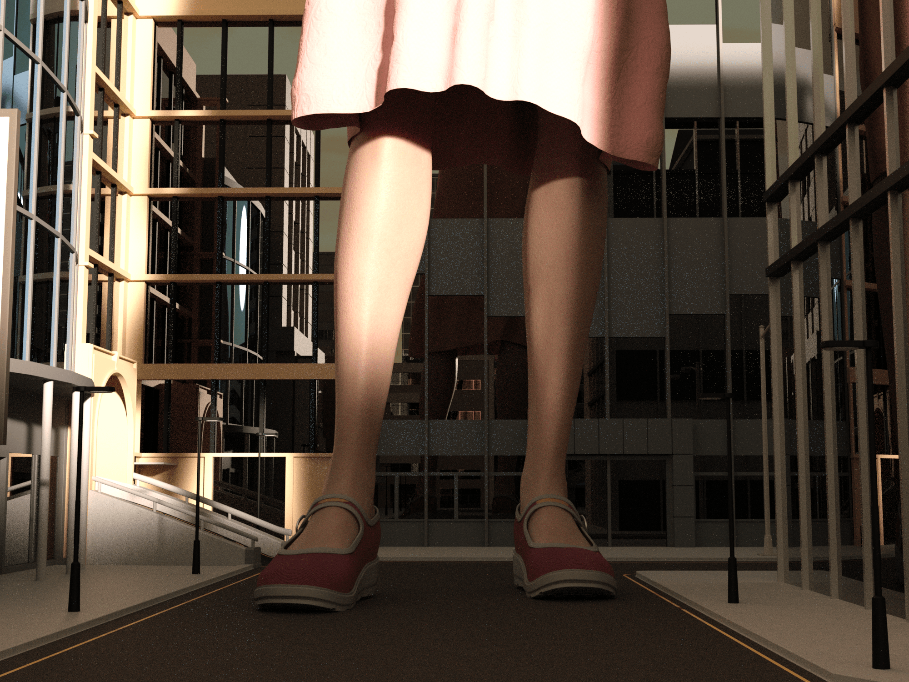
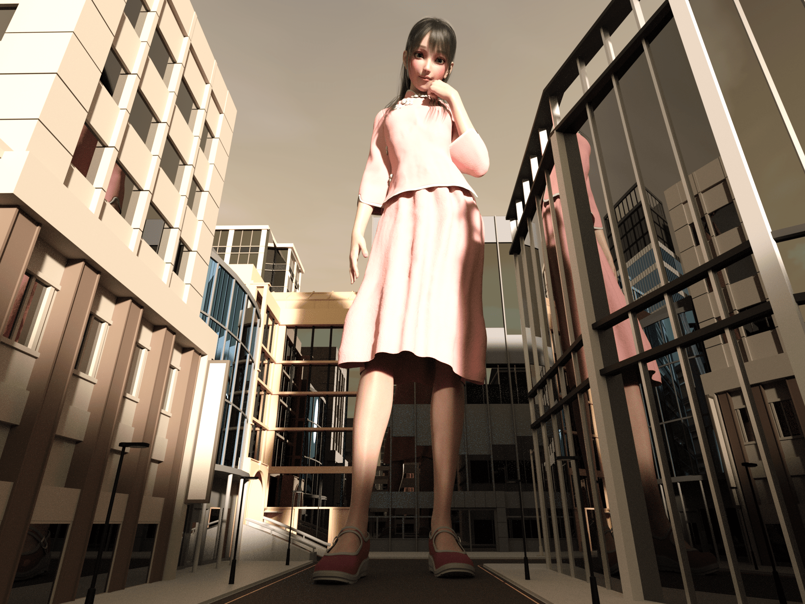

# 询问关于pov透视的问题

作者：琉璃

TID：29856

<title>1</title> <link href="../Styles/Style.css" type="text/css" rel="stylesheet">

# 1

有没有大佬解读下那种小人视角到底是属于透视啊，比如说笼子里或者小人城市里，仰角+透视总感觉傻傻分不清楚
<title>2</title> <link href="../Styles/Style.css" type="text/css" rel="stylesheet">

# 2

其實我覺得比起去細想小人角度，更重要的是你希望你的圖能夠希望表現出一個怎樣的畫面。

最典型的說法我覺得用鏡頭論去解釋也可以 就是超廣角和一般最典型的鏡頭分別
順便用一下圖片輔助說明
基於巨大娘的大小(都說是女巨人了)，基本上如果小人離巨大娘不遠的話，他一眼基本是無法看清巨大娘全身的。
<ignore_js_op>

**AAA.png** *(5.49 MB, 下載次數: 0)*

[下載附件](forum.php?mod=attachment&aid=ODYxMTl8Njg3MmI4ZWV8MTY3NDA2NjIzMnwxODIzMHwyOTg1Ng%3D%3D&nothumb=yes)

2020-11-26 19:43 上傳

當然如果真的代入小人的世界, 直接抬頭仰頭看全身就好

但一般單圖創作的話自然創作者希望一張圖可以將所有元素都濃縮在圖片裡，於是就有了超廣角的出現
<ignore_js_op>

**AAA1.png** *(4.25 MB, 下載次數: 0)*

[下載附件](forum.php?mod=attachment&aid=ODYxMTh8NGJiNDBkNTF8MTY3NDA2NjIzMnwxODIzMHwyOTg1Ng%3D%3D&nothumb=yes)

2020-11-26 19:42 上傳

這種算是一般廣角，當離得巨大娘更近時，需要更加廣角甚至出現魚眼效果。
於是巨大娘全身是看到了，但觀眾的感覺又未必一定是正面的。

所以如一開始所說，更重要的是你希望表達出一個怎樣的畫面(特寫巨大娘的某部分，還是要展現出巨大娘的壓迫感)，從而決定你需要的角度。

希望沒有離題吧(?)</ignore_js_op></ignore_js_op>