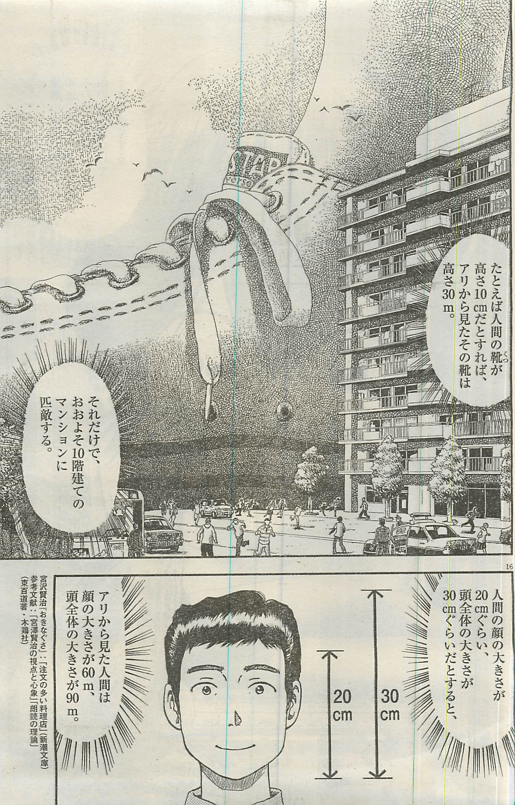

# 请教一下这两幅图的出处

作者：1569964774

TID：27494

<title>1</title> <link href="../Styles/Style.css" type="text/css" rel="stylesheet">

# 1

看上去非常nice，但是尝试了各种办法都找不到，果然还是我太弱了 <title>2</title> <link href="../Styles/Style.css" type="text/css" rel="stylesheet">

# 2

e-hentai.org/g/1500851/64909dab46
这个的P28
谢谢啦，手机上传不了图 <title>3</title> <link href="../Styles/Style.css" type="text/css" rel="stylesheet">

# 3

试了下Google图片搜索也是没有结果，估计是年头十分久远的了吧。。。 <title>4</title> <link href="../Styles/Style.css" type="text/css" rel="stylesheet">

# 4

> [1569964774 發表於 2019-10-14 23:49](https://giantessnight.cf/gnforum2012/forum.php?mod=redirect&goto=findpost&pid=416819&ptid=27494)
> e-hentai.org/g/1500851/64909dab46
> 这个的P28
> 谢谢啦，手机上传不了图

<ignore_js_op>

**螞蟻.jpg** *(622.5 KB, 下載次數: 1)*

[下載附件](forum.php?mod=attachment&aid=Nzk5MjF8OWM3YTEwZDN8MTY3NDA2NjY3MXwxODIzMHwyNzQ5NA%3D%3D&nothumb=yes)

2019-10-15 08:27 上傳

翻譯：
「例如鞋子高10公分，對螞蟻來說是30公尺」
「那樣就跟公寓差不多大了」

「人類的臉大約20公分，頭大約30公分」
「對螞蟻來說人類的臉有60公尺、頭有90公尺」

然後左下角的Refernce是宮澤賢治的《要求特別多的餐廳》和針對宮澤賢治的分析，應該是針對上一頁的註解

我講這麼多是要說，這八成不是A漫
<title>5</title> <link href="../Styles/Style.css" type="text/css" rel="stylesheet">

# 5

根据大佬的分析来看，有可能是一个擦边</ignore_js_op>