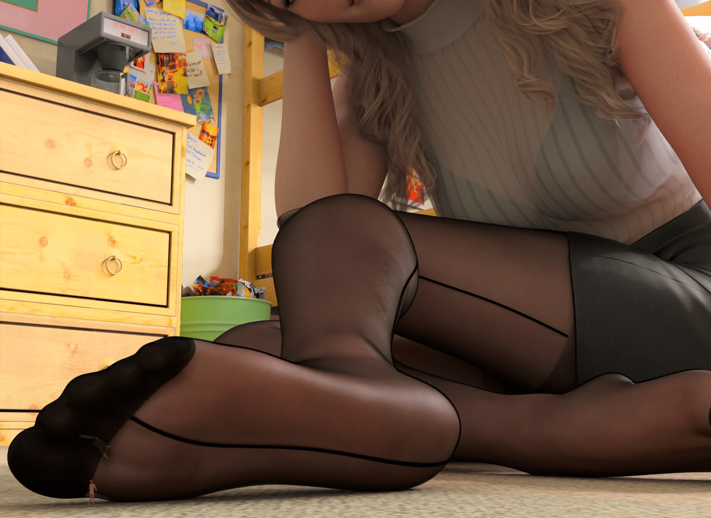
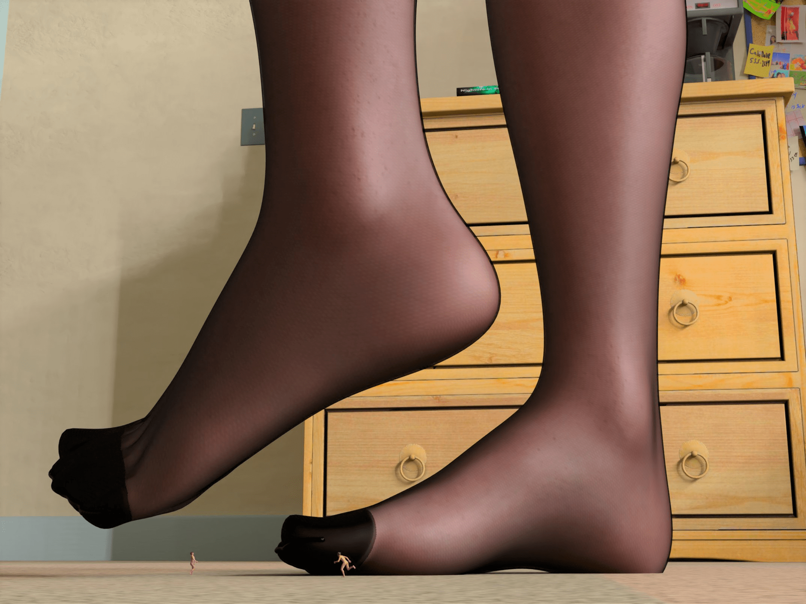
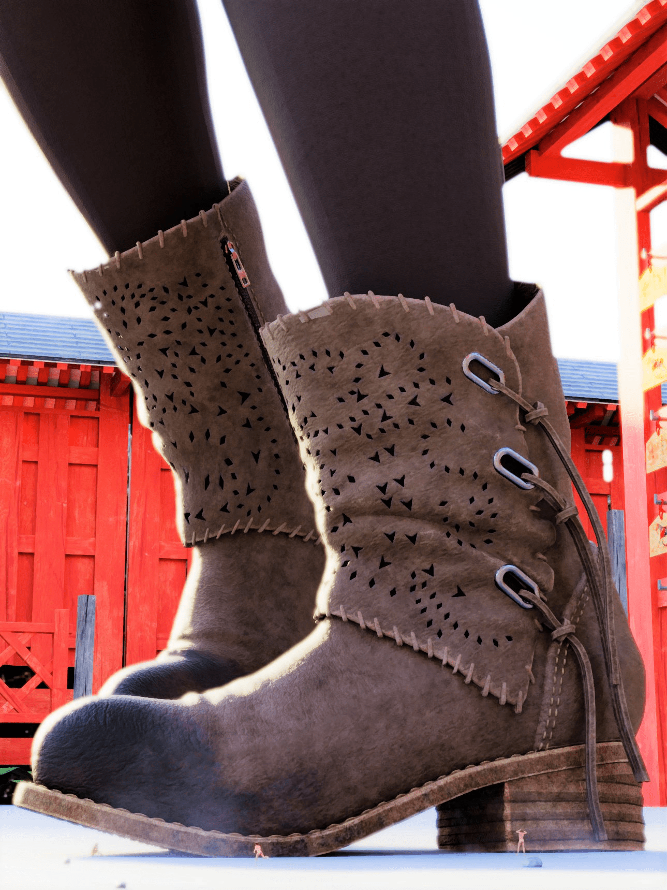
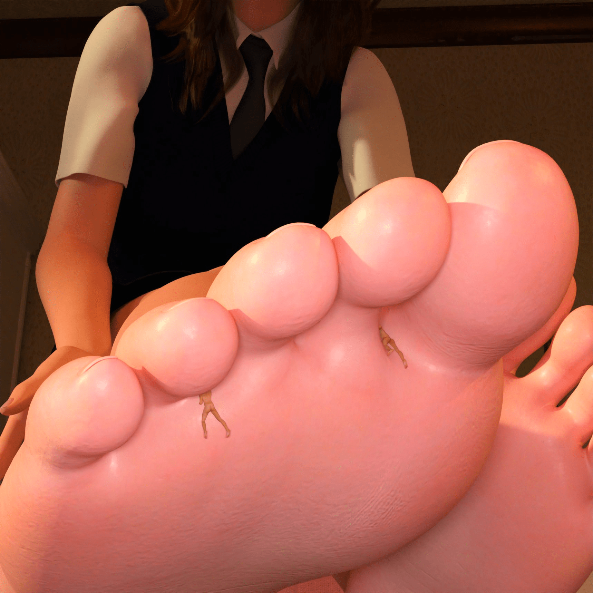

# 请教一下这两张图片的出处

作者：sss668800

TID：27776

<title>1</title> <link href="../Styles/Style.css" type="text/css" rel="stylesheet">

# 1

如题，看别人分享的，渲染的非常精致！求一下出处或者购买的方法，多谢：

<ignore_js_op>

**tt (1).jpg** *(295 KB, 下載次數: 3)*

[下載附件](forum.php?mod=attachment&aid=ODA2ODd8ZDI3N2Y5MDZ8MTY3NDA2NjYzNnwxODIzMHwyNzc3Ng%3D%3D&nothumb=yes)

2019-12-28 14:50 上傳

<ignore_js_op>

**tt (2).jpg** *(275.88 KB, 下載次數: 4)*

[下載附件](forum.php?mod=attachment&aid=ODA2ODh8YTc1Mjg0MmZ8MTY3NDA2NjYzNnwxODIzMHwyNzc3Ng%3D%3D&nothumb=yes)

2019-12-28 14:51 上傳

<title>2</title> <link href="../Styles/Style.css" type="text/css" rel="stylesheet">

# 2

这两张图是推特上的作者（id：73w_udon）创作的。你可以在推特上看到一些他其他的作品。顺便我贴几张他推特上的图片吧，他做得图确实非常细致。 <ignore_js_op>

**EMviYm-UYAAhQqF.jpg** *(321.36 KB, 下載次數: 0)*

[下載附件](forum.php?mod=attachment&aid=ODA2OTB8ZGZlMzYxMjF8MTY3NDA2NjYzNnwxODIzMHwyNzc3Ng%3D%3D&nothumb=yes)

2019-12-28 15:57 上傳

<ignore_js_op>

**EMjOPPIVUAIukWQ.jpg** *(189.69 KB, 下載次數: 0)*

[下載附件](forum.php?mod=attachment&aid=ODA2ODl8NWQxZmQ5NmZ8MTY3NDA2NjYzNnwxODIzMHwyNzc3Ng%3D%3D&nothumb=yes)

2019-12-28 15:57 上傳

<title>3</title> <link href="../Styles/Style.css" type="text/css" rel="stylesheet">

# 3

非常感谢，找到出处了:
[https://pic.twitter.com/jGByiSX9GM](https://pic.twitter.com/jGByiSX9GM) <title>4</title> <link href="../Styles/Style.css" type="text/css" rel="stylesheet">

# 4

要穿墙，才能打开</ignore_js_op></ignore_js_op></ignore_js_op></ignore_js_op>