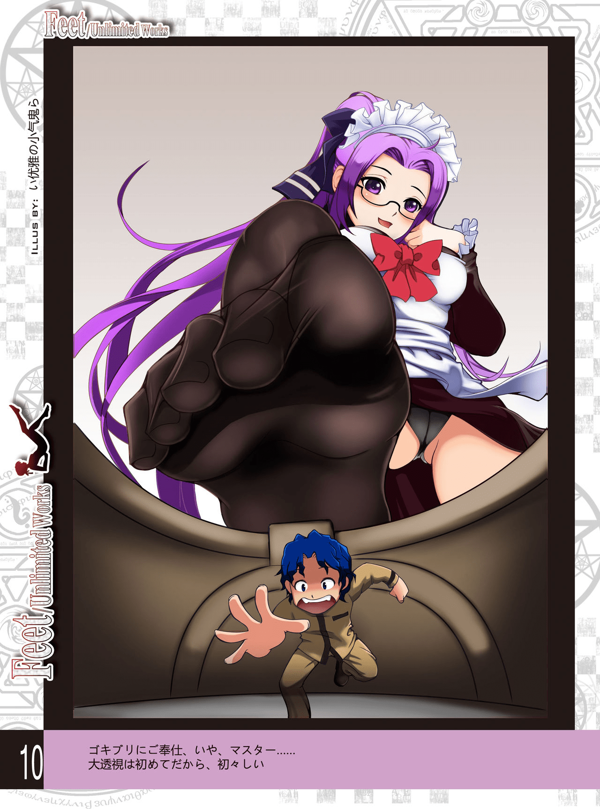
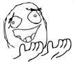

# 请问大家都是从什么时候开始知道自己是GTS爱好者的

作者：xdss

TID：22195

<title>1</title> <link href="../Styles/Style.css" type="text/css" rel="stylesheet">

# 1

请问大家都是从什么时候开始知道自己是GTS爱好者的，或者有对这个方向有所倾向的
<title>2</title> <link href="../Styles/Style.css" type="text/css" rel="stylesheet">

# 2

 <ignore_js_op>[Unlimited_Works_007.jpg](forum.php?mod=attachment&aid=NjU2NzF8OWE4NDY1YTZ8MTY3NDA2NzMwMHwxODIzMHwyMjE5NQ%3D%3D&nothumb=yes) *(276.39 KB, 下載次數: 3)*

[下載附件](forum.php?mod=attachment&aid=NjU2NzF8OWE4NDY1YTZ8MTY3NDA2NzMwMHwxODIzMHwyMjE5NQ%3D%3D&nothumb=yes)

2016-11-21 07:39 上傳  

</ignore_js_op> <title>3</title> <link href="../Styles/Style.css" type="text/css" rel="stylesheet">

# 3

六年级，看到了缩学的cg，然后就喜欢上了
<title>4</title> <link href="../Styles/Style.css" type="text/css" rel="stylesheet">

# 4

看西游记铁扇公主觉醒，有了电脑后知道了gts <title>5</title> <link href="../Styles/Style.css" type="text/css" rel="stylesheet">

# 5

8岁时候开始喜欢女生的时候第一反应就是喜欢GTS <title>6</title> <link href="../Styles/Style.css" type="text/css" rel="stylesheet">

# 6

我不太记得自己什么时候，应该是高中刚开始的时候
<title>7</title> <link href="../Styles/Style.css" type="text/css" rel="stylesheet">

# 7

哆啦a梦……变大灯或什么的 <title>8</title> <link href="../Styles/Style.css" type="text/css" rel="stylesheet">

# 8

当然是从上了这个破站开始 <title>9</title> <link href="../Styles/Style.css" type="text/css" rel="stylesheet">

# 9

從小看格列佛遊記、多啦a夢宇宙小戰爭等作品就有感覺了... <title>10</title> <link href="../Styles/Style.css" type="text/css" rel="stylesheet">

# 10

小学左右吧。。。。。 <title>11</title> <link href="../Styles/Style.css" type="text/css" rel="stylesheet">

# 11

小学左右吧，也是看了铁扇公主那里 <title>12</title> <link href="../Styles/Style.css" type="text/css" rel="stylesheet">

# 12

小学,每天幻想自己變得很小 <title>13</title> <link href="../Styles/Style.css" type="text/css" rel="stylesheet">

# 13

小时候看了爱丽丝梦游仙境，然后去电脑上搜 <title>14</title> <link href="../Styles/Style.css" type="text/css" rel="stylesheet">

# 14

小學，看了哆啦A夢，好像是一寸帽那集吧，大雄被靜香抓抓住那幕被啟發了 <title>15</title> <link href="../Styles/Style.css" type="text/css" rel="stylesheet">

# 15

两年前无意间看了一个GTS的MMD然后发现的 <title>16</title> <link href="../Styles/Style.css" type="text/css" rel="stylesheet">

# 16

我入这个圈不是很早，主要是小时候喜欢变大变小之类的觉得好牛逼啊，后来到网上一查，就查到跟“巨大”这个字眼有关的东西了，就知道了gts <title>17</title> <link href="../Styles/Style.css" type="text/css" rel="stylesheet">

# 17

幼稚園看到女同學,就想被縮小當娃娃.......
很小就覺醒了,也想當小人了.

覺醒原因-不明 <title>18</title> <link href="../Styles/Style.css" type="text/css" rel="stylesheet">

# 18

看到一些很大的巨大的人物的时候，就试着去网上搜索一下女巨人，结果就爱上了。 <title>19</title> <link href="../Styles/Style.css" type="text/css" rel="stylesheet">

# 19

当然是从上了这个破站开始+1 <title>20</title> <link href="../Styles/Style.css" type="text/css" rel="stylesheet">

# 20

不记得了，好像很早，又貌似很晚 <title>21</title> <link href="../Styles/Style.css" type="text/css" rel="stylesheet">

# 21

小学的时候有这种倾向。。但是不懂。。大概在大学左右接触到了以前那个女神论坛 后来通过女神论坛发现了以前的GN   才明白这个性取向叫GTS。。。。。 <title>22</title> <link href="../Styles/Style.css" type="text/css" rel="stylesheet">

# 22

前两年发现了论坛，才知道这个叫GTS..... <title>23</title> <link href="../Styles/Style.css" type="text/css" rel="stylesheet">

# 23

以前总喜欢巨大化物体，但真正开始影响我的生活的是在一次搜巨大，出来了一个少女，我就点进去了，然后就.....到了现在。 <title>24</title> <link href="../Styles/Style.css" type="text/css" rel="stylesheet">

# 24

都是小学时候开始的啊  我也差不多 那时候幻想老师或者班里面很漂亮的女同学变大  之后有一天在网上搜性感女巨人看到了一个5分钟的视频。。 再之后看关键词才知道原来这叫gts <title>25</title> <link href="../Styles/Style.css" type="text/css" rel="stylesheet">

# 25

最先接触的SM，慢慢的在网上看到了 小人阿同 这篇文章。从此不可自拔 <title>26</title> <link href="../Styles/Style.css" type="text/css" rel="stylesheet">

# 26

高中吧，看了爱丽丝梦游仙境之后 <title>27</title> <link href="../Styles/Style.css" type="text/css" rel="stylesheet">

# 27

其實我記得我接觸最早的gts是。。。《十萬個為什麼》 漫畫里有一章就是縮小開膠囊艙探索人體消化系統的 小時後看著很怕 現在，，， <title>28</title> <link href="../Styles/Style.css" type="text/css" rel="stylesheet">

# 28

Alice in Wonderland/ Gulliver's Travels/ The Wonderful Adventure of Nils <title>29</title> <link href="../Styles/Style.css" type="text/css" rel="stylesheet">

# 29

当年查初音新曲巨大少女的时候看到了很多不该看的东西，于是就觉醒了 <title>30</title> <link href="../Styles/Style.css" type="text/css" rel="stylesheet">

# 30

自从无意间从sm网进到了巨大少女吧 <title>31</title> <link href="../Styles/Style.css" type="text/css" rel="stylesheet">

# 31

记得是小学的时候看一部机器猫的剧场版，静香变大了 <title>32</title> <link href="../Styles/Style.css" type="text/css" rel="stylesheet">

# 32

我大概是从1995年那会儿开始就喜欢这个领域了。 <title>33</title> <link href="../Styles/Style.css" type="text/css" rel="stylesheet">

# 33

小学时代的时候 看了西游记里的铁扇公主  女娲补天  还有个观音抓哪吒的一个电视剧 <title>34</title> <link href="../Styles/Style.css" type="text/css" rel="stylesheet">

# 34

差不多幼儿园，看了某部奥特曼中某集女配角是外星人？变大后感觉超级棒。正式接触gts是初中时东查西查从gts文章了解到女神论坛，再了解到gn论坛 <title>35</title> <link href="../Styles/Style.css" type="text/css" rel="stylesheet">

# 35

以前通过优酷，再就是上贴吧，通过贴吧再知道了gn <title>36</title> <link href="../Styles/Style.css" type="text/css" rel="stylesheet">

# 36

.
單純論幾年的話，我大概是1997~1998左右覺醒的吧？
不過我算晚熟的，所以總覺得樓ˋ主的年紀搞不好還比我小。
<title>37</title> <link href="../Styles/Style.css" type="text/css" rel="stylesheet">

# 37

估计这里好多人都是从女巨人吧或者GTS吧开始的 其实我的初体验是卡通频道cartoon network的一部老动画片《乔尼大冒险》开始的，大概就是讲科学家老爹带着一个金毛小哥和一个红发妹子在虚拟世界中历险的全年龄向故事。 然而第44集里，一家人进入虚拟世界后，女主被坏人控制，不认老爹了。老爹和那集的大boss单挑，坏人启动某种程序，变大到老爹的十倍，一手提起老爹，肩膀上还长出电锯要把老爹处死，老爹哀嚎。但这时候，坏人突然被一只大手抓住了，女主的声音：“你很大吗？I don't think so.” 然后巨大化的女主一下子把坏人提到了眼前，然后丢到了虚拟世界之外。接着她蹲下来，让老爹和哥哥坐在手臂上，在虚拟世界崩塌前安全撤离。 这也就是我的初体验，以及为什么喜欢多重身高的原因吧！ <title>38</title> <link href="../Styles/Style.css" type="text/css" rel="stylesheet">

# 38

初几来着，应该在中间那会吧 <title>39</title> <link href="../Styles/Style.css" type="text/css" rel="stylesheet">

# 39

大概还是小学一二年级的样子，就想坐个缩小的机器，在女孩子的血管里遨游，当时还和很要好的一个女孩子聊这个事情，拉钩以后她帮我实现。啊呀，这就是青春啊 <title>40</title> <link href="../Styles/Style.css" type="text/css" rel="stylesheet">

# 40

小学六年级，不过那时候是看的含GT的动画片 <title>41</title> <link href="../Styles/Style.css" type="text/css" rel="stylesheet">

# 41

一年级？当时刚好隔壁班有一个女同学，长得很高（比周围同学高出半个头那样），又很漂亮
然后五年级又在辅导班见到一个很高的女同学（貌似我周围经常能见到比同龄人高一截的女同学啊233），又和我关系不错
再之后就是初一找到了高大女人吧和巨大少女吧（所以我是坚定的miniGTS党） <title>42</title> <link href="../Styles/Style.css" type="text/css" rel="stylesheet">

# 42

优酷上那么多视频，无意中翻到，无意中就知道了。 <title>43</title> <link href="../Styles/Style.css" type="text/css" rel="stylesheet">

# 43

反正一开始只是喜欢足，不知不觉的就很向往巨大的女性，真正意识到了是十多岁的事了…… <title>44</title> <link href="../Styles/Style.css" type="text/css" rel="stylesheet">

# 44

小时候看见过一个广告，一个巨大的妹子把阳台踩了，然后就。。 <title>45</title> <link href="../Styles/Style.css" type="text/css" rel="stylesheet">

# 45

看到龙珠布欧的时候，知道自己是个vore控 <title>46</title> <link href="../Styles/Style.css" type="text/css" rel="stylesheet">

# 46

以下对话吧。。。。。。。。。。。。。。。 <title>47</title> <link href="../Styles/Style.css" type="text/css" rel="stylesheet">

# 47

小学看到的动漫才喜欢的 <title>48</title> <link href="../Styles/Style.css" type="text/css" rel="stylesheet">

# 48

1.喜欢体型悬殊的东西。2.这样有意思一些。3.喜欢xx想要一个xx对自己不离不弃。4.看到转帖推书但大的eoe，猎奇心发作。我觉得很神奇，这是怎么被推荐的？为了寻找这个文章，百度。然后出现了女巨人一系列，进入贴吧，封了n个之后，跑这里来了，觉得这安全些，不会暴露身份。我说这么多，都可以看成一段成长史了。 <title>49</title> <link href="../Styles/Style.css" type="text/css" rel="stylesheet">

# 49

其实具体是什么时间发现的已经有些模糊了，可能是小学时也或许是初中。一开始只是看了西游记里面铁扇公主那一部分剧情时格外的兴奋，于是就开始迷恋那种入侵美女体内的感觉。然后偷偷去百度里找类似的信息与资源。先是找到了铁扇公主吧，可惜我对虐腹这种属性非常反感，虽然没在贴吧里表达出自己的不满，但是对于里面的文章自然是毫无感觉。之后找到了gtss吧以及那时最喜欢的一篇《草莓姐姐》，才发现自己最喜欢的可能是unbirth和GTS。之后虽然注意到了GN的存在，却因为邀请码等原因所以很晚才注册。
现在想想还真是怀念当时刚刚发现GN的时候，那时是才高一，把但大放在首页的文章都拷贝到电子辞典里，然后偷偷在课上看 <title>50</title> <link href="../Styles/Style.css" type="text/css" rel="stylesheet">

# 50

看到关于growth的视频，然后发现自己很喜欢这些 <title>51</title> <link href="../Styles/Style.css" type="text/css" rel="stylesheet">

# 51

> nimcho001122 發表於 2016-11-21 16:32
> 小学,每天幻想自己變得很小

同道中人啊！！！！！!！！！！！！！！！！！！！！！！！！！！！！！ <title>52</title> <link href="../Styles/Style.css" type="text/css" rel="stylesheet">

# 52

小学看的小叮当和大雄入静香腹的那段，然后先上的度娘发现的gb，后来在gb发现的gk，后又发现的贴吧，又从一个个挂掉的贴吧找到了gn（gn注册不上啊啊啊！） <title>53</title> <link href="../Styles/Style.css" type="text/css" rel="stylesheet">

# 53

看格列佛游记， 里面有一段描写 被女官玩弄的情节 <title>54</title> <link href="../Styles/Style.css" type="text/css" rel="stylesheet">

# 54

小学的时候看见很多老师们都喜欢穿靴子，就突然幻想着缩小想钻进去，随着年龄成长口味越来越大，初中想入腹，高中想入阴。。。。 <title>55</title> <link href="../Styles/Style.css" type="text/css" rel="stylesheet">

# 55

好像是因为小时候看了那个三得利的广告？ <title>56</title> <link href="../Styles/Style.css" type="text/css" rel="stylesheet">

# 56

小学的时候就盯着女生的鞋子看..很想钻进去 <title>57</title> <link href="../Styles/Style.css" type="text/css" rel="stylesheet">

# 57

看七宗罪的时候觉醒的 <title>58</title> <link href="../Styles/Style.css" type="text/css" rel="stylesheet">

# 58

哈哈哈哈自从发现了gn之后 <title>59</title> <link href="../Styles/Style.css" type="text/css" rel="stylesheet">

# 59

幼儿园的时候就幻想在班上女孩子身上攀爬，后来小学时候看了王心凌一个MV，里面拍到她的裸足，还有她把一只玩具熊夹在双腿直接玩，瞬间就很羡慕那只玩具熊。。 <title>60</title> <link href="../Styles/Style.css" type="text/css" rel="stylesheet">

# 60

看本子的时候看到擦边球，接着就迷上了（大概是高中） <title>61</title> <link href="../Styles/Style.css" type="text/css" rel="stylesheet">

# 61

大概六年前在google亂跑剛剛好看到但大的文明吞噬者(還是剛出呢)
就開始喜歡GTS了
之後看到但大的魔鬼經理人太平洋4又喜歡變物了
發現GN論壇時剛好在封新註冊...(我記得好像是吧
結果14年無意跑回來看看到GN可以註冊了就馬上註冊了 <title>62</title> <link href="../Styles/Style.css" type="text/css" rel="stylesheet">

# 62

油管上看到日本的一个女巨人广告，然后发现了相关的feet crush视频 <title>63</title> <link href="../Styles/Style.css" type="text/css" rel="stylesheet">

# 63

小学看黄片想着女性的下体然后无师自通上网搜女巨人 <title>64</title> <link href="../Styles/Style.css" type="text/css" rel="stylesheet">

# 64

做梦 梦到自己是gts (-｡-; <title>65</title> <link href="../Styles/Style.css" type="text/css" rel="stylesheet">

# 65

6年级吧，那时候班里女生有的比较高
<title>66</title> <link href="../Styles/Style.css" type="text/css" rel="stylesheet">

# 66

记不太清楚了，似乎是小学时，无意间看到了什么结果就觉醒了。 <title>67</title> <link href="../Styles/Style.css" type="text/css" rel="stylesheet">

# 67

小学时看了多啦A梦中的缩小灯，然后又在网上看了很多的MMD，又幻想自己变小在女生身上爬之后就入坑了 <title>68</title> <link href="../Styles/Style.css" type="text/css" rel="stylesheet">

# 68

除了铁扇公主还能怎样~~~ <title>69</title> <link href="../Styles/Style.css" type="text/css" rel="stylesheet">

# 69

看了百变小樱-----奇怪的书那集瞬间觉醒. <title>70</title> <link href="../Styles/Style.css" type="text/css" rel="stylesheet">

# 70

小学的时候吧，开始是对身高差感觉很好奇（类似于对新事物的好奇），然后开始在可以搜索到视频的地方疯狂搜索“巨大”“缩小”“变小”等关键词，真正觉醒是在优酷上看到了缩小学院的攻略视频（以前一直很讨厌RPG，然后那次被剧情吸引，看完了完整的攻略）此后自然而然的利用贴吧一步步找到了组织。 <title>71</title> <link href="../Styles/Style.css" type="text/css" rel="stylesheet">

# 71

我只是喜欢不知道的场景，小的使事情更有趣大女人是性感的，但我喜欢收缩 <title>72</title> <link href="../Styles/Style.css" type="text/css" rel="stylesheet">

# 72

小時候 看小太陽的女媧  受到啟發 <title>73</title> <link href="../Styles/Style.css" type="text/css" rel="stylesheet">

# 73

小时候就有这种感觉…后来逛优酷，知道了这叫gts
… <title>74</title> <link href="../Styles/Style.css" type="text/css" rel="stylesheet">

# 74

看了奥特曼—被禁止的语言，和种种作品后