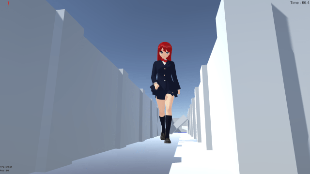

# 请问如何使用游戏控制台

作者：hunj

TID：22101

<title>1</title> <link href="../Styles/Style.css" type="text/css" rel="stylesheet">

# 1

*本帖最後由 hunj 於 2016-11-1 22:21 編輯*

最近刚刚接触一个这个论坛里的游戏:gts exploration,听说游戏控制台可以改变人物大小,所以想问问这个游戏控制台是每个游戏都能用还是说每个游戏有自己的控制台  

ps:不希望听到不好的话,毕竟我跟你们无仇无怨,我是真的真的 对这玩意一窍不通 所以老问别人问题烦到你们了真是很抱歉。经常被别人说成是伸手党,心里不是很好受,但再怎么不好受也没用阿,毕竟你们都上知天文,下知地理的,我才一个初三学生,没多大能耐,也跟你们比不了所以…就是这个意思哈(这ps 太长了算水贴不) <title>2</title> <link href="../Styles/Style.css" type="text/css" rel="stylesheet">

# 2

呃，在打一堆防砲預防針前，至少把遊戲名稱寫出來吧 <title>3</title> <link href="../Styles/Style.css" type="text/css" rel="stylesheet">

# 3

所以这游戏到底叫啥名？？？
控制台变大我第一个想到的是上古卷轴 <title>4</title> <link href="../Styles/Style.css" type="text/css" rel="stylesheet">

# 4

> 3213213210 發表於 2016-11-1 22:05
> 呃，在打一堆防砲預防針前，至少把遊戲名稱寫出來吧

我说的是真心话,希望你们理解 <title>5</title> <link href="../Styles/Style.css" type="text/css" rel="stylesheet">

# 5

> archer 發表於 2016-11-1 22:17
> 所以这游戏到底叫啥名？？？
> 控制台变大我第一个想到的是上古卷轴

主题我已经修改了
gts exploration <title>6</title> <link href="../Styles/Style.css" type="text/css" rel="stylesheet">

# 6

按TAB然后自己查看左边一堆选项， <title>7</title> <link href="../Styles/Style.css" type="text/css" rel="stylesheet">

# 7

> [紫色欧石楠 發表於 2016-11-1 22:55](https://giantessnight.cf/gnforum2012/forum.php?mod=redirect&goto=findpost&pid=313378&ptid=22101)
> 按TAB然后自己查看左边一堆选项，

还能在变大点吗，那个tab就是游戏控制台？
<title>8</title> <link href="../Styles/Style.css" type="text/css" rel="stylesheet">

# 8

怎么说呢，一般情况下控制台是游戏制作者留给玩家输入代码以控制游戏系统的，这个tab只能说是游戏的“编辑模式”，留给你编辑场景的。大小的话只能通过scale调节，更大就不行了，但是你看add stuff里的城市模型，本身就很小了，而且还可以再调小，相对大小差距绝对足够了。 <title>9</title> <link href="../Styles/Style.css" type="text/css" rel="stylesheet">

# 9

> cat 發表於 2016-11-2 04:15
> 怎么说呢，一般情况下控制台是游戏制作者留给玩家输入代码以控制游戏系统的，这个tab只能说是游戏的“编辑 ...

嗯嗯涨知识了非常感谢                         <title>10</title> <link href="../Styles/Style.css" type="text/css" rel="stylesheet">

# 10

> [cat 發表於 2016-11-2 04:15](https://giantessnight.cf/gnforum2012/forum.php?mod=redirect&goto=findpost&pid=313400&ptid=22101)
> 怎么说呢，一般情况下控制台是游戏制作者留给玩家输入代码以控制游戏系统的，这个tab只能说是游戏的“编辑 ...

那请问这个副部长还能变大吗
<title>11</title> <link href="../Styles/Style.css" type="text/css" rel="stylesheet">

# 11

 <ignore_js_op>[093725roelsl78y6etaqae.png.thumb.jpg](forum.php?mod=attachment&aid=NjUzNzd8MWZhZDE2Y2N8MTY3NDA2Nzg1NXwxODIzMHwyMjEwMQ%3D%3D&nothumb=yes) *(60.46 KB, 下載次數: 0)*

[下載附件](forum.php?mod=attachment&aid=NjUzNzd8MWZhZDE2Y2N8MTY3NDA2Nzg1NXwxODIzMHwyMjEwMQ%3D%3D&nothumb=yes)

2016-11-2 20:31 上傳  

</ignore_js_op>