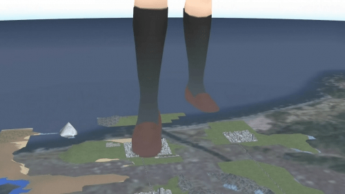

# 请问这个老视频是否有大佬还保存着？

作者：Anlu

TID：34721

<title>1</title> <link href="../Styles/Style.css" type="text/css" rel="stylesheet">

# 1

之前找到了4chan上分享的5.5GB mjgts的包，结果里面没有，哭死了????????????
<title>2</title> <link href="../Styles/Style.css" type="text/css" rel="stylesheet">

# 2

 <ignore_js_op>[161133eukg1epwm6gq6waf.jpg.thumb.jpg](forum.php?mod=attachment&aid=MTAxNDE1fDU4NDFiYjczfDE2NzQwNjkyMTh8MTgyMzB8MzQ3MjE%3D&nothumb=yes) *(67.21 KB, 下載次數: 2)*

[下載附件](forum.php?mod=attachment&aid=MTAxNDE1fDU4NDFiYjczfDE2NzQwNjkyMTh8MTgyMzB8MzQ3MjE%3D&nothumb=yes)

2023-1-6 01:56 上傳  

</ignore_js_op> <ignore_js_op>[161136lzhlys0ptishsh31.jpg.thumb.jpg](forum.php?mod=attachment&aid=MTAxNDE0fGJmMGJiZWUyfDE2NzQwNjkyMTh8MTgyMzB8MzQ3MjE%3D&nothumb=yes) *(89.55 KB, 下載次數: 0)*

[下載附件](forum.php?mod=attachment&aid=MTAxNDE0fGJmMGJiZWUyfDE2NzQwNjkyMTh8MTgyMzB8MzQ3MjE%3D&nothumb=yes)

2023-1-6 01:56 上傳  

</ignore_js_op> <title>3</title> <link href="../Styles/Style.css" type="text/css" rel="stylesheet">

# 3

看着有点印象 在论坛很久以前大佬做的MMD合集（20121001）里找到了
百度云：[https://pan.baidu.com/s/1fwOJvsw3DEc8GbJfE4X67w?pwd=0f6h](https://pan.baidu.com/s/1fwOJvsw3DEc8GbJfE4X67w?pwd=0f6h)
提取码：0f6h
此外楼主能不能分享一下mjgts的大包，想收集收集老资源（x <title>4</title> <link href="../Styles/Style.css" type="text/css" rel="stylesheet">

# 4

> [Anlu 發表於 2023-1-6 18:14](https://giantessnight.cf/gnforum2012/forum.php?mod=redirect&goto=findpost&pid=523919&ptid=34721)
> 看着有点印象 在论坛很久以前大佬做的MMD合集（20121001）里找到了
> 百度云：https://pan.baidu.com/s/1fwOJ ...

就是这个链接失效了，我才求助的????请问有还能用的网址吗？
资源是https://mega.nz/file/NZpyVJjb#pjyuxFDXGpFuer7fALx61UFDBUMoUX5szV2uk0U4biw
<title>5</title> <link href="../Styles/Style.css" type="text/css" rel="stylesheet">

# 5

> [vandarkholme 發表於 2023-1-6 21:10](https://giantessnight.cf/gnforum2012/forum.php?mod=redirect&goto=findpost&pid=523935&ptid=34721)
> 就是这个链接失效了，我才求助的????请问有还能用的网址吗？
> 资源是https://mega.nz/file/NZpyVJjb#pjyux ...

好快的炸 这次用了2层压缩
链接：[https://pan.baidu.com/s/1l8erckmRapb2tNFSLeh7ew?pwd=bo39](https://pan.baidu.com/s/1l8erckmRapb2tNFSLeh7ew?pwd=bo39)
提取码：bo39 <title>6</title> <link href="../Styles/Style.css" type="text/css" rel="stylesheet">

# 6

> [Anlu 發表於 2023-1-6 21:59](https://giantessnight.cf/gnforum2012/forum.php?mod=redirect&goto=findpost&pid=523943&ptid=34721)
> 好快的炸 这次用了2层压缩
> 链接：https://pan.baidu.com/s/1l8erckmRapb2tNFSLeh7ew?pwd=bo39
> 提取码：b ...

太感谢了就是我想找的！
(不过我印象中好像一共有三段视频的，中间好像还有一段)
<title>7</title> <link href="../Styles/Style.css" type="text/css" rel="stylesheet">

# 7

> [vandarkholme 發表於 2023-1-6 23:18](https://giantessnight.cf/gnforum2012/forum.php?mod=redirect&goto=findpost&pid=523952&ptid=34721)
> 太感谢了就是我想找的！
> (不过我印象中好像一共有三段视频的，中间好像还有一段)
> ...

看了一眼确实漏了一个别视角的ww
下意识以为两张图对应两个视频了
百度云：[https://pan.baidu.com/s/1WQ6ucIXRUuRzmXxVsrqRSA?pwd=e1k4](https://pan.baidu.com/s/1WQ6ucIXRUuRzmXxVsrqRSA?pwd=e1k4)
提取码：e1k4

<title>8</title> <link href="../Styles/Style.css" type="text/css" rel="stylesheet">

# 8

> [Anlu 發表於 2023-1-7 00:36](https://giantessnight.cf/gnforum2012/forum.php?mod=redirect&goto=findpost&pid=523963&ptid=34721)
> 看了一眼确实漏了一个别视角的ww
> 下意识以为两张图对应两个视频了
> 百度云：https://pan.baidu.com/s/1WQ6 ...

谢谢！终于集齐了“童年回忆”
<title>9</title> <link href="../Styles/Style.css" type="text/css" rel="stylesheet">

# 9

> [vandarkholme 發表於 2023-1-6 18:00](https://giantessnight.cf/gnforum2012/forum.php?mod=redirect&goto=findpost&pid=523967&ptid=34721)
> 谢谢！终于集齐了“童年回忆”

竟然还有人有这个视频，能用MEGA或者Google云盘或者其他方式发一下吗，感激不尽
<title>10</title> <link href="../Styles/Style.css" type="text/css" rel="stylesheet">

# 10

> [Anlu 發表於 2023-1-7 00:36](https://giantessnight.cf/gnforum2012/forum.php?mod=redirect&goto=findpost&pid=523963&ptid=34721)
> 看了一眼确实漏了一个别视角的ww
> 下意识以为两张图对应两个视频了
> 百度云：[https://pan.baidu.com/s/1WQ6](https://pan.baidu.com/s/1WQ6) ...

请问层主这两个文件解压缩后的后缀名是什么？
<title>11</title> <link href="../Styles/Style.css" type="text/css" rel="stylesheet">

# 11

这个画面看着也太古老了吧。不过好在楼主问了也有人答了，坐收资源，哈哈 <title>12</title> <link href="../Styles/Style.css" type="text/css" rel="stylesheet">

# 12

> [libido 發表於 2023-1-7 08:27](https://giantessnight.cf/gnforum2012/forum.php?mod=redirect&goto=findpost&pid=523987&ptid=34721)
> 请问层主这两个文件解压缩后的后缀名是什么？

.zip 也就是压缩包主要避免在线解压秒炸