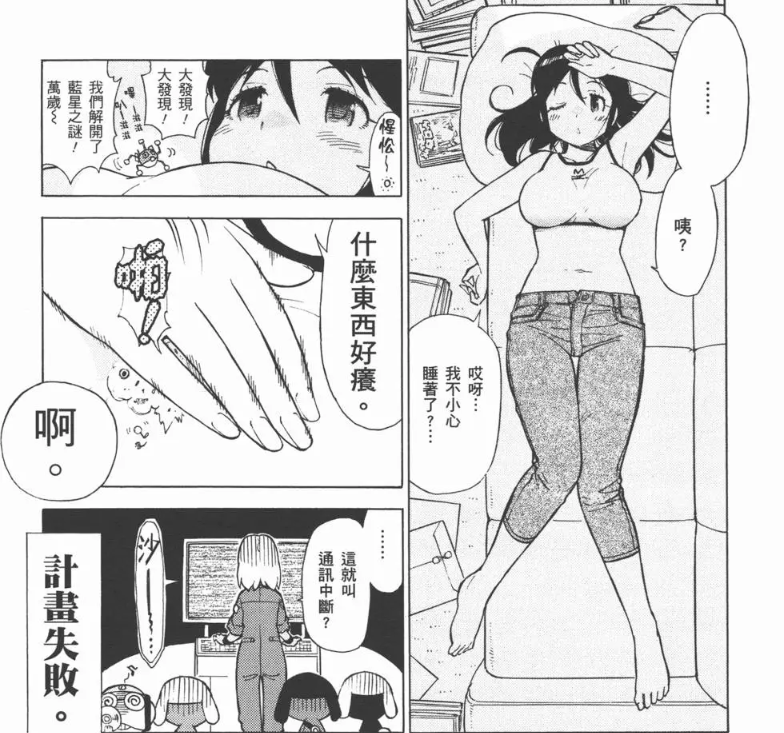

# 谁知道tv动画有什么擦边吗

作者：麻婆豆腐

TID：34719

<title>1</title> <link href="../Styles/Style.css" type="text/css" rel="stylesheet">

# 1

天空侵犯第七还是第八集有一个高跟爆头
转生成人头麦第三还是第四集有变成炸鸡被吃的擦边 <title>2</title> <link href="../Styles/Style.css" type="text/css" rel="stylesheet">

# 2

波奇小恐龙！                                           <title>3</title> <link href="../Styles/Style.css" type="text/css" rel="stylesheet">

# 3

*本帖最後由 陈河伯 於 2023-1-6 15:49 編輯*

妖精的尾巴好像290，306，308估计有擦边，我记不清了
<title>4</title> <link href="../Styles/Style.css" type="text/css" rel="stylesheet">

# 4

出包王女有一集有擦边，是给巨娘洗澡
银魂有一小段vore的剧情，但是实际上没什么感觉 <title>5</title> <link href="../Styles/Style.css" type="text/css" rel="stylesheet">

# 5

七大罪，应该不算擦边了吧，直球巨人族了。
奇妙旋律melody有一集为了追手绢变大的。
军曹好像有两次擦边，一次泡澡一次在身上打高尔夫。
话说优酷和b站好像看到过很多gts动画片段，但大部分都没写名字 <title>6</title> <link href="../Styles/Style.css" type="text/css" rel="stylesheet">

# 6

那必须是超时空要塞系列                           <title>7</title> <link href="../Styles/Style.css" type="text/css" rel="stylesheet">

# 7

https://space.bilibili.com/256894290
这个up收集了很多 <title>8</title> <link href="../Styles/Style.css" type="text/css" rel="stylesheet">

# 8

只打算推光美的路過，暫且幫前幾樓補充一下

銀魂前期還有一集巨大女性外星人

出包還有變倉鼠和縮小的(好像是OVA

軍曹動畫其實約有20次，還有不少沒動畫化的，憑印象打的，之前整理過，不過檔案太大不想解壓
<ignore_js_op>

**Keroro.png** *(545.76 KB, 下載次數: 8)*

[下載附件](forum.php?mod=attachment&aid=MTAxNDMwfGM2MDZiOWY3fDE2NzQwNjUwNTF8MTgyMzB8MzQ3MTk%3D&nothumb=yes)

2023-1-6 20:31 上傳

桃華變大、在無人島變大、夏美扮怪獸、撈地球人、縮小治蛀牙兩次、縮小玩賽車、大富翁、泳池

變成米、變成蟲子、在蛋糕上打戰、宇宙警察跟禁止巨大化法律來著(?、還有模型相關的好像三次

再來就是光美了

無印、GoGo、甜蜜天使、Smile+劇場版、公主、魔法使、食尚甜心劇場版、擁抱、元氣魔法、熱情閃耀
<ignore_js_op> [ヒーリングっど♥プリキュア.mp4](forum.php?mod=attachment&aid=MTAxNDI5fDE2NmY5MzJlfDE2NzQwNjUwNTF8MTgyMzB8MzQ3MTk%3D) *(3.44 MB, 下載次數: 54)* 2023-1-6 20:30 上傳點擊文件名下載附件

少部分有複數集擦邊，集數...?看完就知道了

<ignore_js_op>

**桜坂しずく.png** *(1.58 MB, 下載次數: 8)*

[下載附件](forum.php?mod=attachment&aid=MTAxNDMxfDNhNTlmMjc2fDE2NzQwNjUwNTF8MTgyMzB8MzQ3MTk%3D&nothumb=yes)

2023-1-6 20:31 上傳

繼續等虹咲短篇動畫開播，桜坂しずく婆爆，Ciao</ignore_js_op></ignore_js_op></ignore_js_op>