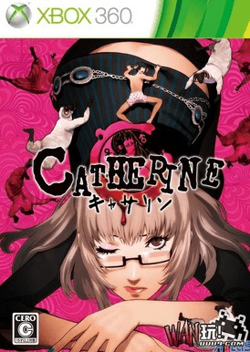

# 谁知道这是个啥游戏、

作者：啪啪啪

TID：13089

<title>1</title> <link href="../Styles/Style.css" type="text/css" rel="stylesheet">

# 1

[http://wan.uuu9.com/kslin/](http://wan.uuu9.com/kslin/)
本作为一款由Atlus公司旗下之前曾经开发人气RPG“女神异闻录”（Persona）系列的开发团队针对PS3�Xbox 360等高画质HD主机所开发制作的一款新作游戏，游戏作品由之前曾经开发“真．女神转生III”、“女神异闻录3”跟“女神异闻录4”等系列作的“桥野桂”担任制作人＆监督导演，并由“副岛成记”担任角色设计、“目黑将司”负责音效音乐，并由日本人气动画制作公司“Studio4℃”负责动画制作部份，更因为是“女神异闻录”开发团队首款HD高画质主机作品而备受瞩目。

      在本作中，玩家们将扮演32岁的独居男子文森，在他所居住的街道里，最近发生了一连串据传跟梦境有关的连续怪异死亡事件。而在某一天，在文森的身边突然出现一名之前未曾谋面的神秘美女凯塞琳，而这也是文森恶梦的开始。究竟有关这个“恶梦”的传闻到底是…？而文森又是否能够从死亡的命运中逃出生天？

      文森（Vincent�ヴィンセント）
      CV：山寺宏一
      不管是工作还是恋爱都没啥特别表现跟野心的草食系男子，在某天与神秘美女凯塞琳相遇之后，开始一连串的恶梦…。

      凯瑟琳（Catherine�キャサリン）
      CV：泽城みゆき
      某天突然造访文森的神秘美女，同时还会以自己美丽的容貌跟完美的身体诱惑文森。
<ignore_js_op>

**PJRT4LIQ[3J[IF8N`)$[S.jpg** *(48.13 KB, 下載次數: 0)*

[下載附件](forum.php?mod=attachment&aid=MzAzMjV8YTFmZmVmYWJ8MTY3NDA2ODU5M3wxODIzMHwxMzA4OQ%3D%3D&nothumb=yes)

2012-8-17 20:10 上傳

<title>2</title> <link href="../Styles/Style.css" type="text/css" rel="stylesheet">

# 2

这个我知道 这个女的叫凯萨琳 估计搜这个名字能找到有关这个游戏的
这个是xbox360的游戏 是一个男主角被女的变成羊在梦里爬楼梯的游戏 要推箱子 然后跳上箱子节节高上 不然下面会有血腥的女巨人上来把你吃掉的。 <title>3</title> <link href="../Styles/Style.css" type="text/css" rel="stylesheet">

# 3

再添一句 这个游戏玩的部分不太多 剧情占60% 很不错哦 <title>4</title> <link href="../Styles/Style.css" type="text/css" rel="stylesheet">

# 4

《凯瑟琳》。在我们看来有少量GTS情节。
不考虑这些的话，也是一款很不错的游戏。</ignore_js_op>